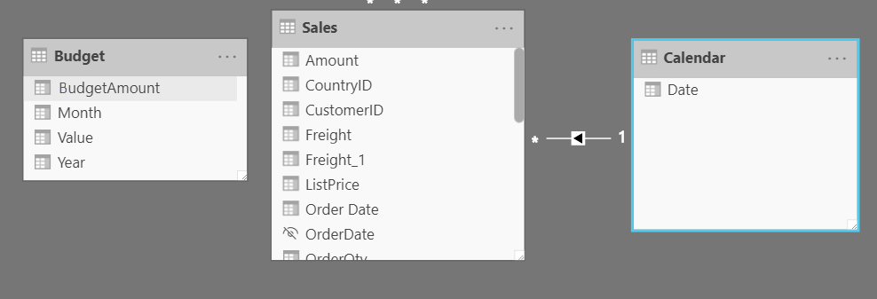
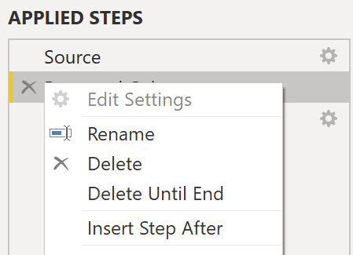
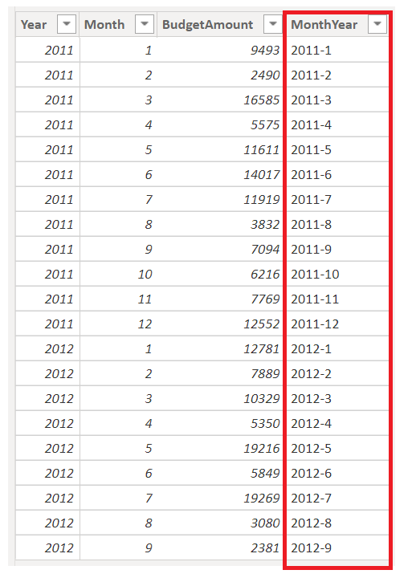
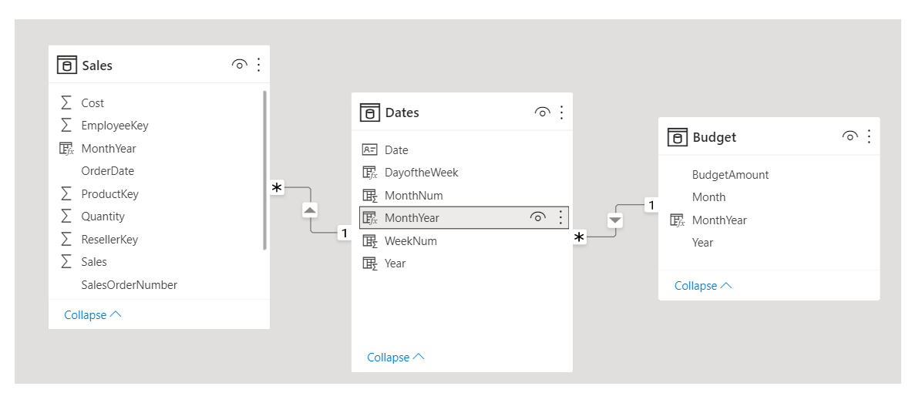

Data granularity is the detail that is represented within your data, meaning that the more granularity your data has, the greater the level of detail within your data.

Data granularity is an important topic for all data analysts, regardless of the Power BI tools that you are using. Defining the correct data granularity can have a big impact on the performance and usability of your Power BI reports and visuals.

### Data granularity defined

Consider a scenario where your company manages 1,000 refrigerated semi-trucks. Every few minutes, each truck uses a Microsoft Azure IoT application to record its current temperature. This temperature is important to your organization because, if the refrigeration were to malfunction, it could spoil the entire load, costing thousands of dollars. With so many trucks and so many sensors, extensive data is generated every day. Your report users don't want to sift through numerous records to find the ones that they are particularly interested in.

How can you change the granularity of the data to make the dataset more usable?

In this scenario, you might want to import the data by using a daily average for each truck. That approach would reduce the records in the database to one record for each truck for each day. If you decide that the approach was acceptable enough for tracking costs and errors, then you could use that data granularity. Alternatively, you could select the last recorded temperature, or you could only import records that are above or below a normal range of temperatures. Any of these methods will reduce the total records that you import, while still bringing in data that is comprehensive and valuable.

For different scenarios, you could settle on data granularity that is defined weekly, monthly, or quarterly. Generally, the fewer the records that you are working with, the faster your reports and visuals will function. This approach translates to a faster refresh rate for the entire dataset, which might mean that you can refresh more frequently.

However, that approach has a drawback. If your users want to drill into every single transaction, summarizing the granularity will prevent them from doing that, which can have a negative impact on the user experience. It is important to negotiate the level of data granularity with report users so they understand the implications of these choices.

### Change data granularity to build a relationship between two tables

Data granularity can also have an impact when you are building relationships between tables in Power BI.

For example, consider that you are building reports for the Sales team at Tailwind Traders. You have been asked to build a matrix of total sales and budget over time by using the Calendar, Sales, and Budget tables. You notice that the lowest level of time-based detail that the Sales table goes into is by day, for instance 5/1/2020, 6/7/2020, and 6/18/2020. The Budget table only goes to the monthly level, for instance, the budget data is 5/2020 and 6/2020.These tables have different granularities that need to be reconciled before you can build a relationship between tables.

The following figure shows your current data model.

> [!div class="mx-imgBorder"]
> [](../media/05-data-granularity-example-01-ss.png#lightbox)

As shown in the preceding figure, a relationship between Budget and Calendar is missing. Therefore, you need to create this relationship before you can build your visual. Notice that if you transform the **Year** and **Month** columns in the Budget table, you can match the format of the **Date** column in the Calendar table. Then, you can establish a relationship between the two columns. To complete this task, you will concatenate the **Year** and **Month** columns and then change the format.

> [!div class="mx-imgBorder"]
> [](../media/05-budget-calendar-tables-9-ss.png#lightbox)

Select **Transform Data** on the ribbon. On **Applied Steps**, on the right pane, right-click the last step and then select **Insert Step After**.

> [!div class="mx-imgBorder"]
> [](../media/05-applied-steps-10-ss.png#lightbox)

Under **Add Column** on the Home ribbon, select **Custom Column**. Enter the following equation, which will concatenate the **Year** and **Month** columns, and then add a dash in between the column names.

```dax 
Column = Table.AddColumn(#"Renamed Columns", "Custom", each [Year] & "-" &[Month])
```

Change the data type to **Date** and then rename the column. Your Budget table should resemble the following figure.

> [!div class="mx-imgBorder"]
> [](../media/05-custom-column-date-02-ssm.png#lightbox)

Now, you can create a relationship between the Budget and the Calendar tables.

## Create a relationship between Calendar and Budget tables 

Power BI automatically detects relationships, but you can also go to **Manage Relationships > New** and create the relationship on the **Date** column. The relationship should resemble the following figure.

> [!div class="mx-imgBorder"]
> [](../media/05-establishing-relationships-03-ssm.png#lightbox)

By completing this task, you have ensured that the granularity is the same between your different tables. Now, you need to create DAX measures to calculate **Total Sales** and **BudgetAmount**. Go to the **Data** pane on Power BI Desktop, select **New Measure**, and then create two measures with the following equations:

```dax
TotalSales = SUM(Sales[Total Sales])/100
```

```dax 
BudgetAmount = SUM (Budget[BudgetAmount])
```

Select the matrix visual on the **Visualization** pane, and then enter these measures and the **Date** into the **Values** field**.** You have now accomplished the goal of building a matrix of the total sales and budgets over time.

> [!div class="mx-imgBorder"]
> [](../media/05-matrix-visual-being-built-04-ssm.png#lightbox)
