In this lab, you will commence developing the data model. It will involve creating relationships between tables, and then configuring table and column properties to improve the friendliness and usability of the data model. You will also create hierarchies and create quick measures.

In this lab, you learn how to:

-   Create model relationships

-   Configure table and column properties

-   Create hierarchies

-   Create quick measures

Open the **Sales Analysis.pbix** file found in the **D:\DA100\Lab04A\Starter** folder.

## Create model relationships

In this task, you will create model relationships.

1.  In Power BI Desktop, at the left, click the **Model** view icon.

	> [!div class="mx-imgBorder"]
	> 

1.  If you do not see all seven tables, scroll horizontally to the right, and then drag and arrange the tables more closely together so they can all be seen at the same time.

1.  To return to Report view, at the left, click the **Report** view icon.

	> [!div class="mx-imgBorder"]
	> 

1.  To view all table fields, in the **Fields** pane, right-click an empty area, and then select **Expand All**.

1.  To create a table visual, in the **Fields** pane, from inside the **Product** table, check the **Category** field.

	> [!div class="mx-imgBorder"]
	> [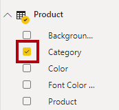](../media/lab-3-ssm.png#lightbox)

	From now on, the labs will use a shorthand notation to reference a field. It will look like this: **Product | Category**.

1.  To add a column to the table, in the **Fields** pane, check the **Sales | Sales** field.

1.  Notice that the table visual lists four product categories, and that the sales value is the same for each, and the same for the total.

	> [!div class="mx-imgBorder"]
	> [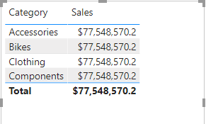](../media/lab-4-ss.png#lightbox)

	> *The issue is that the table is based on fields from different tables. The expectation is that each product category displays the sales for that category. However, because there isn't a model relationship between these tables, the **Sales** table is not filtered. You will now add a relationship to propagate filters between the tables.*

1.  On the **Modeling** ribbon tab, from inside the **Relationships** group, click **Manage Relationships**.

	> [!div class="mx-imgBorder"]
	> [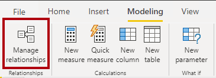](../media/lab-5-ssm.png#lightbox)

1.  In the **Manage Relationships** window, notice that no relationships are yet defined.

1. To create a relationship, click **New**.

1. In the **Create Relationship** window, in the first dropdown list, select the **Product** table.

1. In the second dropdown list (beneath the **Product** table grid), select the **Sales** table.

	> [!div class="mx-imgBorder"]
	> [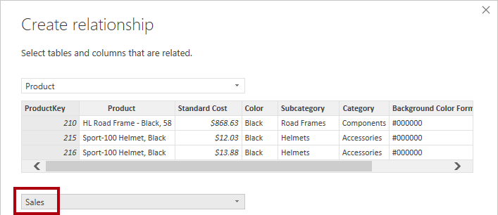](../media/lab-6-ssm.png#lightbox)

1. Notice the **ProductKey** columns in each table have been selected.

	The columns were automatically selected because they share the same name.

1. In the **Cardinality** dropdown list, notice that **One To Many** is selected.

	The cardinality was automatically detected, because Power BI understands that the **ProductKey** column from the **Product** table contains unique values. One-to-many relationships are the most common cardinality, and all relationship you create in this lab will be this type.

1. In the **Cross Filter Direction** dropdown list, notice that **Single** is selected.

	Single filter direction means that filters propagate from the "one side" to the "many side". In this case, it means filters applied to the **Product** table will propagate to the **Sales** table, but not in the other direction.

1. Notice that the **Make This Relationship Active** is checked.

	> *Active relationships will propagate filters. It's possible to mark a relationship as inactive so filters don't propagate. Inactive relationships can exist when there are multiple relationship paths between tables. In which case, model calculations can use special functions to activate them.*

1. Click **OK**.

1. In the **Manage Relationships** window, notice that the new relationship is listed, and then click **Close**.

1. In the report, notice that the table visual has updated to display different values for each product category.

	> [!div class="mx-imgBorder"]
	> 

1. Filters applied to the **Product** table now propagate to the **Sales** table.

1. Switch to Model view, and then notice there is now a connector between the two tables.

	> [!div class="mx-imgBorder"]
	> [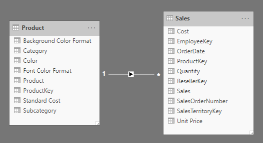](../media/lab-8-ss.png#lightbox)

1. In the diagram, notice that you can interpret the cardinality, which is represented by the **1** and **\*** indicators.

	> [!NOTE]
	> Filter direction is represented by the arrow head. And, a solid line represents an active relationship; a dashed line represents an inactive relationship.

1. Hover the cursor over the relationship to reveal the related columns.

	> *There's an easier way to create a relationship. In the model diagram, you can drag and drop columns to create a new relationship.*

1. To create a new relationship, from the **Reseller** table, drag the **ResellerKey** column on to the **ResellerKey** column of the **Sales** table.

	> [!div class="mx-imgBorder"]
	> [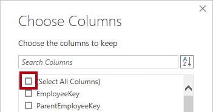](../media/lab-9-ssm.png#lightbox)

	> [!TIP]
	> Sometime a column doesn't want to be dragged. If this situation arises, select a different column, and then select the column you intend to drag again, and try again.

1. Create the following two model relationships:

	-   **Region | SalesTerritoryKey** to **Sales | SalesTerritoryKey**
	
	-   **Salesperson | EmployeeKey** to **Sales | EmployeeKey**

	> *In this lab, the **SalespersonRegion** and **Targets** tables will remain disconnected. There's a many-to-many relationship between salesperson and region, you will work this advanced scenario in the next lab.*

1. In the diagram, placing the tables with the **Sales** table in the center, and arranging the related tables about it.

	> [!div class="mx-imgBorder"]
	> [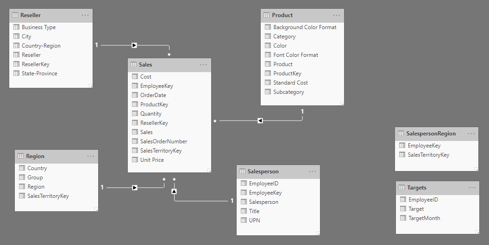](../media/lab-10-ss.png#lightbox)

1. Save the Power BI Desktop file.

## Configure tables

In this exercise, you will configure each table by creating hierarchies, and hiding, formatting, and categorizing columns.

### Configure the Product table

In this task, you will configure the **Product** table.

1. In Model view, in the **Fields** pane, if necessary, expand the **Product** table.

1. To create a hierarchy, in the **Fields** pane, right-click the **Category** column, and then select **Create Hierarchy**.

1. In the **Properties** pane (to the left of the **Fields** pane), in the **Name** box, replace the text with **Products**.

1. To add the second level to the hierarchy, in the **Hierarchy** dropdown list, select **Subcategory**.

1. To add the third level to the hierarchy, in the **Hierarchy** dropdown list, select **Product**.

1. To complete the hierarchy design, click **Apply Level Changes**.

	> [!TIP]
	> Don't forget to click **Apply Level Changes**. It's a common mistake to overlook this step.

1. In the **Fields** pane, notice the **Products** hierarchy.

1. To reveal the hierarchy levels, expand the **Products** hierarchy.

1. To organize columns into a display folder, in the **Fields** pane, first select the **Background Color Format** column.

1. While pressing the **Ctrl** key, select the **Font Color Format**.

1. In the **Properties** pane, in the **Display Folder** box, enter **Formatting**.

1. In the **Fields** pane, notice that the two columns are now inside a folder.

	> [!div class="mx-imgBorder"]
	> [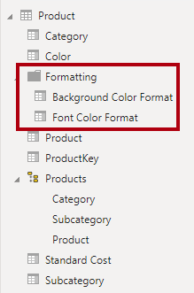](../media/lab-11-ssm.png#lightbox)

	> [!NOTE]
	> Display folders are a great way to declutter tables especially those that contain lots of fields.

### Configure the Region table

In this task, you will configure the **Region** table.

1. In the **Region** table, create a hierarchy named **Regions**, with the following three levels:

	-   Group
	
	-   Country
	
	-   Region

1. Select the **Country** column (not the **Country** level).

1. In the **Properties** pane, expand the **Advanced** section, and then in the **Data Category** dropdown list, select **Country/Region**.

	> [!div class="mx-imgBorder"]
	> [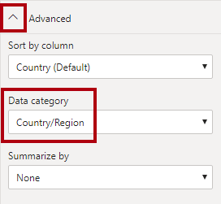](../media/lab-12-ssm.png#lightbox)

	> [!NOTE]
	> Data categorization can provide hints to the report designer. In this case, categorizing the column as country or region, provides more accurate information when rendering a map visualization.

### Configure the Reseller table

In this task, you will configure the **Reseller** table.

1. In the **Reseller** table, create a hierarchy named **Resellers**, with the following two levels:

	-   Business Type
	
	-   Reseller

1. Create a second hierarchy named **Geography**, with the following four levels:

	-   Country-Region
	
	-   State-Province
	
	-   City
	
	-   Reseller

1. Categorize the following three columns:

	-   **Country-Region** as **Country/Region**
	
	-   **State-Province** as **State or Province**
	
	-   **City** as **City**

### Configure the Sales table

In this task, you will configure the **Sales** table.

1. In the **Sales** table, select the **Cost** column.

1. In the **Properties** pane, in the **Description** box, enter: **Based on standard cost**

	> *Descriptions can be applied to table, columns, hierarchies, or measures. In the **Fields** pane, description text is revealed in a tooltip when a report author hovers their cursor over the field.*

1. Select the **Quantity** column.

1. In the **Properties** pane, from inside the **Formatting** section, slide the **Thousands Separator** property to **On**.

	> [!div class="mx-imgBorder"]
	> [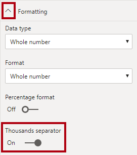](../media/lab-13-ssm.png#lightbox)

1. Select the **Unit Price** column.

1. In the **Properties** pane, from inside the **Formatting** section, slide the **Decimal Places** property to **2**.

1. In the **Advanced** group (you may need to scroll down to locate it), in the **Summarize By** dropdown list, select **Average**.

	> *By default, numeric columns will summarize by summing values together. This default behavior is not suitable for a column like **Unit Price**, which represents a rate. Setting the default summarization to average will produce a useful and accurate result.*

### Bulk update properties

In this task, you will update multiple columns in a single bulk update. You will use this approach to hide columns, and format column values.

1. While pressing the **Ctrl** key, select the following 13 columns (spanning multiple tables):

	-   Product | ProductKey
	
	-   Region | SalesTerritoryKey
	
	-   Reseller | ResellerKey
	
	-   Sales | EmployeeKey
	
	-   Sales | ResellerKey
	
	-   Sales | SalesOrderNumber
	
	-   Sales | SalesTerritoryKey
	
	-   Salesperson | EmployeeID
	
	-   Salesperson | EmployeeKey
	
	-   Salesperson | UPN
	
	-   SalespersonRegion | EmployeeKey
	
	-   SalespersonRegion | SalesTerritoryKey
	
	-   Targets | EmployeeID

1. In the **Properties** pane, slide the **Is Hidden** property to **On**.

	> *The columns were hidden because they are either used by relationships or calculation logic.*

1. Multi-select the following columns:

	-   Product | Standard Cost
	
	-   Sales | Cost
	
	-   Sales | Sales

1. In the **Properties** pane, from inside the **Formatting** section, set the **Decimal Places** property to **0** (zero).

## Review the model interface

In this task, you will switch to Report view, and review the model interface.

1. Switch to Report view.

1. In the **Fields** pane, notice the following:

	-   Columns, hierarchies, and their levels are fields, which can be used to configure report visuals
	
	-   Only fields relevant to report authoring are visible
	
	-   The **SalespersonRegion** table is not visible because all of its fields are hidden
	
	-   Spatial fields in the **Region** and **Reseller** table are adorned with a spatial icon
	
	-   Fields adorned with the sigma symbol (Ʃ) will summarize, by default
	
	-   A tooltip appears when hovering the cursor over the **Sales | Cost** field

1. Expand the **Sales | OrderDate** field, and then notice that it reveals a date hierarchy.

	The **Targets | TargetMonth** presents the same hierarchy. These hierarchies were not created by you. They are created automatically. There is a problem, however. The Adventure Works financial year commences on July 1 of each year. But, the date hierarchy year commences on January 1 of each year. You will now turn off this automatic behavior.

1. To turn off auto/date time, click the **File** ribbon tab to open the backstage view.

1. At the left, select **Options and Settings**, and then select **Options**.

1. In the **Options** window, at the left, in the **Current File** group, select **Data Load**.

1. In the **Time Intelligence** section, uncheck **Auto Date/Time**.

1. Click **OK**.

1. In the **Fields** pane, notice that the date hierarchies are no longer available.

	> [!div class="mx-imgBorder"]
	> [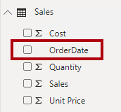](../media/lab-14-ssm.png#lightbox)

## Create quick measures

In this task, you will create two quick measures to calculate profit and profit margin.

1. In the **Fields** pane, right-click the **Sales** table, and then select **New Quick Measure**.

1. In the **Quick Measures** window, in the **Calculation** dropdown list, from inside the **Mathematical Operations** group, select **Subtraction**.

1. In the **Fields** pane, expand the **Sales** table.

1. Drag the **Sales** field into the **Base Value** box.

1. Drag the **Cost** field into the **Value to Subtract** box.

	> [!div class="mx-imgBorder"]
	> [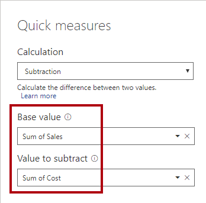](../media/lab-15-ssm.png#lightbox)

1. Click **OK**.

	A quick measure creates the calculation for you. They're easy and fast to create for simple and common calculations. 

1. In the **Fields** pane, inside the **Sales** table, notice the new measure.

	Measures are adorned with the calculator icon.

1. To rename the measure, right-click it, and then select **Rename**.

	> [!TIP]
	> To rename a field, you can also double-click it, or select it and press **F2**.

1. Rename the measure to **Profit**, and then press **Enter**.

1. In the **Sales** table, add a second quick measure, based on the following requirements:

	-   Use the **Division** mathematical operation
	
	-   Set the **Numerator** to the **Sales | Profit** field
	
	-   Set the **Denominator** to **Sales | Sales** field
	
	-   Rename the measure as **Profit Margin**

1. Ensure the **Profit Margin** measure is selected, and then on the **Measure Tools** contextual ribbon, set the format to **Percentage**, with two decimal places.

	> [!div class="mx-imgBorder"]
	> 

1. To test the two measures, first select the table visual on the report page.

1. In the **Fields** pane, check the two measures.

	> [!div class="mx-imgBorder"]
	> 

1. Click and drag the right guide to widen the table visual.

	> [!div class="mx-imgBorder"]
	> [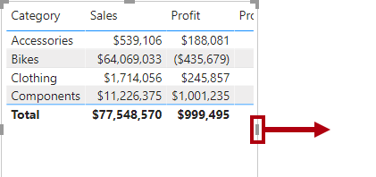](../media/lab-18-ssm.png#lightbox)

1. Verify that the measures produce reasonable result that is correctly formatted.

	> [!div class="mx-imgBorder"]
	> [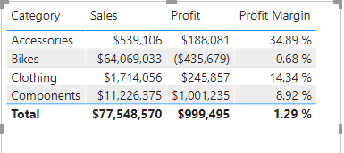](../media/lab-19-ss.png#lightbox)

## Finish up

In this task, you will complete the lab.

1. To remove the table, select the table (by clicking it), and then press the **Delete** key.

1. Save the Power BI Desktop file.

