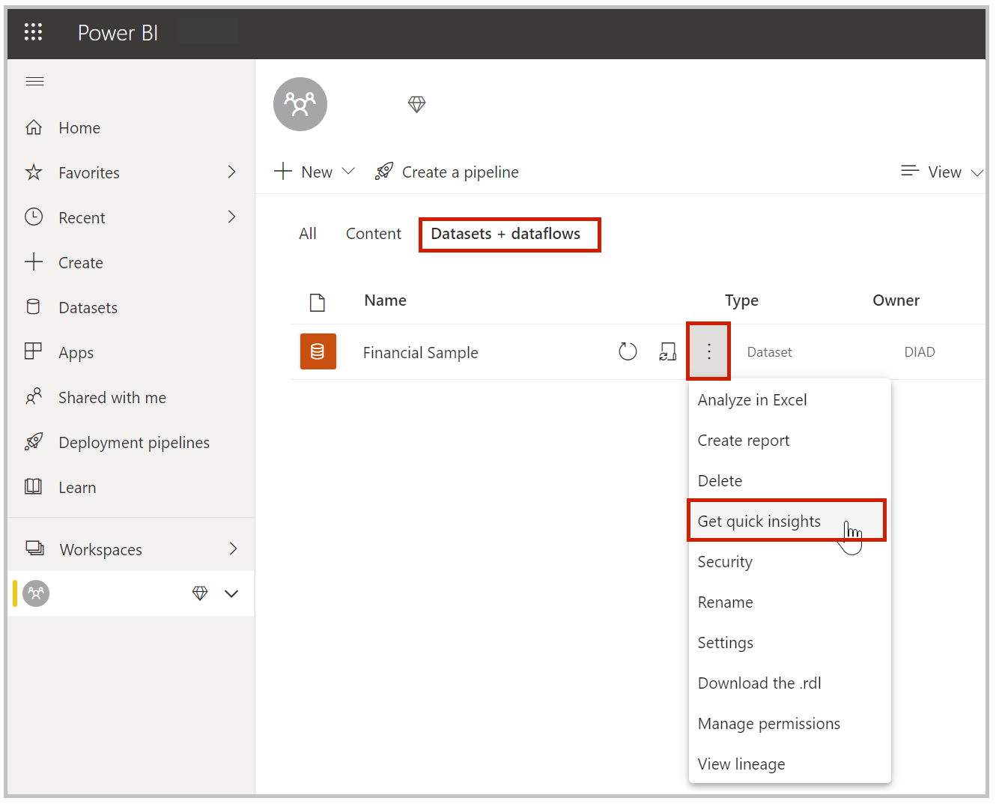
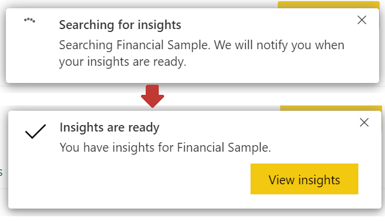
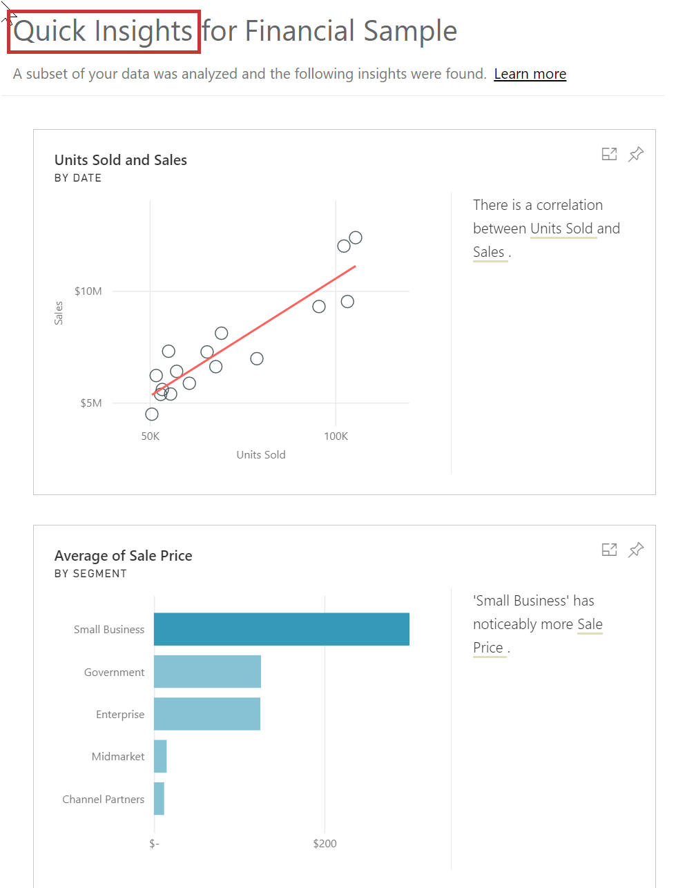

The Power BI service can automatically look for insights in a dashboard, report, or dataset. 

**Video**: Quick insights
> [!VIDEO https://www.microsoft.com/videoplayer/embed/RE3oNL1]

From the **Datasets** section, select the ellipsis beside the dataset that you're interested in and then select **Get quick insights**.

When you select **Get quick insights**, Power BI searches the data for patterns. After about 15 seconds, the notification changes to let you know that Power BI found some insights.

When you select the **View insights** button on the notification, you're presented with a page of visuals. You can scroll down through the page to view and consider the visuals.

As with any other visual, you can interact with the visuals on the **Quick Insights** page. You can also pin any of them to a dashboard or filter to uncover additional insights.

With **Quick Insights**, you can let Power BI do the work to spot outliers and trends in your data. Use those findings in your dashboards or continue to refine and filter to get to the insights that you need.

For more information, see [Generate data insights automatically with Power BI](https://docs.microsoft.com/power-bi/service-insights/?azure-portal=true).
