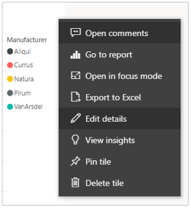
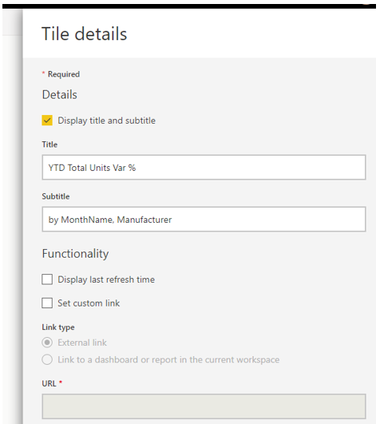
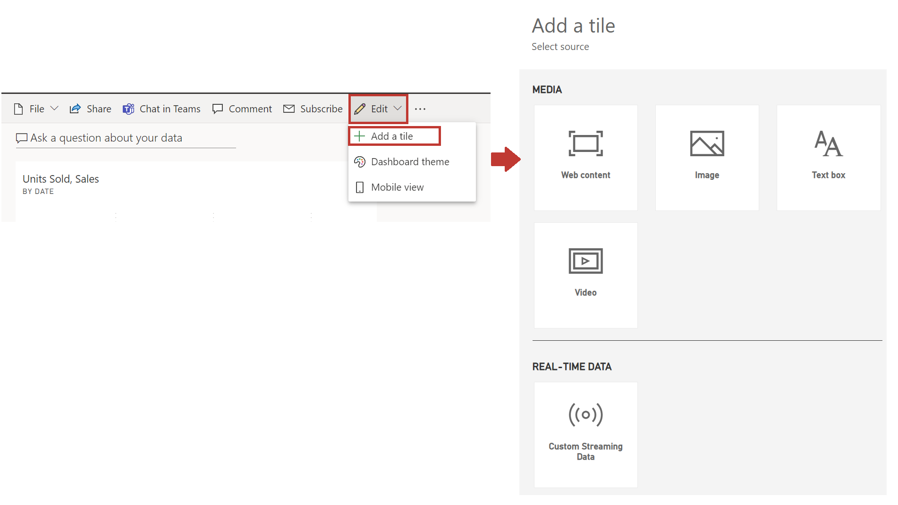

After you've built a dashboard, you can format your tiles in the Power BI service.

**Video**: Edit tile details
> [!VIDEO https://www.microsoft.com/videoplayer/embed/RE3x9vT]

To modify a tile, hover over and select the ellipsis to see the choices that are shown in the following screenshot.

Select the pen icon to open the **Tile details** pane. From this pane, you can change the tile's **Title**, **Subtitle**, or include its last refresh time.

By default, when you select a dashboard tile, you're redirected to the report from which it originated. To change this behavior, use the **Set custom link** field on the **Tile details** pane. One popular use of this feature is to redirect users to the organization homepage when they select a logo image.

## Add images and text to your dashboard
You can also add tiles that contain images, online videos, text boxes, or web content. When you select the **Add tile** link in the upper-left corner of a dashboard, the **Add tile** dialog box appears.

When you add a text box, for example, a **Tile details** pane appears on the right side, where you can edit details. A section is also available for you to define or modify the tile content, such as a rich text editor for a text box.

With tiles and the ability to edit details, you can customize your dashboard and make it appear how you want.

For more information, see [Edit or remove a dashboard tile](https://docs.microsoft.com/power-bi/service-dashboard-edit-tile).
