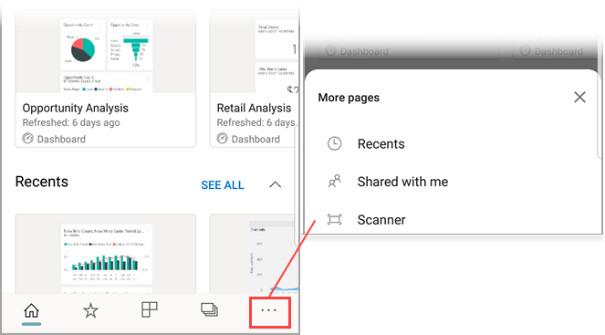

The Power BI mobile apps leverage your mobile device's location and scanning capabilities to make access to your data easier and more efficient when you're out in the field or on the go. You can get a filtered view of your data based on you location, and you can scan QR codes and barcodes to open reports and get filtered views of data.

## Filter reports by your geographic location

A useful capability that the Power BI mobile apps offer is the ability to filter data by geographic location. When you are out in the field, if the report that you need has geographical data, such as data for a particular city, state, or region, you can filter that report based on your geographic location.

Open the report you want in the Power BI mobile app on your mobile device. If the report has geographic data, a message will appear, asking you to allow Power BI to access your location. Select **Allow** and then tap **Allow** again. When the report opens, a pushpin icon will display.

 
Tap the pushpin. Now, you can filter by city, state/province, or country/region, depending on the data in the report. The filter only lists options that match your current location.

 
For more information, see [Filter a report by geographic location in the Power BI mobile apps](/power-bi/consumer/mobile/mobile-apps-geographic-filtering).

## Scan barcodes to get filtered reports

Consider a scenario where you're checking inventory in a large supermarket, and while you're out in the aisles you need to get information about particular products, such as how many the store has in stock, what departments the items are stocked in, and so on. With the Power BI mobile app, you can open the Power BI scanner on your mobile device, scan an item's barcode, and quickly get to the relevant report, already filtered to the data you need.

Here's how it works.

First, you must have access to a report that included barcode data. This means that you or a colleague has created a report in Power BI Desktop that includes barcode data, and that the report has been published to the Power BI service and shared with you.

Then, when you're out in the field and come to a barcoded item whose report you want to see, you can open the app, tap **Scanner** from the **More options (...)** menu on the lower navigation bar, and then scan the barcode.

 
The report (or list of reports) that include items with that barcode will appear. Choose the report that you want, and when you open it, it will be filtered to that barcode.

 
While you've got the report open and you move on to another item that's included in that report, you can just tap **More options (...)** on the report footer to find the barcode scanner icon again so that you can scan the next barcode.

For more information, see [Scan barcodes from the mobile app to get filtered data](/power-bi/consumer/mobile/mobile-apps-scan-barcode-iphone).

## Scan QR codes to get directly to relevant information

With QR codes in Power BI you can connect any item in the real world directly to related Power BI information, eliminating the need to search for or navigate to that information.

Consider another scenario where a colleague has created a QR code in the Power BI service for a report or for a tile in a dashboard, shared the dashboard or report with you, and then placed the QR code in a key location, such as in an email or on a specific item. Afterward, you can scan the QR code for immediate access to the relevant tile or report, directly from your phone by using the scanner in the Power BI app or any other scanner that is installed on your phone.

For more information, see [Scan a Power BI QR code from your mobile device](/power-bi/consumer/mobile/mobile-apps-qr-code).

Now you know what Power BI is and why to use it. In the next unit, you'll learn how to navigate the Power BI user interface.
