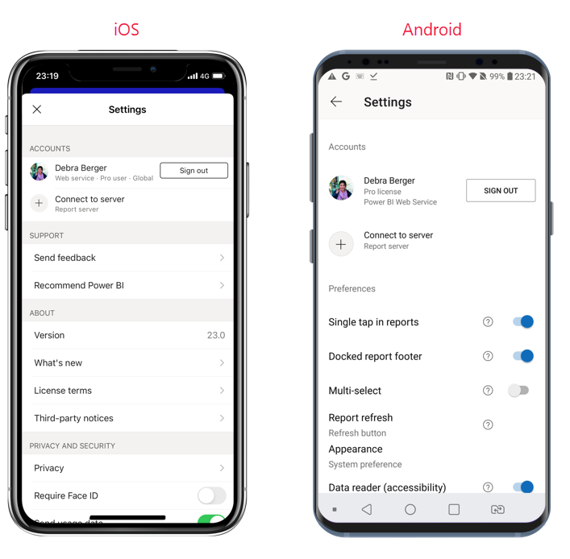

You can configure your app in a number of ways. For instance, you can have the app use biometric identification to help secure your data, and you can change app settings to create a more customized experience that better suits your needs and preferences.

## Protect Power BI data with biometric identification

The Power BI apps for iOS and Android let you protect your data by requiring additional identification. If you set up this feature, every time the app is launched or brought to the foreground, that additional identification will be required. On iOS, the additional identification would be providing Face ID, Touch ID, or a passcode. On Android, you would be providing biometric data (fingerprint ID). You can set up biometric identification in the app settings.

For more information, see [Protect Power BI app with Face ID, Touch ID, passcode, or biometric data](/power-bi/consumer/mobile/mobile-native-secure-access).

## Configure your experience

To customize your experience with the Power BI mobile app, you can configure numerous settings.

* **Light and dark mode** – If you prefer dark text against a light background or light text against a dark background, you can choose which mode to use, or you could continue with the mode that your system is using. For these types of changes, use the **Appearance** option in the app settings.
* **Docked report footer** – You might find that having the report footer available at all times is more convenient. Alternatively, you might prefer to have the report footer disappear when you're not using it. You can choose what happens with the report footer by using the **Docked report footer** option in the app settings.
* **Multi-select** – You can have the effects of selecting a data point replace the effects of the previous selection, or you can view the cumulative effect of selecting multiple data points by selecting the **Multi-select** option in the app settings.
* **Button for refreshing reports** (Android only) - You can choose to have a refresh button on all report headers or to use the pull-to-refresh action (pulling down slightly from top to bottom) on the report page to refresh the report. You can make these changes by using the **Report refresh** option in the app settings.

To find the app settings, tap your profile picture in the upper-left corner of the home page and then tap **Settings**. The following image shows this process on iOS; however, the process is similar on Android.

 
This action gets  you to the settings page. The iOS and Android pages differ slightly.

