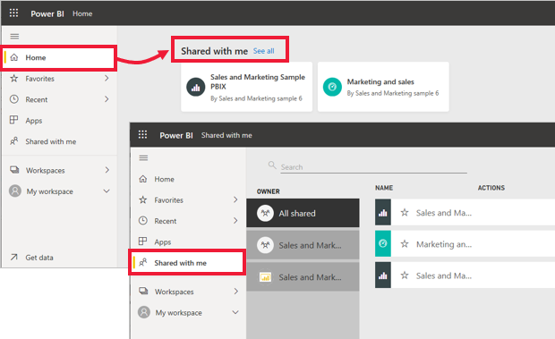
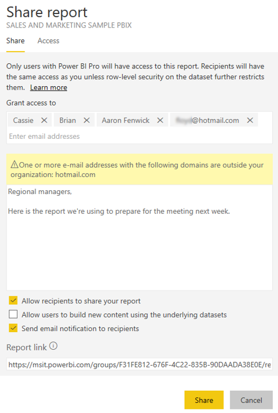
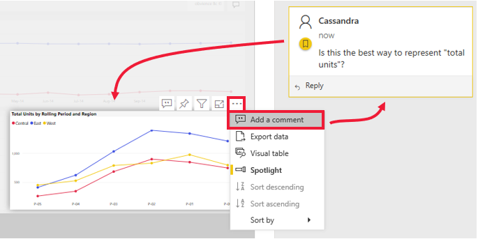
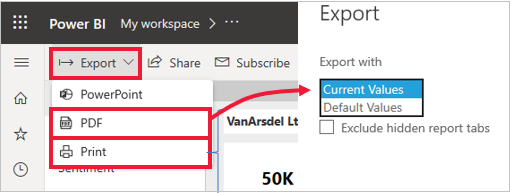
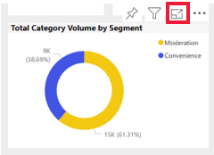

The pains of version control are common. For example, working on a project with coworkers and ending up with 10 versions of the same report. Frequently, in these situations, as you and your colleagues edit and update a report, you lose track of which, if any, is the most updated version.

Power BI simplifies collaboration and improves the outcome by allowing you and your colleagues to work simultaneously on the same dashboards and reports. And, while you and your colleagues explore the data and make changes to the reports and dashboards, the underlying is not affected.

In Power BI, you can collaborate with your colleagues in many ways. This unit focuses on three of these ways: sharing, commenting, and printing.

> [!TIP]
> If you are unable to share with a colleague, it might be because of the type of Power BI license that you or your colleague have. Check with your Power BI administrator for help.

## Sharing

This section explores how designers share content with consumers and how consumers share content with others. Imagine that you’re a regional sales manager and are working with other managers to prepare a presentation for senior leadership. You and your colleagues will work in Power BI from start to finish to collect, organize, analyze, and present your data-driven findings. Your team will all use the same shared content and communicate with each other within the Power BI framework.

### Step 1: Power BI _designers_ share content with Power BI _consumers_ 

Before you begin working on the presentation, you need content from your designer coworkers. You can find this content through apps, dashboards, and reports. Designers can share this content with you and the other managers in several different ways:

*   Share links to individual dashboards or individual reports.
*   Send link to content
*   Install content in your Power BI
*   Post a Power BI app.

**Designer shares a link to an individual report or individual dashboard**

A designer may send you and the other managers a link in email. When you select the link and install, that dashboard or report will show up as **Shared with me** content. As explained in previous units in this module, shared content can be viewed from the nav pane > **Shared with me** and from the **Home** page.

**Designer shares an app**

Sometimes, it’s easier for a designer to package dashboards and reports into an app, which they share with you. With an app, all the related content is simple to find because it’s all part of that single app. Designers can share apps by sending an installation link, automatically installing the app in your Power BI workspace, or posting the app on a website where you can get it.

No matter how the app is shared, it will show up in Power BI under the **Apps** heading in the nav pane and on the **Home** page.

Now that the designers have shared content with you and the other managers, it’s time to start the project. Because the designers gave all managers access to the content, everyone can start working together to prepare for the big meeting.

However, another challenge you face is that you want help from other colleagues, but the designer didn’t give them permissions to the content.

### Step 2: Consumers share content with internal and external colleagues
As a Power BI consumer, you can also share content, provided that the designer gave you reshare permissions.

If you decide to reshare any of this content, go to the **Shared with me** tab in the navigation pane. If the **Actions** column contains the "share" icon, you can click the icon to share. 

In the following figure, notice that two colleagues are internal and the other two are not. External colleagues are never able to reshare, even if the **Allow recipients to share your report** check box is selected.

> [!TIP]
> You can [share a dashboard or report from any of the Power BI mobile apps](https://docs.microsoft.com/power-bi/consumer/mobile/mobile-share-dashboard-from-the-mobile-apps). 

## Add comments to a dashboard

When a dashboard is shared, everyone with access to that dashboard can send messages to each other, right there on the dashboard, by using comments. The following scenario explains the process of adding comments, and then a video at the end of this section illustrates the process for you.

In this scenario, Cassandra has created and shared a dashboard with her team. Instead of sending a chart and message in email, she shares a dashboard and adds a comment.

In preparation for the meeting on Monday, her entire team views the dashboard, reviews the updated version of the report, and continues the conversation on the dashboard canvas. 

Notice that there are two types of comments: those about the dashboard in general and those about a specific visual. The chart icon lets you know that this comment is tied to a specific visual. Selecting the icon highlights the related visual on the dashboard.

### Get your colleagues' attention 

Whether you're commenting on the dashboard or on a particular visual, grab your colleagues' attention by using the at sign (@). When you type **@**, Power BI opens a drop-down list where you can search for and select individuals from your organization. Any verified name prefaced with @ appears in blue font.

This animation shows you the process of using the dashboard, from opening the **Comments** pane, to adding a new comment, and finally, to viewing existing conversations.

## Print from Power BI

A third way to collaborate and share is by printing. Occasionally, you might need to hand out printed copies of your Power BI dashboards and reports, such as when you’re giving a talk at a conference, submitting regulatory documentation, or presenting somewhere without a network connection. To prepare, you want to print copies of the dashboards and reports, in addition to a few specific tiles and report visualizations. 

### Print a dashboard

To print a dashboard, select the ellipses (…) from the upper right corner of the action menu and select **Print dashboard**.

### Print a report

Reports can be printed one page at a time, or you can print all pages at once if you first export to PDF.

### Print tiles and visuals

Tiles and visuals are found on dashboards and reports. To print a single tile or a single visual, you’ll first need to open it by itself. You can use the Focus mode and Full screen mode to open a dashboard tile or a report visual by itself so that it can be printed.

> [!NOTE] 
> The print dialog that you see depends on which browser you are using.

## Export a Power BI report to PowerPoint

Another way to share a report with your team is to export it to PowerPoint. Each report page will be a slide that includes links to the live report in Power BI.

In Power BI, select a report to display on the canvas. You can also select a report from your **Home** page, **Apps**, or any other section on the nav pane. Select **File > Export to PowerPoint** from the menu bar in Power BI.

A pop-up window will appear where you have the option to select the **Current values** or **Default values**. Most users select the **Current values** option, which exports the report in the current state and includes the active changes that you made to slicer and filter values. The **Default values** option exports the original report without the changes that you made.

When the export has finished, you can download the file, open it with PowerPoint, and then modify or enhance it just like you would any other PowerPoint deck.
