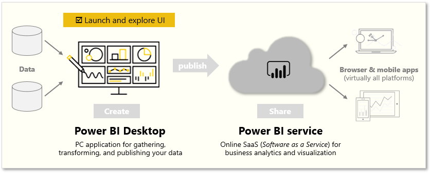
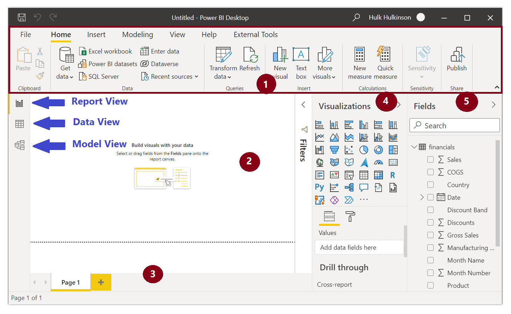
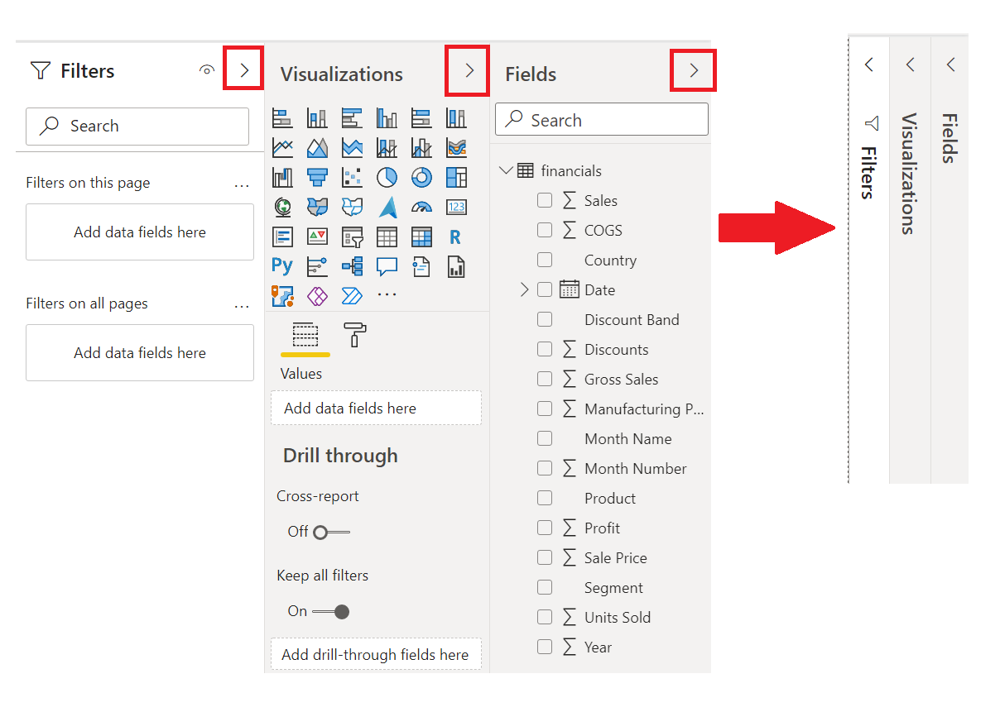
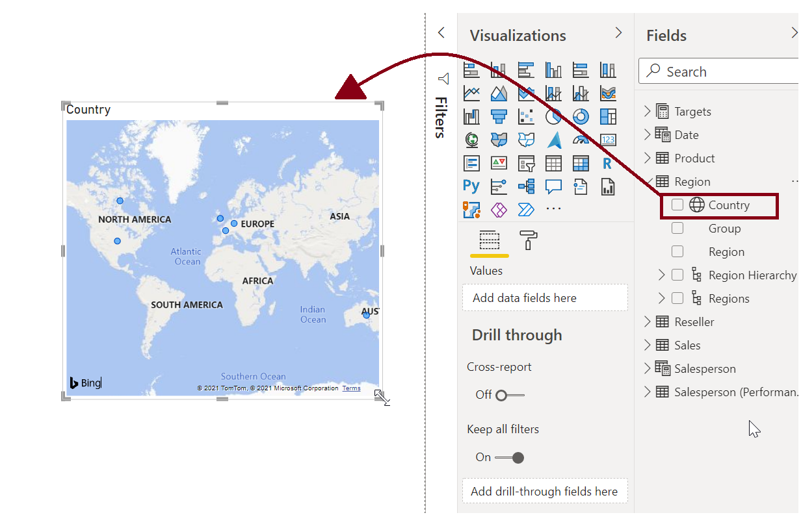
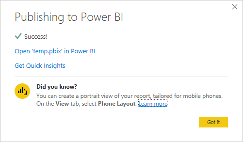

The idea of building and sharing reports is an abstract concept. It will make more sense if you explore Power BI Desktop hands-on. The first step is to launch and explore the user interface (UI). 

In this unit, you will:
- Launch the Power BI Desktop.
- Explore the UI.

&nbsp;

> [!NOTE]
> To follow along with the examples in this module, download the sample Excel workbook <a href="https://go.microsoft.com/fwlink/?linkid=2114225" target="_blank">**here**</a> and import into Power BI Desktop (**Get Data > Excel**) if you haven't already.

## Launch Power BI Desktop

When you launch Power BI Desktop, the **Getting Started** dialog box will appear, which provides useful links to forums, blogs, and introductory videos. Close this dialog box for now, but keep the **Show this screen on startup** option selected so that you can explore it later.

## Explore the report building environment

In Power BI Desktop, you'll begin to build reports in the **Report** view. You'll be working in five main areas:

1. **Ribbon** - Displays common tasks that are associated with reports and visualizations.
2. **Report view, or canvas** - Where visualizations are created and arranged. You can switch between **Report**, **Data**, and **Model** views by selecting the icons in the left column.
3. **Pages tab** - Located along the bottom of the page, this area is where you would select or add a report page.
4. **Visualizations pane** - Where you can change visualizations, customize colors or axes, apply filters, drag fields, and more.
5. **Fields pane** - Where query elements and filters can be dragged onto the **Report** view or dragged to the **Filters** area of the Visualizations pane.

> [!TIP] 
> You can collapse the Visualizations and Fields panes to provide more space in the **Report** view by selecting the small arrow, as shown in the following screenshot. 

## Create a visual

To create a visual, drag a field from the **Fields** list onto the **Report** view.

For example, Power BI Desktop automatically created a map-based visualization because it recognized that the **Country** field contained geolocation data. 

## Publish a report

After creating a report with a few visuals, you're ready to publish to the Power BI service. On the **Home** ribbon on the Power BI Desktop, select **Publish**.

You’ll be prompted to sign in to Power BI. When you've signed in and the publish process is complete, the following dialog box will appear. You can select the link below **Success!**, which will take you to the Power BI service, where you can see the report that you published. 

## Pin a visual to a dashboard

When you view a published report in the Power BI service, you can choose the **Pin** icon to pin that visual to a dashboard. 

You can choose whether to pin the visual to an existing dashboard or to create a new dashboard. 

For more information, see [Report View in Power BI Desktop](https://docs.microsoft.com/power-bi/desktop-report-view/?azure-portal=true).
