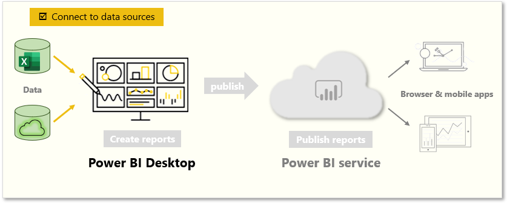
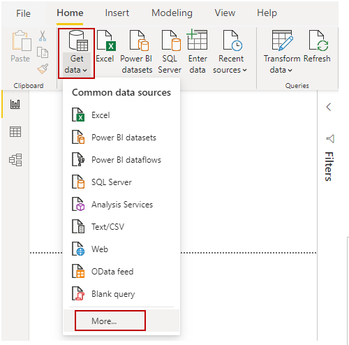
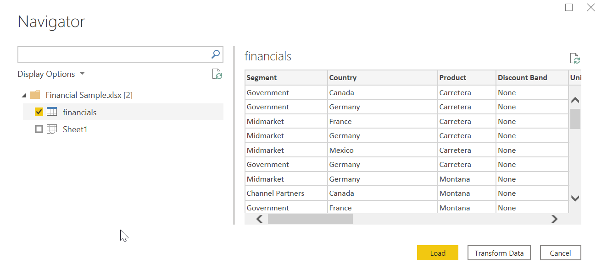
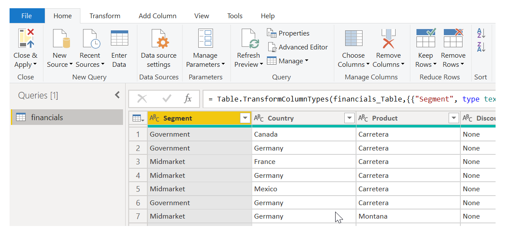

Power BI Desktop connects to many types of data sources, including local databases, worksheets, and data on cloud services. Sometimes when you gather data, it's not quite as structured, or clean, as you want it to be. To structure data, you can transform it, meaning that you can split and rename columns, change data types, and create relationships between columns. 

In this unit, you will: 
- Connect to data. 
- Import data into Power BI Desktop.

&nbsp;

**Video**: Connecting to data sources
> [!VIDEO https://www.microsoft.com/videoplayer/embed/RE3wRgY]

> [!NOTE]
> To follow along with the examples in the videos and on this page, download the sample Access database <a href="https://go.microsoft.com/fwlink/?linkid=2120368" target="_blank">**here**</a> and import into Power BI Desktop (**Get Data > Database > Access database**).

You can connect Power BI Desktop to many types of data sources, including on-premises databases, Microsoft Excel workbooks, and cloud services. Currently, there are about 60 Power BI-specific connectors to cloud services such as GitHub and Marketo. You can also connect to generic sources through XML, CSV, text, and ODBC. Power BI will even extract tabular data directly from a website URL. 

## Connect to data

When you start Power BI Desktop, you can choose **Get Data** from the ribbon on the **Home** tab.

In Power BI Desktop, several types of data sources are available. Select a source to establish a connection. Depending on your selection, you'll be asked to find the source on your computer or network. You might be prompted to sign in to a service to authenticate your request.

## Choose data to import

After connecting, the first window that you'll see is the **Navigator**. The **Navigator** window displays the tables or entities of your data source, and selecting a table or entity gives you a preview of its contents. You can then import your selected tables or entities immediately by selecting **Load**, or you can select **Transform Data** to transform and clean your data before importing.

After you've selected the tables that you'd like to bring into Power BI Desktop, select the **Load** button. You might want to make changes to those tables before you load them. For example, if you only want a subset of customers or a specific country or region, select the **Edit** button and filter data before loading.

No matter what type of data you need, you're likely to find a way to import it into Power BI Desktop. 
