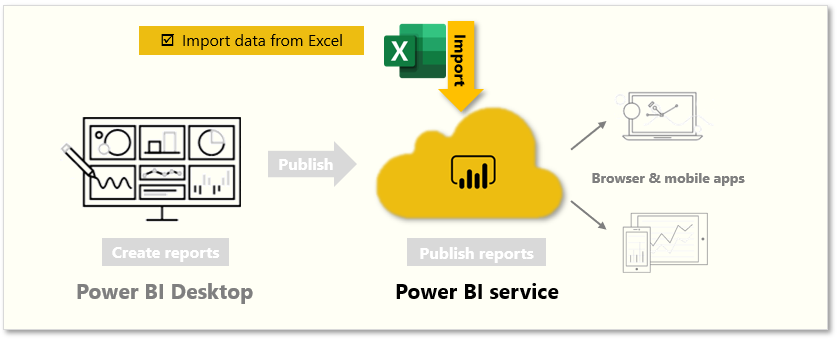
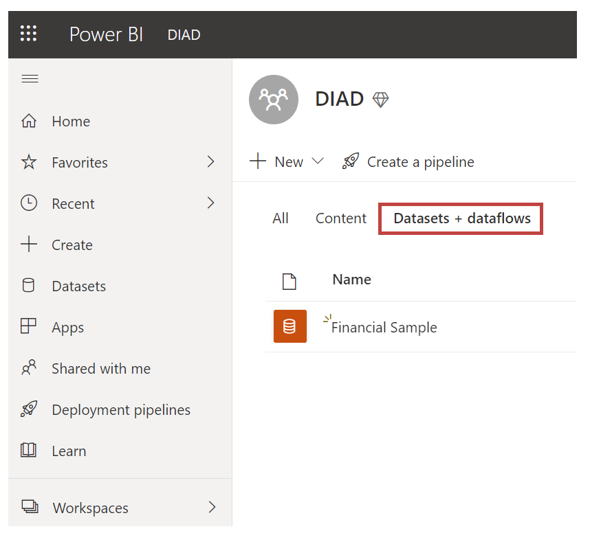
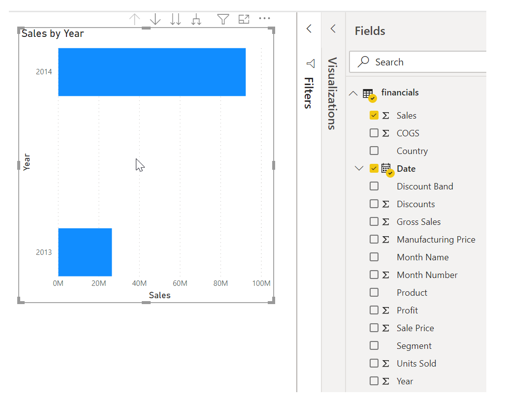

Likely, you've used Microsoft Excel to create or view reports or to build pie charts or other visuals. Getting your Excel data into Power BI is a straightforward process. 

In this unit, you will bring Excel workbooks into Power BI.

&nbsp;

**Video**: 
> [!VIDEO https://www.microsoft.com/videoplayer/embed/RE3nkKG]

This unit explains how you can import an Excel workbook file that contains a simple table from a local drive into Power BI. You'll then learn how to begin exploring that table's data in Power BI by creating a report.

> [!NOTE]
> Up until now, we've been importing data through Power BI Desktop. This unit page is done from the Power BI service. 

## Make sure that your data is formatted as a table
For Power BI to import data from your workbook, that data needs to be  formatted as a table. In Excel, you can highlight a range of cells, and then on the **Insert** tab of the Excel ribbon, select **Table**.

Make sure that each column has a good name; it will make it easier for you to find the data that you want when creating your reports in Power BI.

## Import from a local drive
Wherever you keep your files, Power BI makes importing them simple. In Power BI, you can go to **Get Data > Files > Local File** to select the Excel file that you want.

After the file has been imported into Power BI, you can begin creating reports.

Your files don't have to be on a local drive. If you save your files on OneDrive or SharePoint Team Site, that's even better.

## Create reports
After your workbook's data has been imported, a dataset is created in Power BI and it will appear under **Datasets**. 

Now, you can begin exploring your data by creating reports and dashboards. Select the **Open menu** icon next to the dataset and then select **Explore**. A new blank report canvas appears. On the right-hand side, under **Fields**, are your tables and columns. Select the fields for which you want to create a new visualization on the canvas.

You can change the type of visualization and apply filters and other properties under **Visualizations**.

If you use any of Excel's advanced BI features like **Power Query**, **Power Pivot**, or **Power View**, you can import that data into Power BI, too.

For more information, see [Get data from Excel workbook files](https://docs.microsoft.com/power-bi/service-excel-workbook-files).
