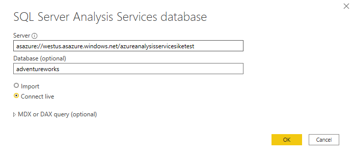

TradeWind Traders uses Azure Analysis Services to store financial
projection data.  You've been asked to compare this with actual sales
data in a different database.   Getting data from Analysis Services
cubes is very similar to getting data from a SQL Server.  For instance: 

1.  You authenticate to the server. 

1.  You choose which cube. 

1.  You select choose which tables you need.  

There are some notable differences, however: 

1.  Analysis Services cubes have calculations already in the cube.   If
    > you don't need an entire table, you can query the data directly. 
    > Instead of using T-SQL to query the data, like you do in SQL
    > Server, you use  DAX or MDX. 

1.  You don't need to use the Get Data button in Power BI Desktop. 

### Connect to data in Azure Analysis Services  

Just like in previous units, you use the **Get data **feature in Power
BI Desktop and select **Analysis Services**.   

You are prompted for the server address and the database name.  You will
also see two new options, Import and **Connect live**. 

You already learned about the options for query import.    Just like
Power BI, AAS uses a tabular model, and DAX to build calculations, AAS
also uses DAX.  Azure Analysis Services has a new connection option you
have not seen yet, **Connect live**.  Using Connect live will keep the
data and the DAX calculations in their original location, without
importing them all into Power BI.  AAS can have a fast refresh schedule,
which can mean that when the data gets refreshed in AAS, Power BI
reports will immediately be updated, without worrying about a Power BI
refresh schedule.   This can improve the timeliness of the data in your
report.  

Just like in a relational database, you can choose which tables you are
interested in.  If you would like to query the AAS model directly, you
can use DAX or MDX.   

For our example, because we need to tie goal data to other data in our
organization, we will import the data directly into Power BI.  An
acceptable alternative would be to import all the other data we are
interested in (from Excel, SQL Server, etc) into the AAS model and use
Connect live. That way the modeling and DAX measures can all performed
in one place.  This can be a much simpler and easier to maintain
solution. 

For more information on connecting Power BI to Azure Analysis Services,
please refer to [Connect with Power BI documentation.](https://docs.microsoft.com/azure/analysis-services/analysis-services-connect-pbi/?azure-portal=true) 

