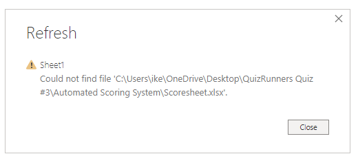
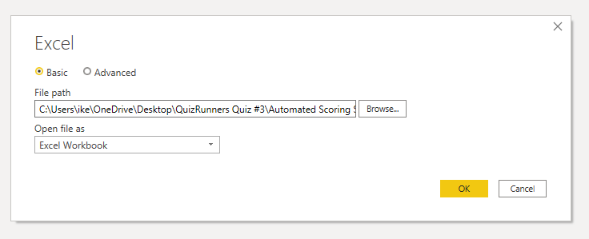

While importing data into Power BI, you may encounter errors resulting from factors such as:

- Power BI imports from numerous data sources.
- Each data source might have dozens (and sometimes hundreds) of different error messages.
- Other components can cause errors, such as hard drives, networks, software services, and operating systems.
- Data can often not comply with any specific schema.

The following sections cover some of the more common error messages that you might encounter in Power BI.

### Query timeout expired 

Relational source systems often have many people who are concurrently using the same data in the same database. Some relational systems and their administrators seek to limit a user from monopolizing all hardware resources by setting a query timeout. These timeouts can be configured for any timespan, from as little as five seconds to as much as 30 minutes or more. 

For instance, if you’re pulling data from your organization’s SQL Server, you might see the error shown in the following figure.

> [!div class="mx-imgBorder"]
> [](../media/9-data-import-query-timeout-ss.png#lightbox)

### Power BI Query Error: Timeout expired

This error indicates that you’ve pulled too much data according to your organization’s policies. Administrators incorporate this policy to avoid slowing down a different application or suite of applications that might also be using that database. 

You can resolve this error by pulling fewer columns or rows from a single table. While you are writing SQL statements, it might be a common practice to include groupings and aggregations. You can also join multiple tables in a single SQL statement. Additionally, you can perform complicated subqueries and nested queries in a single statement. These complexities add to the query processing requirements of the relational system and can greatly elongate the time of implementation. 

If you need the rows, columns, and complexity, consider taking small chunks of data and then bringing them back together by using Power Query. For instance, you can combine half the columns in one query and the other half in a different query. Power Query can merge those two queries back together after you are finished.

### We couldn't find any data formatted as a table 

Occasionally, you may encounter the “We couldn’t find any data formatted as a table” error while importing data from Microsoft Excel. Fortunately, this error is self-explanatory. Power BI expects to find data formatted as a table from Excel. The error event tells you the resolution. Perform the following steps to resolve the issue:

1. Open your Excel workbook, and highlight the data that you want to import. 
1. Press the **Ctrl-T** keyboard shortcut. The first row will likely be your column headers. 
1. Verify that the column headers reflect how you want to name your columns. Then, try to import data from Excel again. This time, it should work.

	> [!div class="mx-imgBorder"]
	> [](../media/9-format-as-table-excel-ss.png#lightbox)

### Could not find file 

While importing data from a file, you may get the "Could not find file" error.   

> [!div class="mx-imgBorder"]
> [](../media/9-file-location-ss.png#lightbox)

Usually, this error is caused by the file moving locations or the permissions to the file changing. If the cause is the former, you need to find the file and change the source settings. 

1. Open Power Query by selecting the **Transform Data** button in Power BI. 
1. Highlight the query that is creating the error. 
1. On the left, under **Query Settings**, select the gear icon next to **Source**.

	> [!div class="mx-imgBorder"]
	> [](../media/9-query-changes-ss.png#lightbox)

1. Change the file location to the new location.  

	> [!div class="mx-imgBorder"]
	> [](../media/9-file-location-new-location-ss.png#lightbox)

### Data type errors 

Sometimes, when you import data into Power BI, the columns appear blank. This situation happens because of an error in interpreting the data type in Power BI. The resolution to this error is unique to the data source. For instance, if you are importing data from SQL Server and see blank columns, you could try to convert to the correct data type in the query. 

Instead of using this query:

```SELECT CustomerPostalCode FROM Sales.Customers```
 
Use this query:

```SELECT CAST(CustomerPostalCode as varchar(10)) FROM Sales.Customers```
 
By specifying the correct type at the data source, you eliminate many of these common data source errors.

You may encounter different types of errors in Power BI that are caused by the diverse data source systems where your data resides. If you encounter an error that was not discussed in the preceding sections, you can search Microsoft documentation for the error message to find the resolution you need.