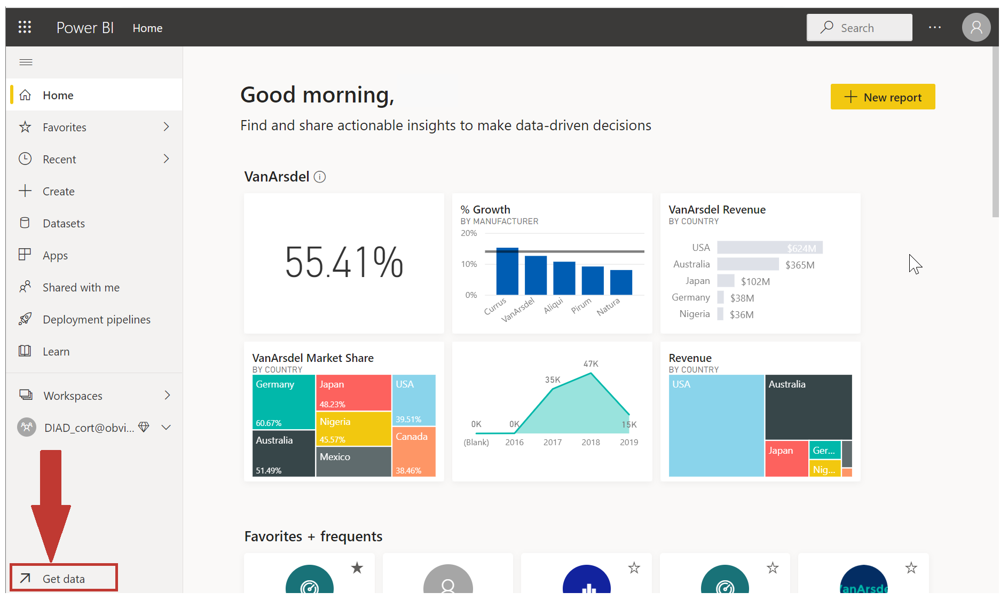
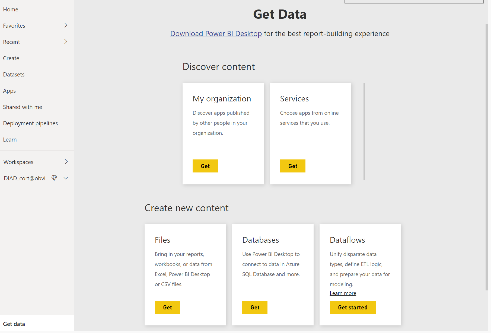
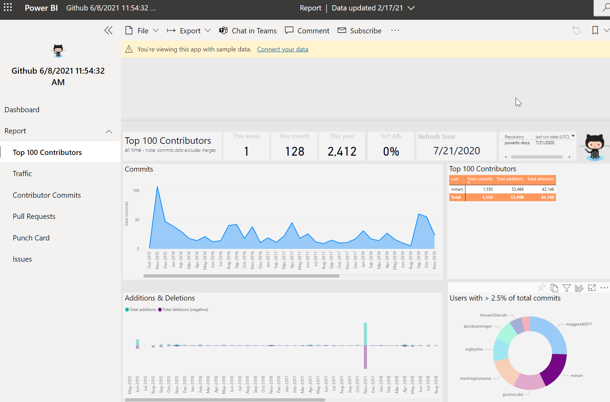
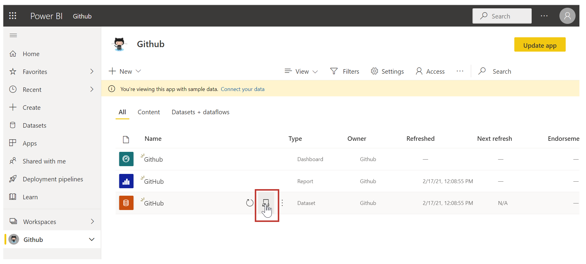

As we learned in the previous unit, the common flow of work in Power BI is to create a report in Power BI Desktop, publish it to the Power BI service, then share it with others so they can view it in the service or on a mobile app.

Some people begin in the Power BI service, though, so let's take a quick look at the service, and learn about an easy and popular way to quickly create visuals in Power BI: *apps*.

An **app** is a collection of pre-configured, ready-made visuals and reports that are shared with an entire organization. Using an app is like microwaving a TV dinner or ordering a fast-food value meal: with just a few clicks and comments, you're quickly served up a collection of entrees designed to go together, all presented in a tidy, ready-to-consume package.

So let's take a quick look at apps, the service, and how it works. We go into more detail about apps (and the service) in upcoming modules; think of this as a bit of taste-testing to whet your appetite.

## Create out-of-the-box dashboards with cloud services
With Power BI, connecting to data is easy. From the Power BI service, you can simply select the **Get Data** button in the bottom left corner of the home screen.

The *canvas* (the area in the center of the Power BI service) shows you the available sources of data in the Power BI service. In addition to common data sources such as Excel files, databases, or Azure data, Power BI can connect to **software services** (also called SaaS providers, or cloud services) such as Salesforce, Facebook, Google Analytics, and a whole assortment of other SaaS services just as easily.

For these software services, the **Power BI service** provides a collection of ready-made visuals, pre-arranged in dashboards and reports for your organization called **apps**. Apps get you up and running in Power BI quickly with data and dashboards that your organization has created for you. For example, when you use the GitHub app, Power BI connects to your GitHub account (once you provide your credentials) and then populates a pre-defined collection of visuals and dashboards in Power BI.

There are apps for all sorts of different online services. The following image shows a screen of apps available from various online services, in alphabetical order, that is displayed when you select **Get** from the **Services** box (shown in the previous image). As you can see from the image below, there are many to choose from.

For our purposes, we’ll choose **GitHub**. GitHub is an application for online source control. When I select the **Get it now** button from the GitHub app the **Connect to GitHub** window appears. 

Once I enter the information and credentials for the GitHub app, it begins to install the app.

Once the data is loaded, the pre-defined GitHub app dashboard appears.

In addition to the app **Dashboard**, the **Report** that was generated (as part of the GitHub app) to create the dashboard is available too, as is the **Dataset** (the collection of data pulled from GitHub) that was created during the data import, and used to create the GitHub Report.

On the Dashboard, you can click on any of the visuals and interact with them, and all the other visuals on the page will respond. So when the **May 2018** bar is clicked in the **Pull Requests (by month)** visual, the other visuals on the page adjust to reflect that selection.

## Refreshing data in the Power BI service
You can also choose to **refresh** the dataset for an app, or other data you use in Power BI. To set refresh settings, select the schedule refresh icon for the dataset you want to refresh, and a menu appears. You can also select the refresh icon beside it (the circle with an arrow) to refresh it now.

The **Datasets** tab is selected from the settings window that appears. Select the **Schedule Refresh** arrow to expand that section in the right pane. The Settings dialog appears on the canvas, letting you set the refresh settings that meet your needs.

That's enough for our quick look at the Power BI service. There are many more things you can do with the service, which we'll cover later in this module, and in upcoming modules. Remember, too, that there are many different types of data you can connect to, and all sorts of apps, with more of each coming all the time.

