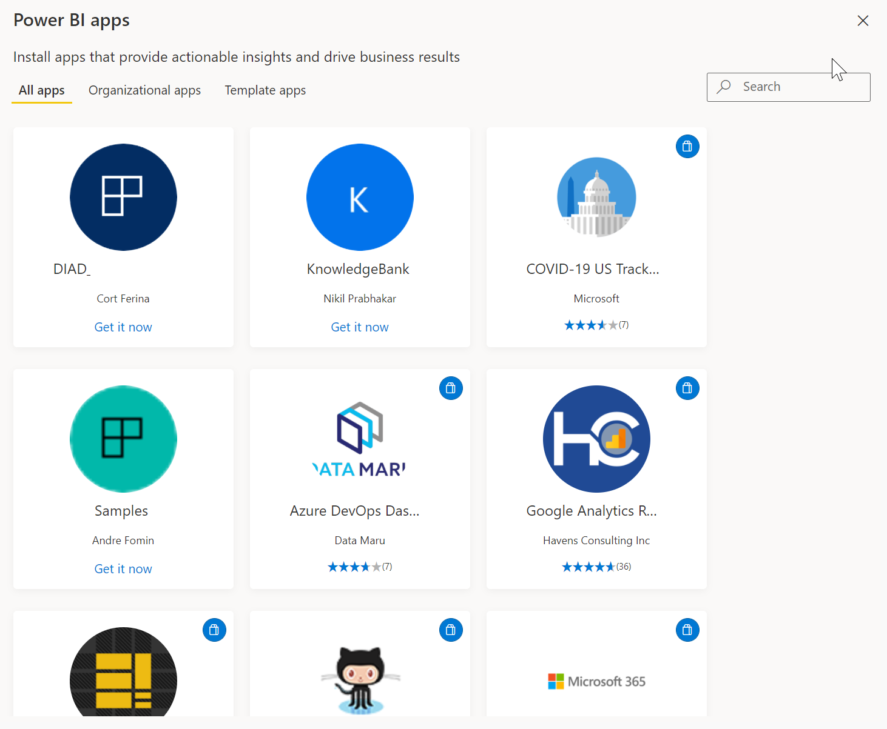
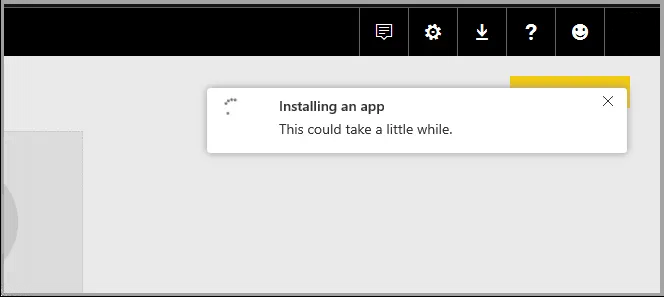
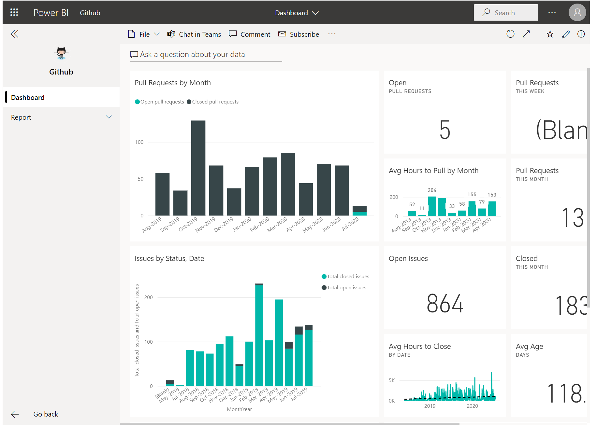
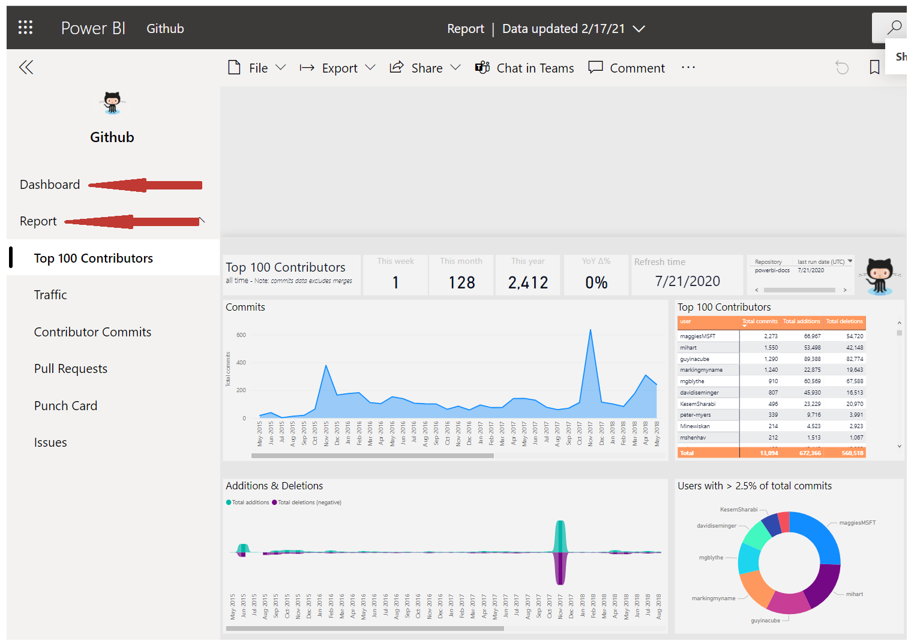

As we learned in the previous unit, the common flow of work in Microsoft Power BI is to create a report in Power BI Desktop, publish it to the Power BI service, and then share it with others, so that they can view it in the service or on a mobile app.

But because some people begin in the Power BI service, let's take a quick look at that first, and learn about an easy and popular way to quickly create visuals in Power BI: *apps*.

An **app** is a collection of preset, ready-made visuals and reports that are shared with an entire organization. Using an app is like microwaving a TV dinner or ordering a fast-food value meal: you just have to press a few buttons or make a few comments, and you're quickly served a collection of entrees designed to go together, all presented in a tidy, ready-to-consume package.

So, let's take a quick look at apps, the service, and how it works. We'll go into more detail about apps (and the service) in upcoming modules, but you can think of this as a taste to whet your appetite. You can sign into the service at [https://powerbi.microsoft.com](https://powerbi.microsoft.com/?azure-portal=true).

## Create out-of-box dashboards with cloud services

With Power BI, connecting to data is easy. From the Power BI service, you can just select the **Get Data** button in the lower-left corner of the home page.

The *canvas* (the area in the center of the Power BI service) shows you the available sources of data in the Power BI service. In addition to common data sources like Microsoft Excel files, databases, or Microsoft Azure data, Power BI can just as easily connect to a whole assortment of **software services** (also called SaaS providers or cloud services): Salesforce, Facebook, Google Analytics, and more.

For these software services, the **Power BI service** provides a collection of ready-made visuals that are pre-arranged on dashboards and reports for your organization. This collection of visuals is called an **app**. Apps get you up and running quickly, with data and dashboards that your organization has created for you. For example, when you use the GitHub app, Power BI connects to your GitHub account (after you provide your credentials) and then populates a predefined collection of visuals and dashboards in Power BI.

There are apps for all sorts of online services. The following image shows a page of apps that are available for different online services, in alphabetical order. This page is shown when you select the **Get** button in the **Services** box (shown in the previous image). As you can see from the following image, there are many apps to choose from.

For our purposes, we'll choose **GitHub**. GitHub is an application for online source control. When you select the **Get it now** button in the box for the GitHub app, the **Connect to GitHub** dialog box appears. Note that GitHub does not support Internet Explorer, so make sure you are working in another browser.

After you enter the information and credentials for the GitHub app, installation of the app begins.

After the data is loaded, the predefined GitHub app dashboard appears.

In addition to the app **dashboard**, the **report** that was generated (as part of the GitHub app) and used to create the dashboard is available, as is the **dataset** (the collection of data pulled from GitHub) that was created during data import and used to create the GitHub report.

You can select any of the visuals and interact with them. As you do so, all the other visuals on the page will respond. For example, when you select the **Pull Requests** report in the treemap, the other visuals on the page adjust to reflect that selection.

## Update data in the Power BI service

You can also choose to **update** the dataset for an app, or other data that you use in Power BI. To set update settings, select the schedule update icon for the dataset to update, and then use the menu that appears. You can also select the update icon (the circle with an arrow) next to the schedule update icon to update the dataset immediately.

The **Datasets** tab is selected on the **Settings** page that appears. In the right pane, select the arrow next to **Scheduled refresh** to expand that section. The **Settings** dialog box appears on the canvas, letting you set the update settings that meet your needs.

That's enough for our quick look at the Power BI service. There are many more things you can do with the service, and we'll cover these later in this module and in upcoming modules. Also, remember that there are many types of data you can connect to, and all sorts of apps, with more of both coming all the time.
