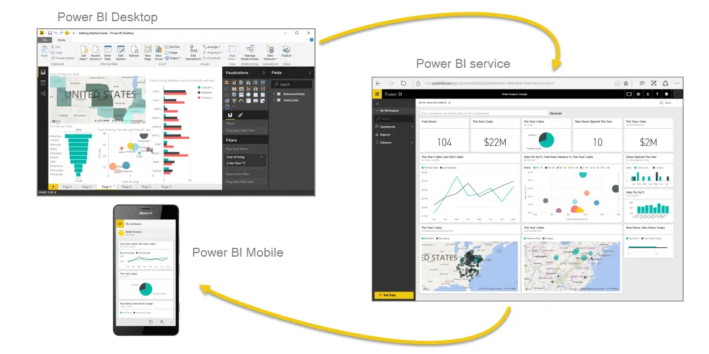

Let's do a quick review of what we covered in this module.

**Microsoft Power BI** is a collection of software services, apps, and connectors that work together to turn your data into interactive insights. You can use data from single basic sources, like a Microsoft Excel workbook, or pull in data from multiple databases and cloud sources to create complex datasets and reports. Power BI can be as straightforward as you want or as enterprise-ready as your complex global business requires.

Power BI consists of three main elements—**Power BI Desktop**, the **Power BI service**, and **Power BI Mobile**—which work together to let you create, interact with, share, and consume your data the way you want.

We also discussed the basic building blocks in Power BI:

* **Visualizations** – A visual representation of data, sometimes just called visuals
* **Datasets** – A collection of data that Power BI uses to create visualizations
* **Reports** – A collection of visuals from a dataset, spanning one or more pages
* **Dashboards** – A single-page collection of visuals built from a report
* **Tiles** – A single visualization on a report or dashboard

In the **Power BI service**, we installed an **app** in just a few clicks. That **app**, a ready-made collection of visuals and reports, let us easily connect to a **software service** to populate the app and bring that data to life.

Finally, we set up a **refresh schedule** for our data, so that we know the data will be fresh when we go back to the Power BI service.

## Next steps
**Congratulations!** You've finished the first module of the **learning path** for Power BI. You now have a firm foundation of knowledge for when you move on to the next module, which walks through the steps to create your first report. 

We mentioned this before, but it's worth restating: this learning path builds your knowledge by following the common flow of work in Power BI:

* Bring data into **Power BI Desktop**, and create a report.
* **Publish** to the Power BI service, where you create new visualizations or build dashboards.
* **Share** your dashboards with others, especially people who are on the go.
* View and interact with shared dashboards and reports in **Power BI Mobile** apps.

You might not do all that work yourself—some people will only view dashboards that were created by someone else, and they'll just use the service. That's fine, and we'll soon have a module dedicated to showing how you can easily navigate and use the **Power BI service** to view and interact with reports and apps.

But the next module follows the flow of work in Power BI, showing you how to create a report and publish it to the Power BI service. You'll learn how those reports and dashboards are created and how they connected to the data. You might even decide to create a report or dashboard of your own.

See you in the next module!

