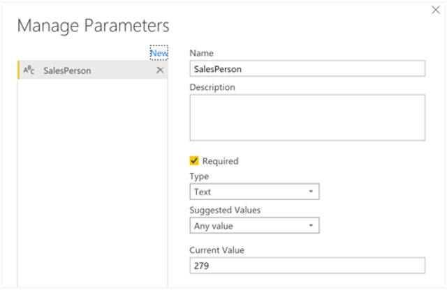
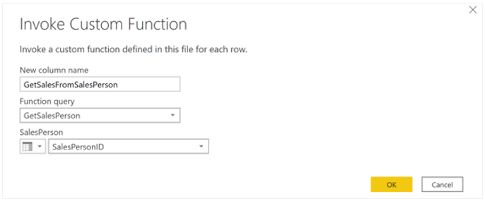

Dynamic reports are reports in which the data can be changed by a developer, according to user specifications. Dynamic reports are valuable, as a single report can be used for multiple purposes. If you use dynamic reports, you'll have fewer individual reports to create, which will save organizational time and resources.

You can use parameters by determining the values that you want to see data for in the report, and the report updates accordingly by filtering the data for you.

Creating dynamic reports allows you to give end-users more power over the data that is displayed in your reports; they can change the data source and filtering the data by themselves.

In this example, you've created a report for the Sales team that displays the sales data in the SQL Server database. The report gives a holistic view of how the Sales team is performing. Whilst the report is extremely useful, the Sales team members would like to be able to filter the report, so they can view only their own data and more easily track their performance against their sales targets.

## Create dynamic reports for individual values 

To create a dynamic report, you first need to write your SQL query and then you need to use the **Get data** feature in Power BI Desktop to connect to the database.

In this example, you connect to your database on SQL Server. In the **SQL Server database** window, after you enter your server details, select the **Advanced options**, then paste the SQL query into the **SQL statement** box, and then select **OK**.

> [!div class="mx-imgBorder"]
> 

> [!div class="mx-imgBorder"]
> 

When the connection is made, you will see the data in the preview window. Select **Edit** to open the data in Power Query Editor.

The next step is to create the parameter. On **Home** tab, select **Manage parameters** > **New parameter**. On the **Parameters** window, change the default parameter name to something more descriptive, so its purpose is clear. In this case, you change the name to *SalesPerson*. Select **Text** from the **Type** list and **Any value** from the **Suggested value** list, then select **OK**.

> [!div class="mx-imgBorder"]
> 

You'll then see a new query for the parameter you created.

> [!div class="mx-imgBorder"]
> 

Now you need to adjust the code in SQL query, to take account of your new parameter. Right-click **Query1** and select **Advanced editor**, then replace the existing value in the execute statement with an ampersand (&) followed by your parameter name (**SalesPerson**), as illustrated in the following image. Ensure there are no errors at bottom of the window, then select **Done**.

> [!div class="mx-imgBorder"]
> 

You won't see anything different, but Power BI will have executed the query. To confirm that is the case, you can run a test. Select the parameter query, then enter a new value into the **Current Value** box.

> [!div class="mx-imgBorder"]
> 

You might see a warning icon displaying next to the query. If that is the case, select that query to view the warning message, which says that permission is required to run this native database query. Select **Edit Permission**, then select **Run**.

When the query executes successfully, you'll see the parameter updates and displays the new value.

> [!div class="mx-imgBorder"]
> 

Select **Close and Apply** to return to the report editor. Now you can apply the parameter to the report. Select **Edit queries** > **Edit parameters**, then on **Edit Parameters** window, enter a new value and select **OK**. Then select **Apply changes** and run the native query again. Now when you view the data, you'll see the data for the new value that was passed through the parameter.

> [!div class="mx-imgBorder"]
> 

You can now create a report that displays data for one particular value at a time. If you want to display data for multiple values at the same time, you need to carry out some additional steps, as outlined in the next section.

## Create dynamic reports for multiple values

To cater for multiple values at a time, you first need to create an Excel worksheet that has a table consisting of one column, which contains the list of values.

Next, use the **Get data** feature in Power BI Desktop to connect to the data in that Excel worksheet, and on the **Navigator** window, select **Edit** to open the data in Power Query Editor, where you'll see a new query for the data table.

> [!div class="mx-imgBorder"]
> 

Rename the column in the table to something more descriptive, then change the column data type to text, so that it matches the parameter type and you avoid any data conversion problems. In the query **Properties** section, also change the name of the data source to something more descriptive -- *SalesPersonID* in this case.

Next, you need to create a function that'll pass the new **SalesPersonID** query into the **Query1**. Right-click **Query1** and select **Create function**.

> [!div class="mx-imgBorder"]
> 

Enter a name for the function and select **OK**.

> [!div class="mx-imgBorder"]
> 

You'll then see your new function in the **Queries** pane.

> [!div class="mx-imgBorder"]
> 

To ensure **Query1** doesn't show up in the field list for the report, which could potentially confuse end-users, you can disable it loading in the report. Right-click **Query1** again, then select **Enable load** (selected by default) to disable the feature.

> [!div class="mx-imgBorder"]
> 

Select the **SalesPerson** query you loaded from the Excel worksheet, then on the **Add Column** tab, select **Invoke custom function** to run the custom function you just created.

> [!div class="mx-imgBorder"]
> 

On the **Invoke Custom Function** window, select your function from **Function query** list. You'll see that the **New column name** updates automatically and the table that contains the values you're going to pass through the parameter is selected by default. Select **OK**, and if required, run the native query.

> [!div class="mx-imgBorder"]
> 

You'll then see a new column for your **GetSalesFromSalesPerson** function next to the **SalesPersonID** column.

> [!div class="mx-imgBorder"]
> 

Select the two arrows icon in that new column header, then select the check boxes of the columns that you want to load. This is where you determine the details that will be available in the report for each value (sales person ID). Clear the **Use original column name as prefix** checkbox at the bottom, as you do not need to see a prefix with the column names in the report. Then select **OK**.

> [!div class="mx-imgBorder"]
> 

Now you can see the data for the columns you selected, for each value (sales person ID).

> [!div class="mx-imgBorder"]
> 

If required, you can add more values (sales people IDs) to the **SalesPersonID** column in the Excel worksheet, or change the existing values. Save your changes, then go back to Power Query Editor. On the **Home** tab, select **Refresh Preview**, then run the native query again (if required), and you'll see the sales from the new sales people IDs that you added into the worksheet.

Click **Close and Apply** to return to the report editor, where you'll see the new column names in **Fields** pane and you can start building your report.
