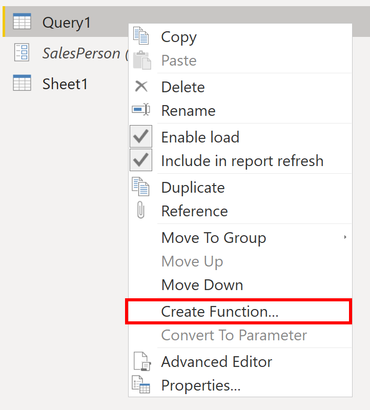
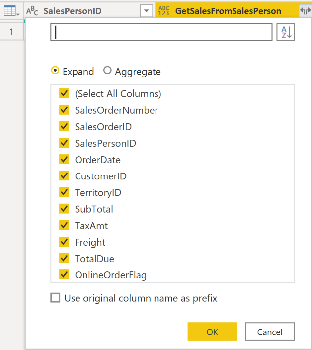

Dynamic reports are reports in which the data can be changed by a developer according to user specifications. Dynamic reports are valuable because a single report can be used for multiple purposes. If you use dynamic reports, you'll have fewer individual reports to create, which will save organizational time and resources.

You can use parameters by determining the values that you want to see data for in the report, and the report updates accordingly by filtering the data for you.

Creating dynamic reports allows you to give users more power over the data that is displayed in your reports; they can change the data source and filter the data by themselves.

In the following example, you've created a report for the Sales team at Tailwind Traders that displays the sales data in the SQL Server database. The report gives a holistic view of how the Sales team is performing. While the report is useful, the Sales team members want to be able to filter the report so that they can view their own data only and track their performance against their sales targets.

## Create dynamic reports for individual values 

To create a dynamic report, you first need to write your SQL query. Then, you will use the **Get data** feature in Power BI Desktop to connect to the database.

In this example, you will connect to your database on SQL Server by following these steps:

1. After you have entered your server details, in the **SQL Server database** window, select **Advanced options**. 

2. Paste the SQL query into the **SQL statement** box and then select **OK**.

   > [!div class="mx-imgBorder"]
   > 

   > [!div class="mx-imgBorder"]
   > 

When the connection is made, the data will be shown in the preview window. 

3. Select **Edit** to open the data in Power Query Editor.

Next, you will create the parameter by following these steps:

1. On the **Home** tab, select **Manage parameters > New parameter**. 

2. On the **Parameters** window, change the default parameter name to something more descriptive so that its purpose is clear. In this case, you will change the name to **SalesPerson**. 

3. Select **Text** from the **Type** list and then select **Any value** from the **Suggested value** list. 

4. Select **OK**.

   > [!div class="mx-imgBorder"]
   > 

   A new query will now be shown for the parameter that you created.

   > [!div class="mx-imgBorder"]
   > 

Now, you need to adjust the code in SQL query to assess your new parameter: 

1. Right-click **Query1** and then select **Advanced editor**. 

2. Replace the existing value in the execute statement with an ampersand (**&**) followed by your parameter name (**SalesPerson**), as illustrated in the following image. 

   > [!div class="mx-imgBorder"]
   > 

3. Make sure that no errors are shown at bottom of the window and then select **Done**.

Though you won't notice a difference on the screen, Power BI will have run the query. 

4. To confirm that the query was run, you can run a test by selecting the parameter query and entering a new value in the **Current Value** box.

   > [!div class="mx-imgBorder"]
   > 

5. A warning icon might display next to the query. If so, select that query to view the warning message, which states that permission is required to run this native database query. Select **Edit Permission** and then select **Run**.

   When the query runs successfully, the parameter will update and display the new value.

   > [!div class="mx-imgBorder"]
   > 

6. Select **Close and Apply** to return to the report editor. 

Now, you can apply the parameter to the report: 

1. Select **Edit queries > Edit parameters**.

2. On the **Edit Parameters** window, enter a new value and then select **OK**. 

3. Select **Apply changes** and then run the native query again. 

   Now, when you view the data, you'll see the data for the new value that was passed through the parameter.

   > [!div class="mx-imgBorder"]
   > 

You can now create a report that displays data for one particular value at a time. If you want to display data for multiple values at the same time, you need to complete additional steps, as outlined in the next section.

## Create dynamic reports for multiple values

To accommodate multiple values at a time, you first need to create a Microsoft Excel worksheet that has a table consisting of one column that contains the list of values.

Next, use the **Get data** feature in Power BI Desktop to connect to the data in that Excel worksheet, and then follow these steps:

1. On the **Navigator** window, select **Edit** to open the data in Power Query Editor, where you'll see a new query for the data table.

   > [!div class="mx-imgBorder"]
   > 

2. Rename the column in the table to something more descriptive. 

3. Change the column data type to **Text** so that it matches the parameter type and you avoid data conversion problems. 

4. In the query **Properties** section, change the name of the data source to something more descriptive. For this example, enter **SalesPersonID**.

Next, you need to create a function that will pass the new **SalesPersonID** query into **Query1**: 

1. Right-click **Query1** and then select **Create function**.

   > [!div class="mx-imgBorder"]
   > 

2. Enter a name for the function and then select **OK**.

   > [!div class="mx-imgBorder"]
   > 

Your new function will appear in the **Queries** pane.

   > [!div class="mx-imgBorder"]
   > 

3. To ensure that **Query1** doesn't show up in the field list for the report, which could potentially confuse users, you can disable it from loading in the report by right-clicking **Query1** again and then selecting **Enable load** (selected by default) to disable the feature.

   > [!div class="mx-imgBorder"]
   > 

4. Select the **SalesPerson** query that you loaded from the Excel worksheet and then, on the **Add Column** tab, select **Invoke custom function** to run the custom function that you created.

   > [!div class="mx-imgBorder"]
   > 

5. On the **Invoke Custom Function** window, select your function from the **Function query** list. 

The **New column name** will update automatically and the table that contains the values that you're going to pass through the parameter will be selected by default. 

6. Select **OK** and, if necessary, run the native query.

   > [!div class="mx-imgBorder"]
   > 

   A new column for your **GetSalesFromSalesPerson** function will appear next to the **SalesPersonID** column.

   > [!div class="mx-imgBorder"]
   > 

7. Select the two arrows icon in the new column header and then select the check boxes of the columns that you want to load. This section is where you will determine the details that will be available in the report for each value (sales person ID). 

8. Clear the **Use original column name as prefix** check box at the bottom of the screen because you don't need to see a prefix with the column names in the report. 

9. Select **OK**.

   > [!div class="mx-imgBorder"]
   > 

   You should be able to view the data for the columns that you selected, for each value (sales person ID).

   > [!div class="mx-imgBorder"]
   > 

   If necessary, you can add more values (sales people IDs) to the **SalesPersonID** column in the Excel worksheet, or you can change the existing values. 

10. Save your changes and then return to Power Query Editor. 

11. On the **Home** tab, select **Refresh Preview**, and then run the native query again (if necessary). You should see the sales from the new sales people IDs that you added into the worksheet.

12. Select **Close and Apply** to return to the report editor, where you'll see the new column names in the Fields pane. 

Now, you can start building your report.
