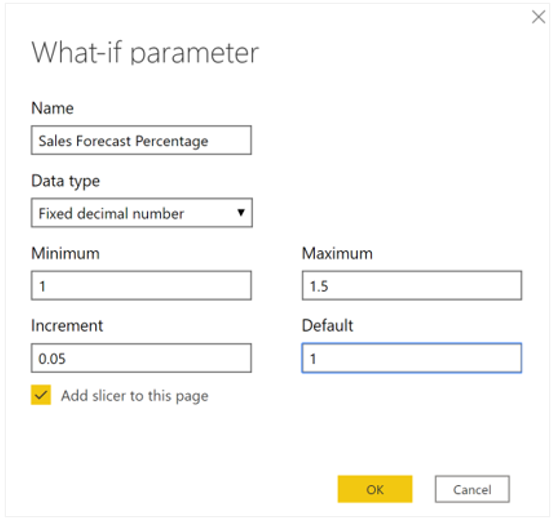

You can use *what-if* parameters to run scenarios and scenario-type analysis on your data. What-if parameters are powerful additions to your Power BI data models and reports because they enable you to look at historical data to analyze potential outcomes if a different scenario had occurred. Additionally, what-if parameters can help you look forward, to predict or forecast what could happen in the future.

You can use what-if parameters in multiple situations, such as to determine the effect of increased sales to deeper discounts, or to let sales consultants see their compensation if they meet certain sales goals or percentages.

In the following example, you want to enable the Sales team to find out how much growth (percentage), from a sales perspective, that they need to make to earn USD 2 million gross sales each month.

## Create a what-if parameter

To create a what-if parameter, follow these steps: 

1. Go to the **Modeling** tab and select **New Parameter**.

   > [!div class="mx-imgBorder"]
   > 

2. On the **What-if parameter** window, configure the new parameter. 

3. For this example, change the parameter name to **Sales Forecast Percentage**.

4. Select **Fixed decimal number** as the **Data type** list because you are using currency in your forecast. 

5. Set the **Minimum** value to **1**, the **Maximum** value to **1.50**, and the **Increment** value to **0.05**, which is how much the parameter will adjust when it is interacted with in a report. 

6. Set the **Default** value to **1.00**. 

7. Leave the **Add slicer to this page** check box selected so that Power BI will automatically add a slicer with your what-if parameter onto the current report page.

8. Select **OK**.

   > [!div class="mx-imgBorder"]
   > 

> [!NOTE]
> For decimal numbers, make sure that you precede the value with a zero (as in **0.50** versus **.50**). Otherwise, the number won't validate and the **OK** button won't be selectable.

The new slicer visual will appear on the current report page. You can move the slider to see the numbers increase according to the settings that you applied. You should also see a new field for the Sales Forecast Percentage table in the Fields pane, and when you expand that field, the what-if parameter should be selected.

> [!div class="mx-imgBorder"]
> 

Similarly, you should see that a measure was also created. You can use this measure to visualize the current value of the what-if parameter.

> [!div class="mx-imgBorder"]
> 

After you have created a what-if parameter, the parameter and the measure will become part of your model; therefore, they will be available throughout the report and can be used on other report pages. Additionally, because the parameter and measure are part of the model, you can delete the slicer from the report page. If you want it back, you can drag the what-if parameter from the **Fields** list onto the canvas and then change the visual type to a slicer.

## Use a what-if parameter

If you want to use the what-if parameter after you've created it, you will need to create a new measure whose value adjusts with the slider. You can create complex and unique measures that let your report users visualize the variable of your what-if parameter. However, to keep this example simple, the new measure is the total sales amount, with the forecast percentage applied, as illustrated in the following image.

> [!div class="mx-imgBorder"]
> 

Next, you will create a clustered column chart with the **MonthName** field on the axis and the **GrossSales** and **Gross Sales Forecast** measures as the values.

Initially, the bars are similar; however, as you move the slider, notice that the **Gross Sales Forecast** column reflects the sales forecast percentage amount.

   > [!div class="mx-imgBorder"]
   > 

To enhance the visual, you can add a constant line so that you can clearly see how the organization is performing against a particular threshold or target. In this example, you will add a constant line with USD 2 million as the threshold value. Then, you will use the slider to find out what percentage of gross sales needs to increase by, each month, to reach that threshold. In the following image, the gross sales need to increase by 1.40 percent to reach the USD 2 million threshold.

> [!div class="mx-imgBorder"]
> 
