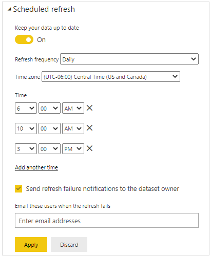

The **Scheduled refresh** feature in Power BI allows you to define the frequency and time slots to refresh a particular dataset. Scheduling the refresh of your data will save you time because you don't have to manually refresh the data. It also ensures that users can access the most up-to-date data.

In this example, you are creating a report, but then realize that the version of the sales data that you're using isn't the most up to date. You check the refresh status and notice that it was last refreshed 10 days ago, and no refresh is scheduled to take place.

> [!div class="mx-imgBorder"]
> 

Considering how important it is to have accurate sales data, you need to find a solution. Usually, the data is updated weekly, but you don't want to return to the report every week to manually refresh the dataset, and you know that you occasionally forget to do so. Therefore, you decide to use the **Scheduled refresh** functionality in Power BI to solve this problem.

## Set up a refresh schedule

Before you can set up a refresh schedule, you need to have created a gateway connection.

To set up a refresh schedule for your dataset, follow these steps:

1. Go to the **Datasets + dataflows** page.

2. Hover over the dataset for which you want to set up the schedule and then select the **Schedule refresh** icon.

   > [!div class="mx-imgBorder"]
   > 

3. On the **Settings** page, turn on the **Scheduled refresh** feature.

4. Select the **Refresh frequency** and ensure that the correct time zone is selected.

5. Add the time(s) that you want the refresh to occur. You can configure up to eight daily time slots, if your dataset is on shared capacity, or 48 time slots on Power BI Premium.

6. When you have finished configuring the scheduled refresh, select **Apply**.

> [!NOTE]
> While you can set a time for the refresh, be aware that the refresh might not take place at that exact time. Power BI starts scheduled refreshes on a best effort basis. The goal is to initiate the refresh within 15 minutes of the scheduled time slot, but a delay of up to one hour can occur if the service can't allocate the required resources sooner.

In this example, you want the system to refresh the sales data on a daily basis, at 6:00 AM, 10:00 AM, and 3:00 PM, as illustrated in the following image.

> [!div class="mx-imgBorder"]
>
> 

When you have configured a refresh schedule, the dataset settings page informs you of the next refresh time, as shown in the following image.

> [!div class="mx-imgBorder"]
> 

## Perform an on-demand refresh

In addition to the scheduled refreshes, you can refresh a dataset at any time by performing an on-demand refresh. This type of refresh doesn't affect the next scheduled refresh time.

For example, you might want to refresh now because you need to view the most recent data and can't wait for the next refresh time, or you might want to test your gateway and data source configuration.

To perform an on-demand refresh, on the **Datasets + dataflows** page, hover over the dataset that you want to refresh and then select the **Refresh now** icon.

> [!div class="mx-imgBorder"]
> 

## Check the refresh status and history

You can check the refresh status and history at any time. This feature is useful if you want to find out when the last refresh occurred and when the next one is scheduled. It is also good practice to check the status of your datasets occasionally to check if refresh errors have occurred.

> [!NOTE]
> Power BI deactivates your refresh schedule after four consecutive failures or when the service detects an unrecoverable error that requires a configuration update, such as invalid or expired credentials. It is not possible to change the consecutive failures threshold.

A quick way to check the refresh status is to view the list of datasets in a workspace.

> [!div class="mx-imgBorder"]
> 

If a dataset displays a small warning icon, you'll know that the dataset is currently experiencing an issue. Select the warning icon to get more information.

> [!div class="mx-imgBorder"]
> 

You should also check the refresh history occasionally to review the success or failure status of past synchronization cycles. To view the refresh history, open the dataset's settings page and then select **Refresh history**.

> [!div class="mx-imgBorder"]
> 
