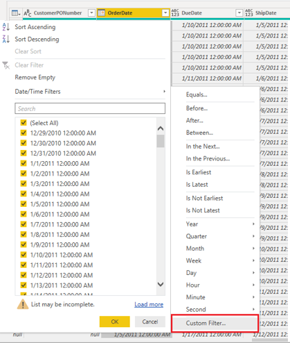
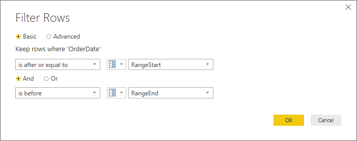
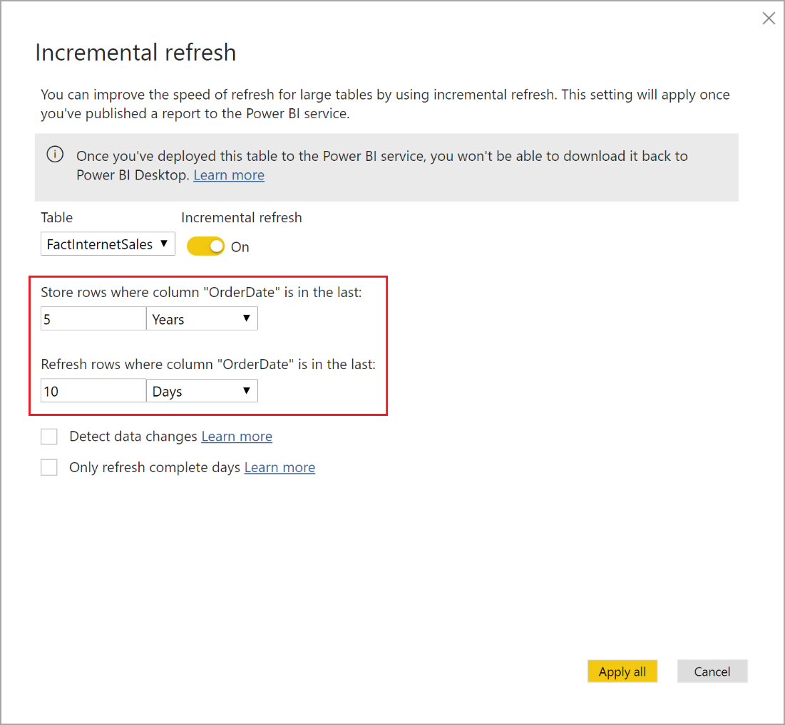

The **Incremental refresh** feature in Power BI is a popular feature because it allows you to refresh large datasets quickly and as often as you need, without having to reload historical data each time.

> [!WARNING]
> Incremental refresh should only be used on data sources and queries that support query folding. If query folding isn't supported, incremental refresh could lead to a bad user experience because, while it will still issue the queries for the relevant partitions, it will pull all data, potentially multiple times.

Traditionally, complex code was required for running incremental refreshes, but you can now define a refresh policy within Power BI Desktop. The refresh policy is applied when you publish to Power BI service, which then does the work of managing partitions for optimized data loads, resulting in the following benefits:

- **Quicker refreshes** - Only data that needs to be changed gets refreshed. For example, if you have five years' worth of data, and you only need to refresh the last 10 days because that is the only data that has changed, the incremental refresh will refresh only those 10 days of data. Undoubtedly, the time it takes to refresh 10 days of data is much shorter than five years of data.

- **More reliable refreshes** - You no longer need to keep your long-running data connections open to schedule a refresh.

- **Reduced resource consumption** - Because you only need to refresh the smaller the amount of data, the overall consumption of memory and other resources is reduced.

In this example, the Sales team has come to you with a dilemma. The data in their report is already out-of-date. It isn't feasible for you to manually refresh the data by adding a new file because the refreshes need to happen regularly to match the frequency of the sales transactions that are occurring. Also, the manual refresh task is becoming more difficult because the datasets have millions of rows. Consequently, you need to implement a better data refresh solution.

You can define an incremental refresh policy to solve this business problem. This process involves the following steps:

1. Define the filter parameters.

2. Use the parameters to apply a filter.

3. Define the incremental refresh policy.

4. Publish changes to Power BI service.

## Define filter parameters

Whether you are using incremental refresh or not, large datasets are commonly filtered when they are imported into Power BI Desktop because the PBIX file is limited by the memory resources that are available on the desktop computer. For incremental refresh, the datasets are filtered by two date/time parameters: **RangeStart** and **RangeEnd**. These parameters have a dual purpose. In Power BI Desktop, they are the filtering window because they restrict the used data to the range that is listed in the start and end dates. After they have been published to the service, the parameters are taken over to be the sliding window to determine what data to pull in.

To define the parameters for the incremental refresh, follow these steps:

1. Open your dataset in Power Query Editor.

2. On the **Home** tab, select **Manage Parameters**.

3. On the **Parameters** window that displays, add two new parameters, **RangeStart** and **RangeEnd**, ensuring that for both parameters, the **Type** is set to **Date/Time** and the **Suggested Value** is set to **Any value**.

4. Regarding the **Current Value**, for the **RangeStart** parameter, enter the date on which you want to begin the import, and for the **RangeEnd** parameter, enter the date on which you want the import to end.

   > [!div class="mx-imgBorder"]
   > 

## Apply the filter

When you have defined the new parameters, you can apply the filter by following these steps:

1. Go to the applicable **Date** column and then right-click that column and select **Custom Filter**.

   > [!div class="mx-imgBorder"]
   > 

2. In the **Filter Rows** window that displays, to avoid the double counting of rows, make sure that you keep rows where **OrderDate** is after or equal to the **RangeStart** parameter and before the **RangeEnd** parameter.

   > [!div class="mx-imgBorder"]
   > 

3. Select **Close and Apply** from the Power Query Editor.

You should now see a subset of the dataset in Power BI Desktop.

## Define the incremental refresh policy

When you have filtered the data, you can define the incremental refresh policy for the data table, which sets up the refresh process.

Right-click the applicable table and then select **Incremental refresh**.

> [!div class="mx-imgBorder"]
> 

On the **Incremental refresh** window that displays, turn on the **Incremental refresh** option. Then, configure the refresh as required. In this example, you will define a refresh policy to store data for five full calendar years, plus data for the current year up to the current date, and incrementally refresh 10 days of data.

> [!div class="mx-imgBorder"]
> 

The first refresh operation in Power BI service will load the historical data for the last five years. The subsequent refresh operations are incremental, and they will refresh the data that was changed in the last 10 days up to the current date. The incremental refreshes will also remove calendar years that are older than five years prior to the current date.

## Publish to Power BI service

When you have defined the incremental refresh policy in Power BI Desktop, to apply that refresh policy, you need to publish the report to Power BI service.

For more information, see [Incremental refresh on Power BI](https://docs.microsoft.com/power-bi/service-premium-incremental-refresh/?azure-portal=true).
