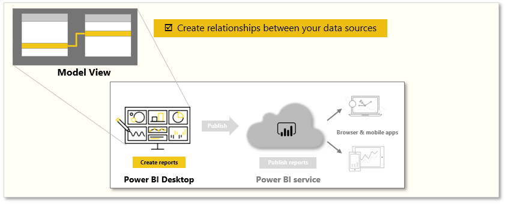
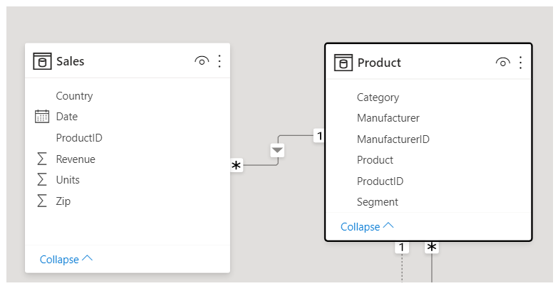
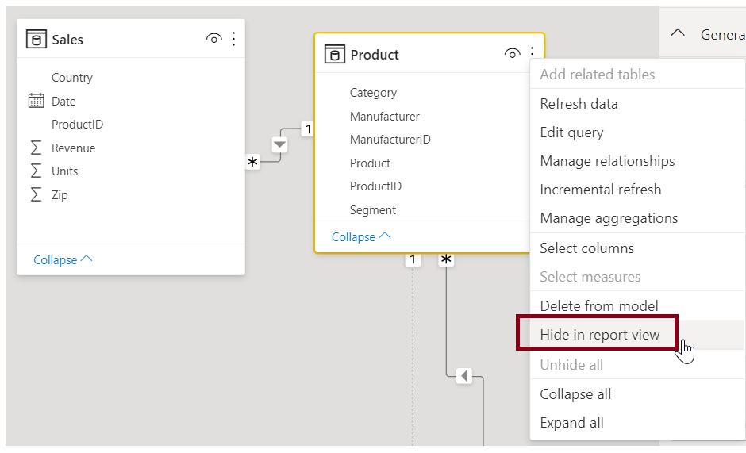
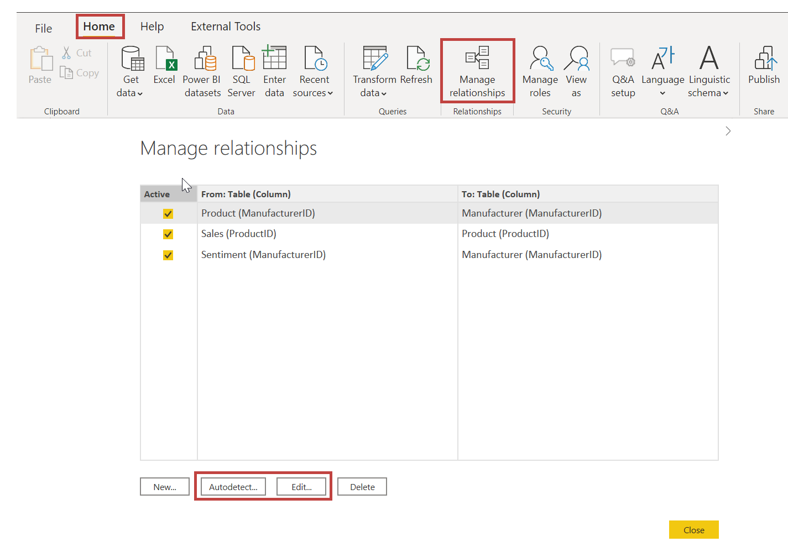

The **Model view** in Power BI Desktop allows you to visually set the relationship between tables or elements. Use the Model view to see a diagrammatic view of your data.

Tasks in this unit include:

**Video**: Manage data relationships
> [!VIDEO https://www.microsoft.com/videoplayer/embed/RE3wRhg]

In the Model view, notice that a block represents each table and its columns and that lines between them represent relationships.

Adding and removing relationships is straightforward. To remove a relationship, right-click the relationship and select **Delete**. To create a relationship, drag and drop the fields that you want to link between tables.

To hide a table or individual column from your report, right-click the table or column in the Model view and select **Hide in report view**.

For a more detailed view of your data relationships, on the **Home** tab, select **Manage Relationships**. The **Manage Relationships** dialog box displays your relationships as a list instead of as a visual diagram. From the dialog box, you can select **Autodetect** to find relationships in new or updated data. Select **Edit** to manually edit your relationships. You'll find advanced options in the Edit section to set the *Cardinality* and *Cross-filter* direction of your relationships.

Your options for Cardinality are explained in the following table.

| Cardinality options 	|  Example                             	|
|-------------------	|------	|-----------------------------------	|
| *Many to One* 	| The most common default relationship. The column in one table can have more than one instance of a value. The related table (or lookup table) has only one instance of a value.	|
| *One to One* 	| The column in one table has only one instance of a particular value, and the other related table has only one instance of a particular value. 	|

By default, you will set relationships to cross-filter in both directions. Cross-filtering in just one direction limits some of the modeling capabilities in a relationship.

Setting accurate relationships between your data allows you to create complex calculations across multiple data elements.

For more information, see: [Create and manage relationships in Power BI Desktop](https://docs.microsoft.com/power-bi/desktop-create-and-manage-relationships/?azure-portal=true).
