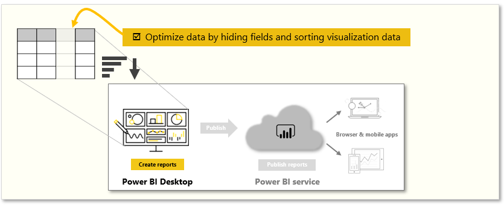
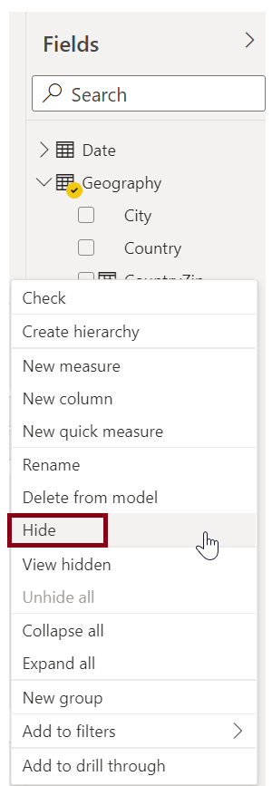
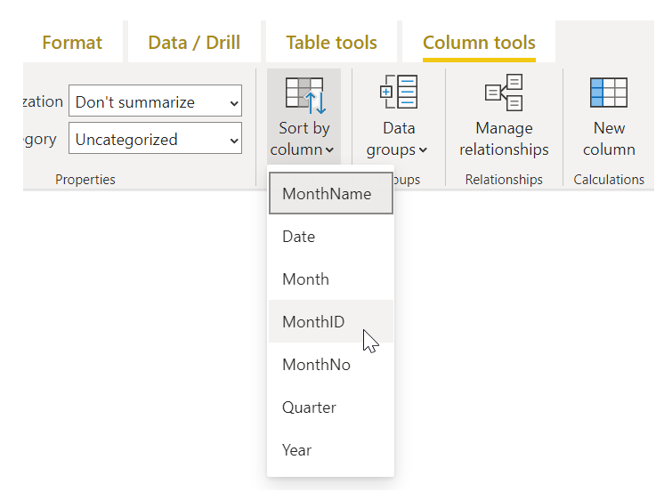

Imported data often contains fields that you don't need for your reporting and visualization tasks. Data might contain unnecessary information or it might be available in another column. Power BI Desktop has tools to optimize your data and make it more usable for building reports and visuals.

Tasks in this module include:

**Video**: Optimize data models
> [!VIDEO https://www.microsoft.com/videoplayer/embed/RE3wRhh]

## Hide fields
To hide a field in the Fields pane of Power BI Desktop, right-click the column and select **Hide**. Your hidden fields aren't deleted. If you've used a hidden field in existing visuals, the data is still there; the hidden field just isn't displayed on the Fields pane.

If you view tables in the **Model** view, hidden fields appear dimmed. The data in these tables is still available and is still part of the model. You can unhide any field that has been hidden by right-clicking the field and then selecting **unhide**.

## Sort visualization data by another field
The **Sort by Column** tool, available on the **Modeling** tab, is useful to help ensure that your data is displayed in the order that you intended.

As a common example, data that includes the name of the month is sorted alphabetically by default, for example, August would appear before February.

In this case, selecting the field in the **Fields** list, selecting **Sort by Column** from the **Modeling** tab, and then choosing a field to sort by can remedy the problem. The **MonthNo** category sort option will order the months as intended.

Setting the data type for a field is another way to optimize your information so that it's handled correctly. To change a data type from the report canvas, select the column in the Fields pane, and then use the **Format** drop-down menu to select one of the formatting options. Any visuals you've created that display that field are updated automatically.

For more information, see [Sort by column in Power BI Desktop](https://docs.microsoft.com/power-bi/desktop-sort-by-column/?azure-portal=true).
