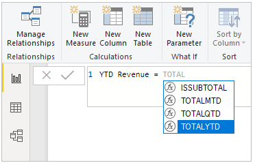
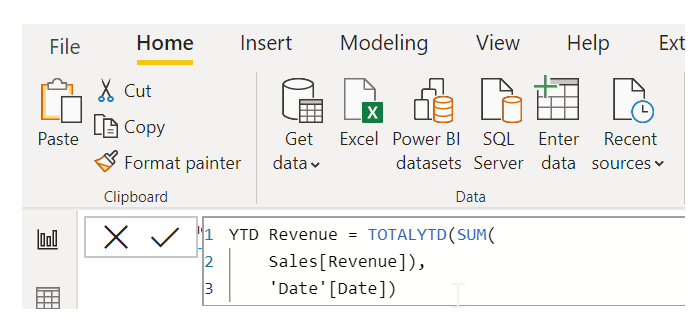

In Power BI, *measures* are defined calculations on your data that are performed at the time of your query. Measures are calculated as you interact with your reports and aren't stored in your database.

Tasks in this unit include:

**Video**: Create measures
> [!VIDEO https://www.microsoft.com/videoplayer/embed/RE3wWvJ]

> [!NOTE]
> To follow along with the examples in the videos and on this page, download the sample Access database [here](https://go.microsoft.com/fwlink/?linkid=2120368/?azure-portal=true) and import into Power BI Desktop (**Get Data > Database > Access database**). If you have any issues loading the Access database, please read this [article](https://go.microsoft.com/fwlink/?linkid=2131277/?azure-portal=true).

## Create a measure

To create a measure, in **Report** view, select **New Measure** from the **Modeling** tab.

From the Formula bar, you can enter the DAX expression that defines your measure. As you enter your calculation, Power BI suggests relevant DAX functions and data fields. You'll also receive a tooltip that explains some of the syntax and function parameters.

If your calculation is long, you can add extra line breaks in the Expression Editor by typing **ALT-Enter**.

## Apply a measure

After you've created a new measure, it will appear in one of the tables on the Fields pane, which is found on the right side of the screen. Power BI inserts the new measure into whichever table you have currently selected. While it doesn't matter, exactly, where the measure is located in your data, you can easily move it by selecting the measure and using the **Home Table** drop-down menu on the **Measure tools** tab.

You can use a measure like any other table column: just drag and drop it onto the report canvas or visualization fields. Measures also integrate seamlessly with slicers, segmenting your data on the fly, which means that you can define a measure once and then use it in many different visualizations.

For more information, see [Tutorial: Create your own measures in Power BI Desktop](https://docs.microsoft.com/power-bi/desktop-tutorial-create-measures/?azure-portal=true).
