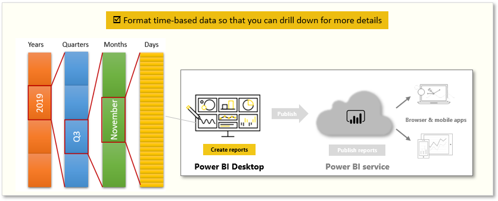
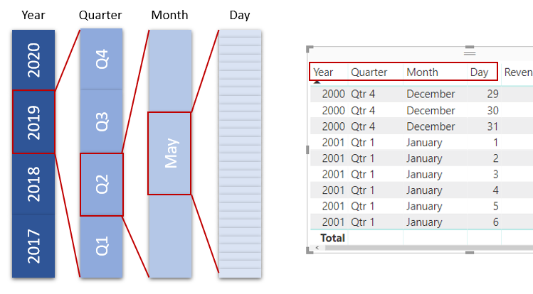
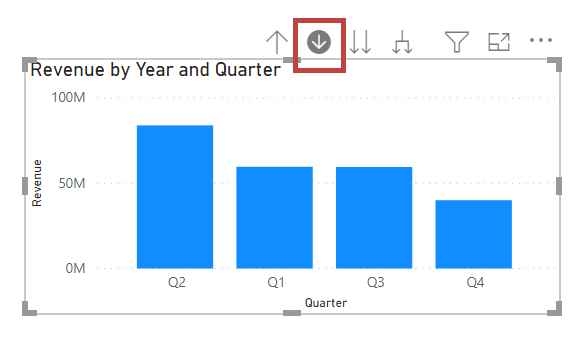
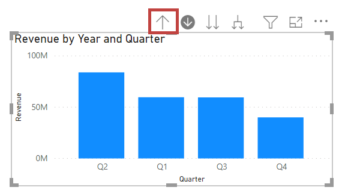

Analyzing time-based data with Power BI is a simple process. The modeling tools in Power BI Desktop automatically generate fields that let you drill down through time periods. 

Tasks in this unit include:

**Video**: Explore time based data
> [!VIDEO https://www.microsoft.com/videoplayer/embed/RE3x6SD]

When you create a table visualization in your report by using a date field, Power BI Desktop automatically includes breakdowns by time period. For example, the single date field in the **Date** table was automatically separated into Year, Quarter, Month, and Day by Power BI.

Visuals display data at the *year* level by default, but you can change that by turning on **Drill Down** in the top, right-hand corner of the visual.

When you select the bars or lines in your chart, the system will drill down to the next level of time hierarchy, for example, from *years* to *quarters*. You can continue to drill down until you reach the most granular level of the hierarchy: *days*. To move back up through the time hierarchy, select **Drill Up** in the top, left-hand corner of the visual.

You can also drill down through all the data that is shown on the visual instead of through one selected period. To do so, use the **Go to the next level in the hierarchy** double-arrow icon.

As long as your model has a date field, Power BI will automatically generate different views for different time hierarchies.
