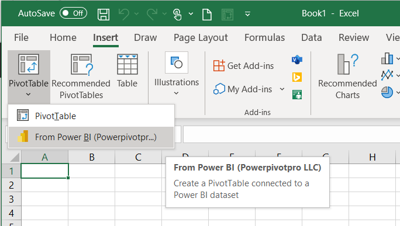
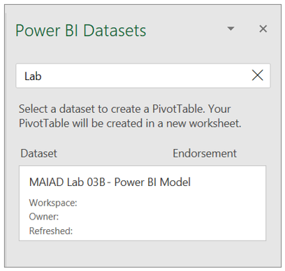
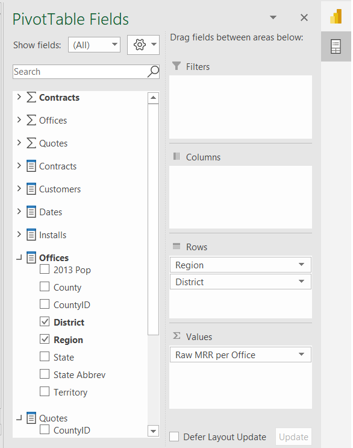
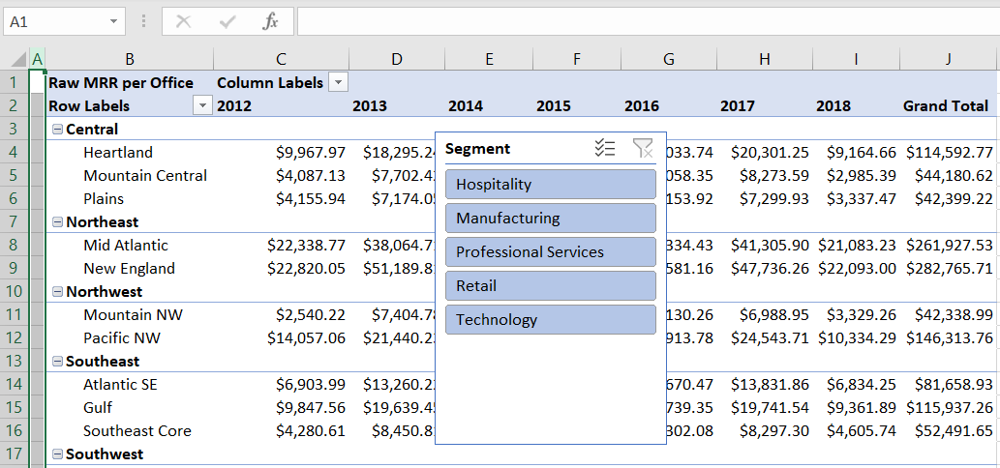
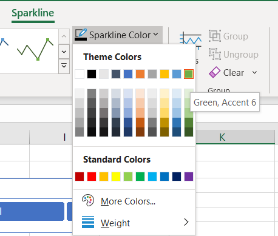
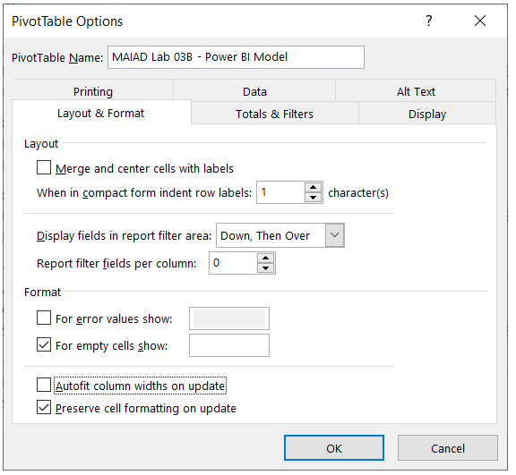

## Overview

The estimated time to complete this exercise is 30 minutes.

In this exercise, you will complete the following tasks:

1.  Use Excel to create a pivot table from a Dataset published in the Power BI service

1.  Add Sparkline Charts

> [!NOTE]
> This exercise has been created based on the sales activities of the *fictitious* Wi-Fi company called SureWi which has been provided by [P3 Adaptive](https://p3adaptive.com/). The data is property of P3 Adaptive and has been shared with the purpose of demonstrating Excel and Power BI functionality with industry sample data. Any use of this data must include this attribution to P3 Adaptive. If you have not already, download and extract the lab files from https://aka.ms/modern-analytics-labs into your **C:\ANALYST-LABS** folder. 

## Exercise 1: Use Excel to create a Pivot Table from a Data Set in the Power BI service

In this exercise, you will use Excel to connect to a published Data Set in the Power BI service.

### Task 1: Launch Excel

In this task, you will launch a new blank worksheet to get started.

1.  Launch Excel.

	> [!NOTE]
	> If you have not already signed in to your O365 account, you may be prompted to sign in, use your work email address and password to sign into your account.

1.  Create a new blank workbook.

### Task 2: Use Insert new Pivot Table from Power BI

In this task, you will create a new Pivot Table workspace connected to a published data set in the Power BI service.

1.  Select the **Insert** tab on the Main Excel main ribbon menu.

1.  Choose **PivotTable** > **From Power BI**.

	> [!div class="mx-imgBorder"]
	> 

1.  If you have many published Data Sets, you can use the **Search** option to type in "Lab", then select the **MAIAD Lab 03 - Power BI Model** data set from the available data set options.

	> [!div class="mx-imgBorder"]
	> 

1.  Notice you have a new Pivot Table workspace and the PivotTable Fields with Measure and Field tables.

	> [!NOTE]
	> Measure tables are identified by the summation icon. This behaviour occurs when Excel connects to a Power BI data set. All Measures that can ONLY go into the Values of the PivotTable Fields will be in located in the summation icon table name. And any of the columns or calculated columns that are used for Filters, Columns, or Rows are located in a table icon of the same name.

	> [!div class="mx-imgBorder"]
	> 

	> [!NOTE]
	> On the right-hand side of the PivotTable Fields window, notice the icons that allow you to toggle the window between Power BI Datasets or PivotTable Fields.

	> [!div class="mx-imgBorder"]
	> 

### Task 3: Add Measures to the PivotTable Fields Values

In this task, you will populate the PivotTable with Measure fields from the Power BI Dataset connection.

1.  From the **Contracts** measure table, drag the [Raw MRR per Office] measure to the **Values** section in the PivotTable Fields List.

	> [!div class="mx-imgBorder"]
	> 

### Task 4: Add Fields to the PivotTable Fields Rows

In this task, you will populate the PivotTable with Lookup fields from the Power BI Dataset connection.

1.  From the **Offices** field table, drag the [Region]and [District] fields to the **Rows** section in the PivotTable Fields List.

	> [!NOTE]
	> Lookup field tables are identified by the table with fields icon.

	> [!div class="mx-imgBorder"]
	> 

1.  From the **Dates** field table, drag the [Year] field to the **Columns** section in the PivotTable Fields List.

	> [!div class="mx-imgBorder"]
	> 

### Task 5: Add Slicers

In this task, you will Add Slicers connected to the Pivot Table.

1. If the PivotTable Fields list does not display, click on the Pivot Table to make it *active* and then use a right click and choose **Show Field List**.

1. In the PivotTable Fields, locate the **Customers** Lookup fields table, right-click on the [Company Size] field.

1. Select the **Add as Slicer** option.

	> [!NOTE]
	> The Slicer will just appear in a random location the worksheet, we will reposition the Slicer in the next task.

1. You can also add a Slicer from the Main ribbon menu. Click on the Pivot Table to make it active and then click on the **PivotTable Analyze** tab in the Main ribbon menu.

1. Click the **Insert Slicer** button.

1. From the **Customers** Lookup fields table, click the checkbox next to the [Segment] field.

### Task 6: Move & Format Slicers

In this task, you will insert blank Rows and Columns to make space for the Slicers to create a mindful report design for the end users.

1. Right-click on Column A and **Insert 1 blank column** to the left of the Pivot Table.

1. Right-click on Column A to resize the Column Width to 1.

	> [!div class="mx-imgBorder"]
	> 

1. Right-click in Row 1 and **Insert 1 blank row** above the Pivot Table.

1. Use **CTRL+Y** to repeat the insert **five times** to create a total of 6 blank rows above the Pivot Table. This will provide space for our Slicers above the Pivot Table.

1. Drag the **Company Size slicer** above the Pivot Table.

1. With the Company Size slicer selected, choose the **Slicer** tab on the Main ribbon menu.

1. Change the Slicer Buttons number of Columns to 3.

	> [!div class="mx-imgBorder"]
	> 

1. Change the Slicer Style color to **Dark Blue**.

	> [!div class="mx-imgBorder"]
	> 

1. Drag the **Segment slicer** above the Pivot Table and to the right of the Company Size slicer.

1. With the Segment slicer selected, choose the **Slicer** tab in the Main ribbon menu.

1. Change the Slicer Buttons number of Columns to 5.

1. Change the Color to **Dark Blue**.

	> [!div class="mx-imgBorder"]
	> 

### Task 7: Add Report Title & Format Pivot Table

In this task, you will add a title for the Report and apply final formatting to the Pivot Table.

1. In cell B2, enter the Report title **MAIAD - Lab 03B - Excel & Power BI service - better together** and use **CTRL + B** to make the font bold.

1. In cell B8, enter the Pivot Table row title **By Region & District**.

1. In cell C7, enter the Pivot Table column title **By Year**.

	> [!div class="mx-imgBorder"]
	> 

1. Click in the Pivot Table to make it active.

1. Select **Design** from the Main ribbon menu > **Subtotals** button > **Subtotals at Top of Group** option. This will create Subtotals for each Region in the Pivot Table.

1. Highlight Columns C to J and with a right-click, change the Column Width to 12.

1. With the Columns C to J still highlighted, select the **Center** Alignment from the Home tab on the Main ribbon menu.

	> [!div class="mx-imgBorder"]
	> 

1. Expand the Segment Slicer so that each of the values is fully visible to the end user.

1. Right-click on the Pivot Table and select **PivotTable Options...**

1. From the Layout & Format tab, de-select the **Autofit column widths on update** checkbox.

	> [!div class="mx-imgBorder"]
	> 

## Exercise 2: Add Sparklines 

In this exercise, you will create Sparkline charts to display the Year trend next to the Pivot Table.

### Task 1: Create Sparkline chart

In this task, you will create a Sparkline chart, combining features in Excel with a Data Model published to the Power BI service.

1. Position your cursor in cell **K9** then choose **Insert** from the main ribbon menu and select the **Line** button.

	> [!div class="mx-imgBorder"]
	> 

1. Enter the Data Range for the **Central Region** and the Years 2013 to 2017 (D9:H9). Then select the **OK** button.

1. From the Sparkline menu options, select the **Sparkline Color drop down** and change to **Green, Accent 6**.

	> [!div class="mx-imgBorder"]
	> 

1. From the Sparkline menu options, select the **Marker Color drop down** and add a **Green, Accent 6** High Point. Then add a **Dark Red** Low Point.

	> [!div class="mx-imgBorder"]
	> 

1. In Column K, copy/paste the Sparkline for each of the Region rows.

1. In cell K8, enter the title **Completed Year Trend**.

	> [!div class="mx-imgBorder"]
	> 

1. Hold the **CTRL** key and highlight each of the Region rows (9, 13, 16, 19, and 23) and then with a right-click, select the **Row Height**... and change to 20.

	> [!div class="mx-imgBorder"]
	> 

### Task 2: Final Formatting

In this task, you will create a final polished report by removing the Excel Headings and Gridlines.

1. From the main ribbon menu, select the **View** tab.

1. De-select the **Formula Bar**, **Headings**, and **Gridlines** check boxes.

	> [!div class="mx-imgBorder"]
	> 

1. Select the Pivot Table and use a **right-click** to display the **PivotTable Options** and de-select the **Autofit column widths on update check box**. This will keep the Pivot Table column widths when slicers are selected.

	> [!div class="mx-imgBorder"]
	> 

### Task 3: Save the Excel file

In this task, you will save the Excel file.

1. From the main ribbon menu, select **File** > **Save**.

1. Navigate to the **C:\ANALYST-LABS\Lab 03B** folder.

1. Save the file as **MAIAD Lab 03B - Solution.xlsx**.

In this exercise, you started in the Excel application and connected to a published data set in the Power BI service to create a Pivot Table with Slicers and Sparkline charts, demonstrating how Excel + Power BI is used better together!

> [!div class="mx-imgBorder"]
> 

