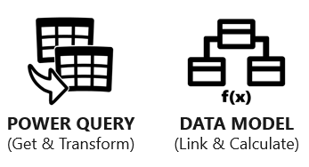
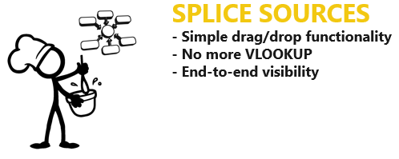
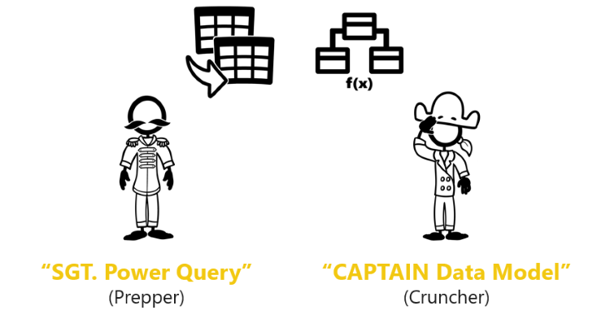

Microsoft Excel is an application that has been used since 1985 by over 750 million users worldwide. Currently, most reports and forecasts are built in Excel by using the existing capabilities that were developed decades ago.

Excel offers more functionality than you might have realized. In 2009, a new version of Excel was created to enable more modern analysis, provide interactive business intelligence, and build a data culture within organizations.

> [!VIDEO https://www.microsoft.com/videoplayer/embed/]

Excel has received two major upgrades:

-   **Power Query**, which is occasionally referred to as **Get & Transform** due to its home on the Excel data ribbon.

-   **Power Pivot**, which is also known as **Data Model**.

> [!div class="mx-imgBorder"]
> []

Power Query and Data Model are two Excel technologies that have been offered since 2009, and they have evolved into Microsoft Power BI, which includes these two Excel technologies. However, Power BI differs in that it also offers you the ability to publish data models to the Power BI service cloud for creating and sharing reports and dashboards.

Collectively, Excel plus these two new technologies and Power BI are referred to as Modern Analytics. Adoption of these modern tools will save you time and generate smarter, more valuable results, providing real benefit to your company and your career.

Moreover, you can use these technologies in a self-service or enterprise capacity to improve the way that you work with data.

## Daily benefits for you and your organization

You and your organization will experience daily benefits from Modern Analytics capabilities, such as **Auto Refresh**, **Nimble Response**, **Splice Sources**, and **Capacity & Speed**. Additionally, these tools provide you with a competitive edge when you are working with data.

The following sections examine these daily benefits in depth.

> [!div class="mx-imgBorder"]
> []

Maintaining your existing, traditional Excel spreadsheet reports and keeping them up to date with the latest data is often time-consuming. This labor-intensive process results in businesses frequently having to act on stale information while it simultaneously consumes the analyst's time, limiting innovation and prohibiting real analysis. Auto Refresh capabilities help you keep your data up to date without the need for manual labor. Therefore, rather than expending extra effort, you can apply your time to driving data insights, actions, and real business outcomes.

> [!div class="mx-imgBorder"]
> []

New reports will take less time to build. Frequently, an analyst will spend hours working on a report and will deliver precisely what was asked for, only to be asked a follow-up question that might require a complete rebuild of the traditional Excel spreadsheet. Contrarily, Modern Analytics will let you answer follow-up questions with a single click, requiring no time and effort to rebuild. This feature is beneficial, considering that most people aren't certain about what they need until they physically see what they've asked for. Well-built solutions that use Modern Analytics provide speedy results and near limitless answers to follow up questions, and they empower nimble responses to organizations' most challenging business questions.

> [!div class="mx-imgBorder"]
> []

Most businesses run on multiple systems. The most valuable business questions are not specific to one silo or system. For example, answering the question, "What is our cash flow forecast for 90 days from now?" might require information from CRM, accounting, and other systems.

Power Query connects to data from disparate business systems and sources to splice, integrate, and shape data to create data models, resulting in end-to-end visibility across your business. Traditional Excel was not built to provide that ability.

> [!div class="mx-imgBorder"]
> []

Modern Excel has near-limitless data capacity. Traditional Excel is limited to one million rows of data for each sheet but is often slow before you reach one million rows. When you use Excel with Power Query, Data Model, and Power BI, it routinely handles tens of millions of rows while recalculating in a fraction of the time. This feature unlocks usage patterns that people might not consider in regular Excel, such as loading multiple years' worth of data into a single workbook rather than starting a new workbook each month. This approach saves you time while allowing you to perform analyses that you might not have imagined were possible.

## Ecosystem

Several references have been made to Microsoft Power BI-related tools and technologies. The following sections closely examine how these tools relate to each other. 

> [!div class="mx-imgBorder"]
> []

Every solution starts with raw data, which is messy.

With Power Query, you can grab, clean, and shape data for feeding into the data model. The **Data Model** feature "crunches" data into meaningful, insightful metrics and analytics, and it's used to explore data to drive informed business decisions and measure impact.

By using Power BI Desktop to create a data model and create reports, you can publish or share those dataset and report assets into Power BI service for consumption. Power BI reports have a modern reporting and visualization surface with support for customizing reports and a dashboard for mobile devices. You can also use the familiar Excel canvas as the reporting and visualization surface with the **Analyze In Excel** feature in Power BI, which includes enhanced functions to access the calculations that are performed by your data model.

This Modern Analytics ecosystem allows data professionals to create a *single version of the truth* solution to empower self-service or to support enterprise scale business intelligence reporting and analysis.

## Roles in action, *the tech*

It's important to understand how the roles of Power Query and Data Model are relative to each other. The premise of the following analogy might seem unusual, but it might help you remember the basic details. Consider a scenario where these tools are referred to as Sergeant Prepper and Captain Crunch, respectively. Captain Crunch does the data crunching (or analysis), and Sergeant Prepper connects to messy, disparate data sources to clean, prepare, and shape the data for data crunching.

> [!div class="mx-imgBorder"]
> []

Essentially, Data Model creates business value; however, it can't do its job without Power Query feeding it the correct data. It might be tempting for new learners to use Power Query as the "cruncher" and then build most of the analysis in Power Query. However, we don't recommend that approach because you will miss what Data Model could have done for you.

> [!div class="mx-imgBorder"]
> []

Operationally, Power Query comes first. It connects, cleans, prepares, and transforms data for Data Model. In the current Modern Analytics landscape, it's best to create the data model in Power BI Desktop and then publish, share, and consume in Power BI service, Excel, or even in Microsoft Teams or SharePoint.

## Roles in action, *the people*

The technologies of Power Query, Data Model, Power BI Desktop, and Power BI service have specific roles to play together to achieve Modern Analytics, as do the people in your organization.

> [!div class="mx-imgBorder"]
> []

A published data model represents a certified single version of the truth. However, you might want to know where the data model comes from. The original author, a knowledgeable data expert who is familiar with the business data sources, will develop and design the data model to target key business problems and metrics.

A Power BI admin can promote and certify the data model, empowering other report authors to find, create, and share reports and dashboards.

Business users will use Power BI or Excel to uncover data trends or other insights to inform business decisions and drive results.

Consider a scenario where you have a single version of the truth data model for your finance, sales, healthcare, manufacturing, or other industry business question. This situation is an aspiration, and it's a possibility with Modern Analytics by using Excel and Power BI.
