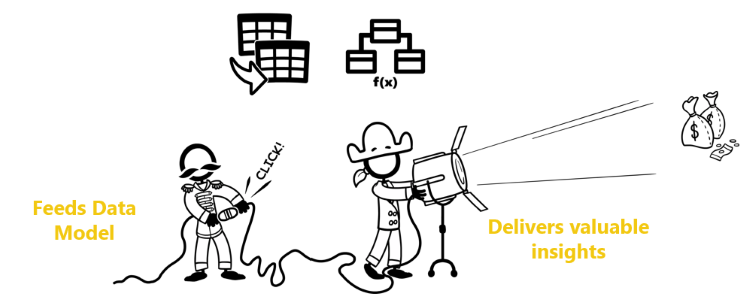

## Modern analystics - Roles in action, *the tech*

It's important to understand how the roles of Power Query and Data Model are relative to each other. The premise of the following analogy might seem unusual, but it might help you remember the basic details. Consider a scenario where these tools are referred to as Sergeant Power Query and Captain data model, respectively. Captain Crunch does the data crunching (or analysis), and Sergeant Power Query connects to messy, disparate data sources to clean, prepare, and shape the data for data crunching.

> [!div class="mx-imgBorder"]
> 

Essentially, Data Model creates business value; however, it can't do its job without Power Query feeding it the correct data. It might be tempting for new learners to use Power Query as the "cruncher" and then build most of the analysis in Power Query. However, that approach is not recommened because you will miss what Data Model could have done for you.

> [!div class="mx-imgBorder"]
> 

Operationally, Power Query comes first. It connects, cleans, prepares, and transforms data for Data Model. In the current modern analytics landscape, it's best to create the data model in Power BI Desktop and then publish, share, and consume in Power BI service, Excel, or even in Microsoft Teams or SharePoint.

## Modern analystics - Roles in action, *the people*

The technologies of Power Query, Data Model, Power BI Desktop, and Power BI service have specific roles to play together to achieve modern analytics, as do the people in your organization.

> [!div class="mx-imgBorder"]
> 

A published data model represents a certified single version of the truth. However, you might want to know where the data model comes from. The original author, a knowledgeable data expert who is familiar with the business data sources, will develop and design the data model to target key business problems and metrics.

A Power BI admin can promote and certify the data model, empowering other report authors to find, create, and share reports and dashboards.

Business users will use Power BI or Excel to uncover data trends or other insights to inform business decisions and drive results.

Consider a scenario where you have a single version of the truth data model for your finance, sales, healthcare, manufacturing, or other industry business question. This situation is an aspiration, and it's a possibility with modern analytics by using Excel and Power BI.
