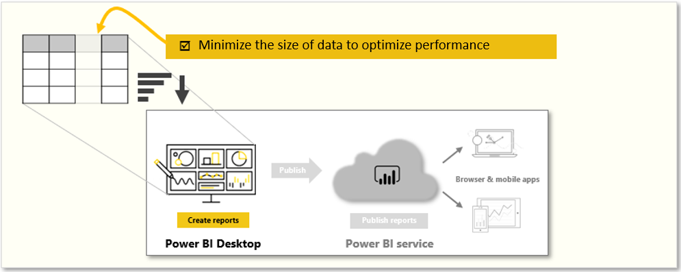

Performance optimization, also known as performance tuning, involves making changes to the current state of the data model so that it runs more efficiently. Essentially, when your data model is optimized, it performs better.

> [!VIDEO https://www.microsoft.com/videoplayer/embed/RWG0Ll]

You might find that your report runs well in test and development environments, but when deployed to production for broader consumption, performance issues arise. From a report user's perspective, poor performance is characterized by report pages that take longer to load and visuals taking more time to update. This poor performance results in a negative user experience.

As a data analyst, you will spend approximately 90 percent of your time working with your data, and nine times out of ten, poor performance is a direct result of a bad data model, bad Data Analysis Expressions (DAX), or the mix of the two. The process of designing a data model for performance can be tedious, and it is often underestimated. However, if you address performance issues during development, you will have a robust Power BI data model that will return better reporting performance and a more positive user experience. Ultimately, you will also be able to maintain optimized performance. As your organization grows, the size of its data grows, and its data model becomes more complex. By optimizing your data model early, you can mitigate the negative impact that this growth might have on the performance of your data model.

A smaller sized data model uses less resources (memory) and achieves faster data refresh, calculations, and rendering of visuals in reports. Therefore, the performance optimization process involves minimizing the size of the data model and making the most efficient use of the data in the model, which includes:

-   Ensuring that the correct data types are used.

-   Deleting unnecessary columns and rows.

-   Avoiding repeated values.

-   Replacing numeric columns with measures.

-   Reducing cardinalities.

-   Analyzing model metadata.

-   Summarizing data where possible.

> [!div class="mx-imgBorder"]
> 

In this module, you will be introduced to the steps, processes, and concepts that are necessary to optimize a data model for enterprise-level performance. However, keep in mind that, while the basic performance and best practices guidance in Power BI will lead you a long way, to optimize a data model for query performance, you will likely have to partner with a data engineer to drive data model optimizing in the source data sources.

For example, assume that you work as a Microsoft Power BI developer for Tailwind Traders. You have been given a task to review a data model that was built a few years ago by another developer, a person who has since left the organization.

The data model produces a report that has received negative feedback from users. The users are happy with the results that they see in the report, but they are not satisfied with the report performance. Loading the pages in the report is taking too long, and tables are not refreshing quickly enough when certain selections are made. In addition to this feedback, the IT team has highlighted that the file size of this particular data model is too large, and it is putting a strain on the organization's resources.

You need to review the data model to identify the root cause of the performance issues and make changes to optimization performance.

By the end of this module, you will be able to:

-   Review the performance of measures, relationships, and visuals.

-   Use variables to improve performance and troubleshooting.

-   Improve performance by reducing cardinality levels.

-   Optimize DirectQuery models with table level storage.

-   Create and manage aggregations.
