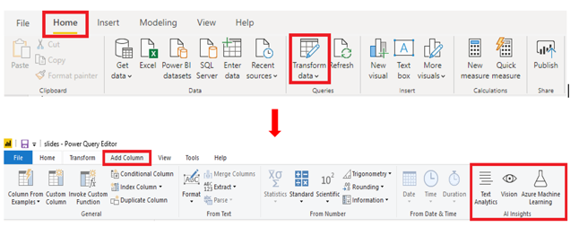

The **AI Insights** feature allows you to connect to a collection of pre-trained machine learning models that you can apply to your data, to enhance your data preparation efforts.

Continuing with the above example, suppose you now want to add text analytics to the content of the **Comments** field in the ticketing data, to see if you can determine the sentiment of the customers featured in the Help tickets. You can use the **AI Insights** feature to do that.

To apply the AI insights to your data, open Power Query Editor and select the **Add Column** tab. You'll see three **AI Insights** options: **Text Analytics**, **Vision** and **Azure Machine Learning**.

> [!NOTE]
> Premium capacity is required to use the **Text Analytics** and **Vision** options.

> [!div class="mx-imgBorder"]
> 

> [!NOTE]
> If you do not see these options, you need to enable the **AI Insights** feature in the Power BI Desktop settings. Go to **File** > **Options and Settings** > **Options**. In the **Global** options list, select **Preview Features**, then select the check box for the **AI Insights function browser** option, and then select **OK**.

> [!div class="mx-imgBorder"]
> 

On the **Add column** tab, the most relevant **AI Insights** option for this example is **Text Analytics**, which includes Azure Cognitive Services models, such as Sentiment Analysis, Key Phrase Extraction, and Language Detection that derive meaning or specific pieces of language from text data. You can use either the Sentiment Analysis or Key Phrase Extraction option to determine the customer sentiments in the Help tickets and visually show the results in Power BI.
