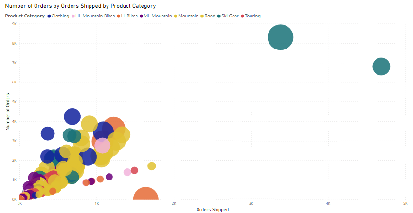
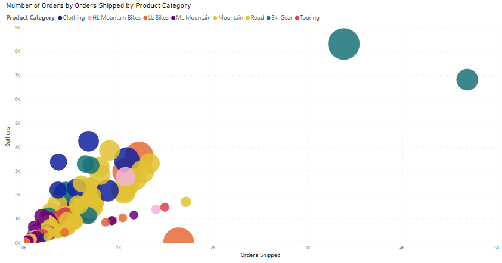

An outlier is a type of anomaly in your data, something that you didn't expect or that surprised you, based on historical averages or results. You will want to identify outliers to isolate data points that significantly differ from other data points, and then take action to investigate the reasons for the differences. The results of this analysis can make a significant impact on business decision making.

Consider the scenario where you are analyzing data for a shipping warehouse. You notice that the number of orders increased above average for a specific product category. You first want to identify the product category. Then, you want to ask several questions about the outlier: 

- Did above average shipments happen that day? 

- Did this anomaly occur in a specific warehouse? 

- Did a single event cause the increase in orders for that specific category? 

- Did this event occur on other days in the last month, quarter, year, or prior year?

Power BI allows you to identify outliers in your data, but you need to first determine the logic behind what constitutes an outlier. You can use trigger points, such as calculations, around what you would consider the outlier to be.

The process of identifying outliers involves segmenting your data into two groups: one group is the outlier data and the other group is not. You could use calculated columns to identify outliers, but the results would be static until you refresh the data. A better way to identify outliers is to use a visualization or DAX formula because these methods will ensure that your results are dynamic.

When you have identified the outliers in your data, you can then use slicers or filters to highlight those outliers. Additionally, you can add a legend to your visuals so that the outliers can be identified among the other data. You can then drill in to the outlier data for more detailed analysis.

## Use a visual to identify outliers

The best visual to use for identifying outliers is the scatter chart, which shows the relationship between two numerical values. Scatter charts display patterns in large sets of data and are, therefore, ideal for displaying outliers.

When you add a scatter chart to your Power BI report, you put your fields of interest in the **X Axis** and **Y Axis** sections, respectively. In this case, the **Orders Shipped** field is on the x-axis, and the **Qty Orders** field is on the y-axis.

> [!div class="mx-imgBorder"]
> [](../media/3-add-scatter-chart-ss.png#lightbox)

The visual will update to display the data according to the selected fields, and you'll be able to clearly identify the outliers in that data; they are the isolated items that are away from the bulk of the data.

> [!div class="mx-imgBorder"]
> [](../media/3-scatter-chart-outlier-ss.png#lightbox)

Now that you can identify the outliers in your data, you can investigate the reasons for their existence and take corrective action.

## Use DAX to identify outliers

You can use DAX to create a measure that will identify the outliers in your data, such as in the following formula:

```dax
Outliers =
CALCULATE (
    [Order Qty],
    FILTER (
        VALUES ( Product[Product Name] ),
        COUNTROWS ( FILTER ( Sales, [Order Qty] >= [Min Qty] ) ) > 0
    )
) 
```

When you have created a new outlier measure, you can group your products into categories by using the grouping feature, as you previously did when creating a histogram. You then need to add a scatter chart visual, as you did in the previous section, because this the best visualization option for displaying outliers. When you've added the scatter chart, populate it with the fields that are associated with your DAX formula and outlier measure.

> [!div class="mx-imgBorder"]
> [](../media/3-select-outlier-logic-fields-ss.png#lightbox)

In the scatter chart, you'll be able to identify the outliers in your data. You can then investigate the reasons for their existence and take corrective action.

> [!div class="mx-imgBorder"]
> [](../media/3-scatter-chart-populate-outliers-ss.png#lightbox)
