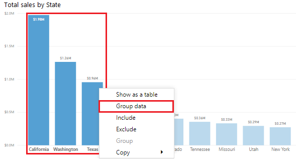
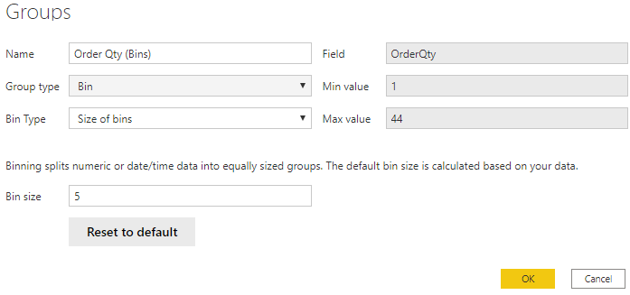

When you create visuals, Power BI Desktop aggregates your data into groups, based on the values it finds in the underlying data. You can refine how those default groups are presented. You can also create new groups by grouping two or more data points in a visual or putting values into equal sized groups (binning).

Grouping is used for categories of data. Binning is similar to grouping but it is used for grouping continuous fields, such as numbers and dates.

You can use the grouping and binning features to ensure the visuals in your reports display your data exactly how you want them to, so you can more clearly view, analyze, and explore the data and trends in your visuals. You'll be able to identify clusters, patterns of behavior, data averages, and more. The results of this analysis will provide your end-users with more specific insights on their data, which can drive business decisions.

In this example, the Customer Service team has come back to you, greatly impressed by the analysis you have done so far. They now want you to further analyze their Help ticket data -- they ask if you can segment the data into different groups and clusters. In particular, they want to identify the cities with the highest sales.

## Create a group

In the following image, you can see a bar chart in which Power BI has automatically segmented the data in the way that it found most useful - Total Sales by City. However, you want to group some of the bars (cities) together, so you can view them as one category, which will help the Sales team to identify the cities with the highest sales.

To create the group, you start by using **Ctrl+click** to select the data points on the visual that you want to group, in this case it is cities with sales greater than 500 thousand dollars. You then right-click one of those selected data points and select the **Group data** option.

> [!div class="mx-imgBorder"]
> 

When the group is created, you'll see that the visual updates to take account of the new group. In the following image, you can see that the other cities, which are the cities with lower sales (less than 500 thousand dollars) have been grouped together and are highlighted in a different shade.

> [!div class="mx-imgBorder"]
> 

You'll see that the new group field displays in the **Legend** bucket for the visual and is listed in the **Fields** pane.

When you create a group, you can change the way the data is displayed in the visual. For example, you might want to switch the values in each axis. You can also use the group in any of the other visuals in your report. To do so, simply drag the group field from the **Fields** pane, then drop it into the visual in which you want to use it.

## Edit a group

Continuing the above example, you now want to edit the categories that make up your group. Right-click the group field in either the **Legend** bucket or the **Fields** pane, and then select **Edit Groups**.

In the **Groups** window that displays, you can see a list of the groups and the different items within those groups. In the following image, you can see the **Cities with Sales > 500k** group and its members, along with the **Other** group (**Cities with Sales < 500k**) that contains all of the other values that have not been put into the first group. If you refresh your data and new items appear in the ungrouped values list, they'll all go into the **Other** group.

> [!div class="mx-imgBorder"]
> 

You can now make changes to the group. You can rename any group by double-clicking the group title in the **Groups and members** section and entering a new name. You can add ungrouped values into an existing group, remove values from an existing group, and even create a new group.

## Create bin groups

The process of binning allows you to group your numerical and time field data into "bins" of equal size, so you can visualize and identify trends in your data in more meaningful ways. Binning allows you to right-size the data that Power BI Desktop displays.

In this example, you want to create bins (groups) for the **Order Qty** field. You start in the **Fields** pane, where you right-click the field **Order Qty** that you want to create the bins for, then select **New Group**. On the **Groups** window that displays, set the **Bin size** to the size you want, and adjust any other settings as required, then select **OK**.

> [!div class="mx-imgBorder"]
> 

When you have set up the bin group, you'll see a new field in the **Fields** pane with **(bins)** appended to its name. You can then drag that field onto the canvas to use the bin size in a visual.