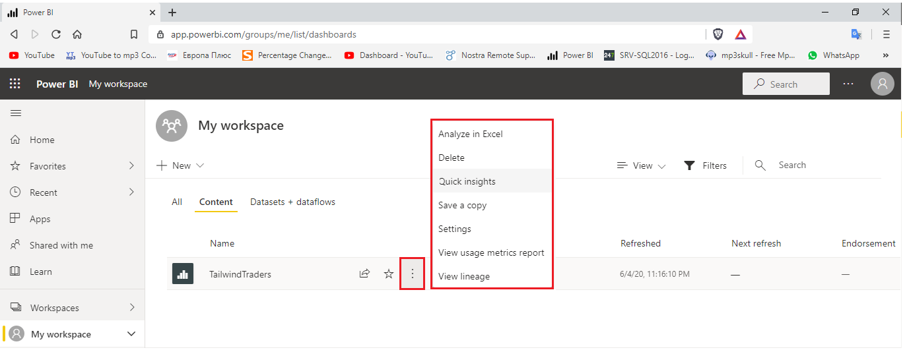
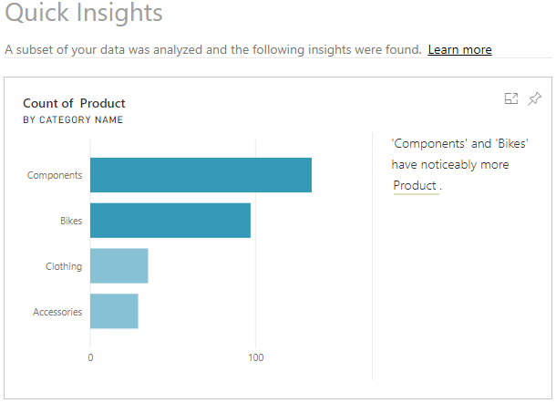
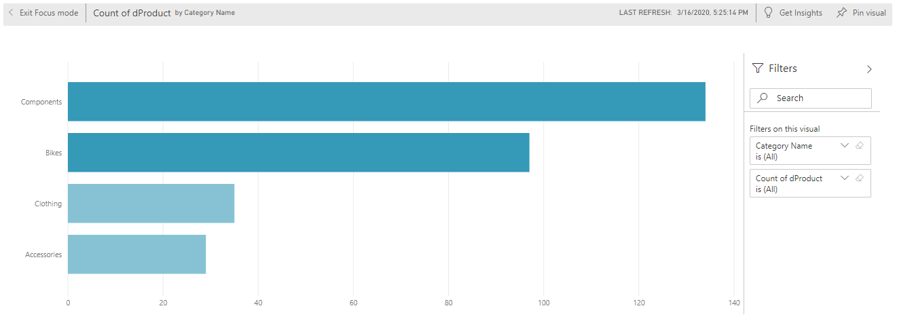

The **Quick insights** feature in Power BI uses machine learning algorithms to run over your entire dataset and produce insights (results) for you, very quickly. This feature is a great way to build dashboards, when you don't know where to start. It also helps you to determine any insights you might've missed when building out your reports. From the insights that Power BI discovers, you can generate interesting interactive visualizations.

> [!NOTE]
> This feature is available in the Power BI Web Service only. Also, this feature doesn't work with DirectQuery; it only works with data imported to Power BI.

Suppose one of the datasets you've been given contains a massive amount of data concerning the Help tickets created for the Customer Service team. You don't know where to start analyzing, as there is just so much data, so you decide to let Power BI do it for you.

## Get quick insights on your dataset

To get quick insights on your dataset, open your Power BI Web Service, then select the **Content** tab. Locate your report for which you want to get quick insights, in this case it is the **TailwindTraders**. Then select **More options** (...) > **Quick insights**.

> [!div class="mx-imgBorder"]
> 

Power BI will use various algorithms to search for trends in your dataset. This process might take a few seconds but when it is finished, you'll see a message in the top right corner letting you know that the results are ready to be viewed.

> [!div class="mx-imgBorder"]
> 

Select **View insights** to open the **Quick Insights** page for the selected dataset and view the insights that Power BI found for you. The **Quick Insights** page contains up to 32 separate insight cards, and each card has a chart or graph, plus a short description. In this example, one of the insights is a card that displays a visual for **Count of Products by Category Name**, as illustrated in the following image.

> [!div class="mx-imgBorder"]
> 

## Add a quick insights result card to a report

If you see an insight card that is particularly interesting, you can add it to your report. On the **Quick Insights** page, hover over the card, then select the pin icon. The visual is added to your dashboard, where you can reposition it as required.

## Interact with the quick insights results 

To take a closer look at a particular insight card on the **Quick Insights** page, select an insight card to open the insight screen opens in **Focus** mode.

> [!div class="mx-imgBorder"]
> 

You can then perform the following actions:

-   Filter the visualization using the available options in the **Filters** panel.

-   Pin the insight card to a dashboard by selecting **Pin visual**.

-   Run insights on the card itself (scoped insights) by selecting **Get insights** in the top-right corner. The scoped insights allow you to drill down deeper into your data.

-   Return to the original insights canvas by selecting **Exit Focus mode** in the top-left corner.
