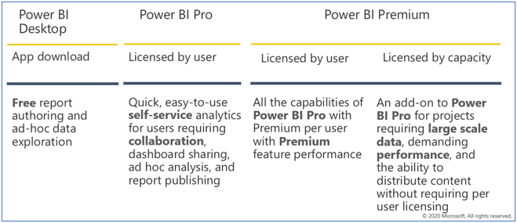
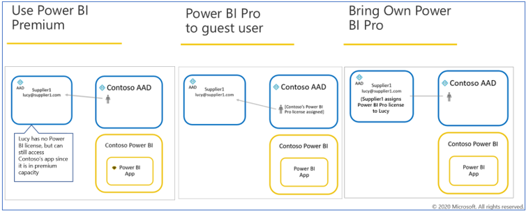
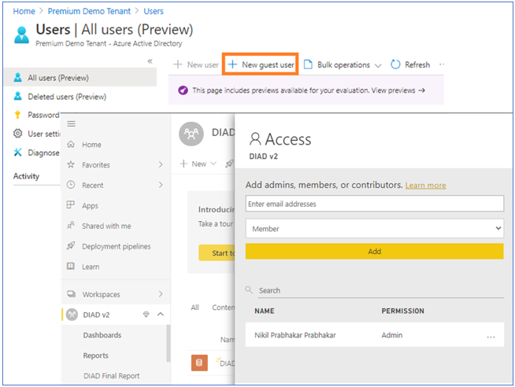

This unit focuses on purchasing services and per-user licensing from an administrator perspective. For more information about how users can get their own license, see [Signing up for Power BI as an individual](https://docs.microsoft.com/power-bi/fundamentals/service-self-service-signup-for-power-bi/?azure-portal=true).

All users of the Power BI service must have a license. There are two ways for users to get a license:

- Power BI admins can assign an existing license to users.

- Users can use their work or school account to sign up for a free Power BI Desktop license, or purchase a Power BI Pro, or Power BI Premium.

What users can do in the Power BI service depends on the type of license they have. The level of access provided by their license depends on whether the workspace being accessed is a Premium workspace or not.

The graphic below shows user capabilities by license type.

> [!div class="mx-imgBorder"]
> 

## Who can purchase and assign licenses?

You must have a Microsoft 365 admin role to purchase or assign licenses for your organization.

The following table shows which role is required to do tasks related to purchase and licensing. For more information about administrator roles in Azure Active Directory, see [View and assign administrator roles in Azure Active Directory](https://docs.microsoft.com/azure/active-directory/users-groups-roles/directory-manage-roles-portal/?azure-portal=true). To learn more about admin roles in Microsoft 365, including best practices, see [About admin roles](https://docs.microsoft.com/microsoft-365/admin/add-users/about-admin-roles/?azure-portal=true).

| **Who can purchase services and licenses?** | **Who can manager user licenses?** |
|---------------------------------------------|-----------------------------------|
| Billing administrator | License administrator |
| Global administrator  | User administrator |
|                       | Global administrator |

## License types

All user-based, commercial licenses from Microsoft are based on Azure Active Directory identities. To use the Power BI service, users must sign in with an identity that Azure Active Directory supports for commercial licenses. You can add Power BI to any Microsoft license that uses Azure Active Directory for identity services. Some licenses, such as Microsoft 365 E5, include a Power BI Pro license, so no separate sign-up for Power BI is needed.

There are two kinds of Power BI licenses for organizations: standard and premium.

With a standard, self-service Power BI Pro license, Microsoft 365 admins assign per user licenses. There's a per user monthly fee for Power BI Pro licenses. This license type enables collaboration, publishing, sharing, and ad-hoc analysis. Content is saved to shared storage capacity that is fully managed by Microsoft.

A Power BI Premium license allocates a capacity to an organization. Suitable for enterprise BI, big data analytics, and cloud and on-premises reporting, Premium provides advanced administration and deployment controls.

> [!Note]
> With Power BI premium licensing, Power BI end-users do not need any additional licensing to view Power BI resources.

Dedicated compute and storage resources are managed by capacity admins in the organization. In addition to other Premium advantages, content stored in Premium capacity can be accessed by and distributed to users who don't have Power BI Pro licenses. At least one user must have a Power BI Pro license assigned to use Premium, and content creators and developers still need a Power BI Pro license.

> [!Note]
> The two types of licenses aren't mutually exclusive. You can have both Power BI Premium and Power BI Pro. In this configuration, content stored in Premium capacity can be shared with all users and shared capacity is also available. For information about capacity limits, see [Manage data storage in Power BI workspaces](https://docs.microsoft.com/power-bi/admin/service-admin-manage-your-data-storage-in-power-bi/?azure-portal=true).

To compare product features and pricing, see [Power BI pricing](https://powerbi.microsoft.com/pricing/?azure-portal=true).

## Guest user access

Azure Active Directory Business-to-business (Azure AD B2B) enables sharing with external guest users. The following prerequisites must be met to share with external users:

- The ability to share content with external users must be enabled

- The guest user must have the proper licensing in place to view the shared content

The following image shows typical content access scenarios based on license type.

> [!div class="mx-imgBorder"]
> 

For detailed information about providing guest users with access to content, review this article. [Distribute Power BI content to external guest users using Azure Active Directory B2B](https://docs.microsoft.com/power-bi/whitepaper-azure-b2b-power-bi/?azure-portal=true).

## Configure, enable, and monitor B2B trust

Power BI provides an option that enables external guest users to edit and manage content in the organization. By default, external users have a read-only consumption-oriented experience. However, this new setting allows the Power BI admin to choose which external users can edit and manage content within their own organization. Once allowed, the external user can edit reports, dashboards, publish or update apps, work in workspaces, and connect to data they have permission to use.

> [!div class="mx-imgBorder"]
> 
