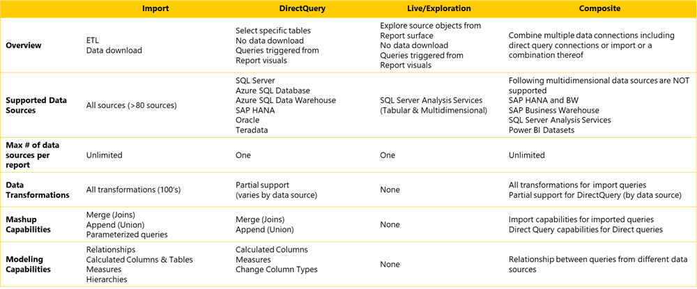

The following chart lists the different data connectivity modes available in Power BI. Your task and the data source you are using will dictate which data connectivity mode to use.

> [!div class="mx-imgBorder"]
> 

## Import mode

Import is the most common data connectivity mode. The import capability allows you to take data from your data source and import it into the Power BI data model.

The data within Power BI is stored highly compressed, which allows you to place a large amount of data into your data model via Import.

The import capability supports more than 80 data sources that can be imported into Power BI. The maximum number of data sources per report is unlimited, however, if you have a large number of data sources, you should consider combining all or parts of your data sources before you import them into Power BI. In Power BI, there are over 100 possible data transformations. For example, splitting columns or cleaning columns.

When using Power BI import mode, you have the ability to merge, append, and parameterize queries.

There are numerous modeling capabilities available through import mode. For example, once relationships are modeled between queries, you can create calculated columns or calculated tables, measures, and hierarchies.

## Direct query mode

In Direct query, data is not stored within the Power BI data model, it is stored within the data source itself.

With direct query, only data and tables used for the visualization is taken from the data source. Plus, you're limited to a single data source per report and the data source must support direct query. Examples of supported data sources are SQL Server, Azure SQL database, Azure SQL data warehouse, SAP HANA, Oracle, or Teradata.

The data transformations available through direct query are partial depending on the data source. When using the direct query mode in Power BI, you can merge or append data within one dataset.

Finally, with direct query you are limited to calculated columns, measures, and change column types modeling capabilities.

## Live or exploration mode

Live or exploration mode is similar to Direct Query with one distinction. Live or exploration mode supports only one data source, SQL Server Analysis Services. This mode will support either tabular or multidimensional models depending on what is installed on your SQL Server Manager Services. Only one data source can be used per report, and no transformations, mash ups, or modeling capabilities are available with live or exploration connectivity mode. Any calculations or transformations must be done on your cube, prior to loading your data into Power BI.

## Composite mode

The composite connectivity mode allows you to combine multiple data connections from either direct query or import modes or a combination of both. Most multidimensional data sources are supported with the following exceptions: SAP HANA and BW, SAP Business Warehouse, SQL Server Analysis Services, and Power BI Datasets. As a reminder, you can base an unlimited number of reports on the one dataset published through Power BI. Plus, the number of data sources per report is unlimited through the composite mode.

In composite mode, you have all data transformations available on sources accessed through the import mode, and depending on the source, you have partial support for sources connected to through a direct query. The mashup capabilities for important data include merge, append, and parameterized queries. For direct query data, mash up capabilities include merge and append.

Finally, you have the ability to establish relationships between queries from different data sources.

For more information regarding connectivity modes, see the following [video](https://www.youtube.com/watch?v=HaSD6uRljDw&t=2240s/?azure-portal=true) and articles.