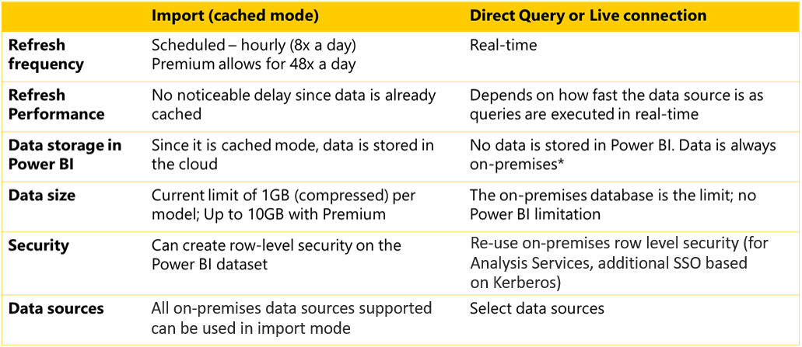

There are two data connection modes available with an enterprise gateway. The first is import or cached mode, and the second is direct query or live connection.

The chart below provides a comparison between the two data connection modes.

> [!div class="mx-imgBorder"]
> 

With the import mode, refreshes can be scheduled hourly or eight times a day if you have Power BI Pro, or you can schedule up to 48 refreshes per day per dataset with Power BI Premium capacity.

The number of scheduled refreshes depends somewhat on your dataset and what you need to analyze. For example, if you're pulling data from a warehouse that is updated once per day, a scheduled import of once a day would be sufficient.

Currently with Power BI the data size limit is 1 GB per data model, however, if you have Premium capacity, the limit is 10 GB.

With import mode, you can create row-level security on the dataset and all on-premises data sources supported can be used in import mode. An interesting factor is that you can establish security within the service, even if the original data source does not support security as with a comma-separated values (CSV) or excel file.

With direct query or live connection, refreshes are performed real time and the response or delay is determined by how fast the data source can execute the query.

With direct query or live connections, data is not stored in Power BI, the data is always stored in the on-premises data source. Plus, there is no data size limitation in Power BI. Data size limitation is dependent solely on the on-premises data source.

You can reuse on-premises row level security from your database if you're using direct query and if your using live connections, you will use the security from your analysis services.

Data sources supported when using direct query or live connections are listed in Unit 1 of this course.