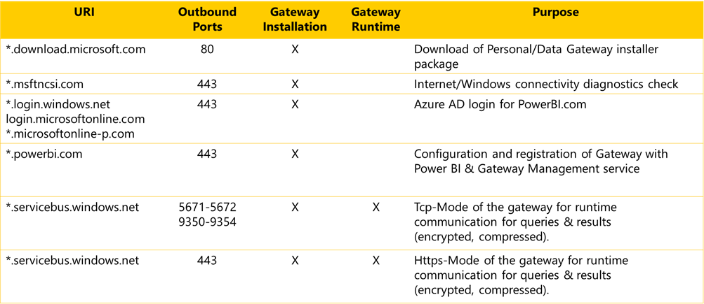

There are several network requirements that must be considered before installing, running, and monitoring performance of a data gateway. First and foremost, a high performing internet connection is crucial as the data gateway, while on-premises must connect with the Power BI service.

The requirements will differ if you are installing versus just using a data gateway.

The following chart provides a list of key uniform resource locators (URLs), outbound ports, and guidance for installing a gateway.

> [!div class="mx-imgBorder"]
> 

The first requirement if you're installing a gateway is an internet connection to allow you to download from [Microsoft.com](https://www.microsoft.com/). From there, you will download the gateway installer. For this task, you will need the 80 outbound port.

You will also need to download the internet Windows connectivity diagnostic check from **msftncsi**. This function runs on port 443.

Next, you will need the components to support Azure Active Directory sign in for [PowerBI.com](https://powerbi.microsoft.com). These components include, `login.windows.net`, `login.microsoftonline.com`, and `microsoftonline-p.com`. You will use outbound port 443 for this function. You will also use port 443 to access [PowerBI.com](https://powerbi.microsoft.com/?azure-portal=true) to configure and register the gateway with Power BI and Gateway Management service.

Once installation and registration are completed, you must then connect to the service bus and [servicebus](https://azure.microsoft.com/services/service-bus) to set the mode you plan to run your gateway in.

There are essentially two data gateway mode options, transmission control protocol (TCP) and hypertext transfer protocol secure (HTTPS).

TCP mode is dependent on outbound ports, 5671-5672 and 9350-9354. If these ports are unavailable to you due to security restrictions, your only option would be to run your gateway in the HTTPS mode in which case all the traffic between your data gateway and the Power BI service will be tunneled over HTTPS protocol.