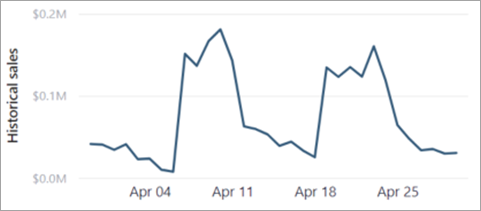
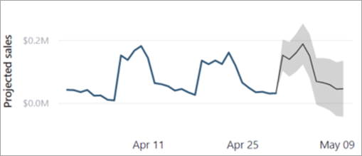
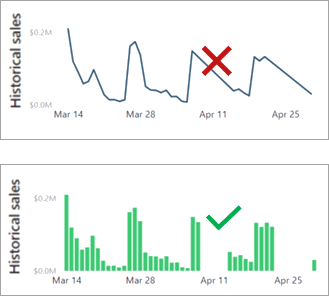
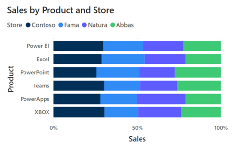
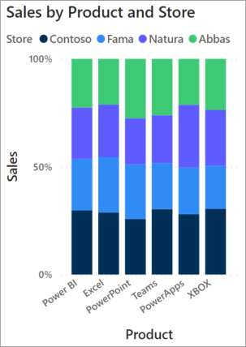
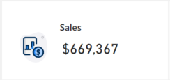

The primary goal of data visualization is to communicate information clearly and effectively to report consumers. That's why selecting the most effective visual type to meet requirements is critical. Selecting the wrong visual type could make it difficult for report consumers to understand the data, or worse, it could result in the misrepresentation of the data.

Visual selection can be challenging because so many visuals are available to choose from. To help you select an appropriate visual, the following sections provide tips and guidance to help you meet specific visualization requirements.

## Categorical visuals

Often, bar or column charts are good choices when you need to show data across multiple categories. Selecting which type depends on the number of categories and the kind of information that you want to visualize. For example, if many category values are available, you should avoid selecting a visual where color is used to split the data, such as a stacked bar chart with a category legend. Instead, use the category dimension on the axis of a bar chart.

Additionally, you should avoid a line chart with a categorical X-axis because the line implies a relationship between elements that might not exist. In the following example, notice that the line chart visual implies a relationship between the product categories on the X-axis.

> [!div class="mx-imgBorder"]
> 

In the next example, a bar chart shows sales by product category. Notice that the visual is sorted by sales values in descending order. Mostly, you should sort categorical charts by value rather than in alphabetical category order. Make sure that you determine the sort order (ascending or descending) by what you want to first draw peoples' attention to so that it provides the report consumer with an intuitive visual that is organized to produce a natural flow.

> [!NOTE]
> You should sort by category when an established sequence is in place, such as steps in a process that should be displayed in that order.

> [!div class="mx-imgBorder"]
> 

## Time series visuals

Always use a line or column chart to show values over time. The X-axis should present time, sorted from earliest to latest periods (left to right).

> [!NOTE]
> This placement applies to audiences who predominantly read left to right (LTR). When your audience reads right to left (RTL), as is the case with some written languages, sort the X-axis from right to left.

In the following example, a line chart shows historical sales. The line chart shows the natural flow of a timeline from left to right, eliminating the time needed to interpret the X-axis.

> [!div class="mx-imgBorder"]
> 

You can bring the line chart to the next level by adding an analytics option. In this case, it [applies a forecast](/power-bi/transform-model/desktop-analytics-pane?azure-portal=true#apply-forecasting/) to extend historical sales with projected sales.

> [!div class="mx-imgBorder"]
> 

Line charts work well with a consistent flow of data, such as when sales are recorded for every period. If no sales are recorded for some periods, the line chart visual will fill such gaps with a straight line that connects the values of the previous and next periods. If missing values are a possibility, a column chart might be a better visual choice because it will help to avoid the interpretation of a non-existent trend.

> [!div class="mx-imgBorder"]
> 

Other Power BI core visuals that you can use for time series data include:

- Stacked column chart

- Area chart

- Line and stacked column chart

- Ribbon chart, which has the added benefit of showing rank changes over time

## Proportional visuals

Proportional visuals show data as part of a whole. They effectively communicate how a value is distributed across a dimension. Column and bar chart visuals work well for visualizing proportions across multiple dimensions.

> [!NOTE]
> Proportional visuals can't plot a mix of positive and negative values. They should be used when all values are positive or all values are negative.

In the following example, a 100% Stacked Bar chart visual shows proportional sales across four stores. It allows you to compare each store across the six product categories. Notice that the actual sales value isn't shown. Instead, the proportion of sales is shown, allowing report consumers to determine which one is higher. (If necessary, you can reveal the actual values in a tooltip.)

> [!div class="mx-imgBorder"]
> 

In the next example, notice that the same information can be expressed vertically as a 100% Stacked Column chart. It yields an equivalent result.

> [!div class="mx-imgBorder"]
> 

Other Power BI core visuals that you can use for proportional visualization include:

- 100% Stacked Column chart

- Funnel chart

- Treemap

- Pie chart

- Doughnut chart

## Numeric visuals

Often presented by card visuals, numeric values show high-level callouts that demand immediate attention. They can be powerful in dashboard and analytical reports because they communicate important data quickly.

In the following example, a card visual shows a single value that is quick and simple to read.

> [!div class="mx-imgBorder"]
> 

You can also use a multi-row card to display multiple values in a single visual.

## Grid visuals

Often overlooked, tables and matrices can effectively convey a lot of detailed information. Tables have a fixed number of columns, and each column can express grouped or summarized data. Matrices can have groups on columns and rows. Adding conditional formatting options, such as background colors, font colors, or icons, can enhance values with visual indicators. This extra context supports simple report consumption and can bring balance to a report page.

Additionally, matrices provide one of the best experiences for hierarchical navigation. They allow users to drill down, on the columns or rows, to discover detailed data points of interest.

The table and matrix **Format** options provide a high degree of control to format and style grid values.

In the following example, a table visual shows sales and units sold by product. Showing these metrics together in a single visual can be a challenge because the scale of values for sales and units is so different. But by applying conditional formatting, data bars help report consumers quickly understand the distribution of values. Notice that the products are sorted by sales values in descending order, drawing attention to the product with the highest sales.

> [!div class="mx-imgBorder"]
> 

In the next example, a matrix visual displays inventory by product and by store. It uses conditional formatting to show indicators, which provide visual cues to understanding the data.

> [!div class="mx-imgBorder"]
> 

## Performance visuals

Communicating performance involves describing a value and its comparison to a target. Any difference between the value and target is its variance, which can be favorable or unfavorable. Color or icons can convey status. For example, when the variance is unfavorable, you can display a red color or an exclamation mark (!) icon.

In the following example, a KPI visual shows the number of items sold. It also adds context by showing how that value compares to target.

> [!div class="mx-imgBorder"]
> 

Other Power BI core visuals that you can use to show performance include:

- Gauge

- KPI

- Table, with conditional formatting

- Matrix, with conditional formatting

## Geospatial visuals

When a dataset has geospatial information, it can be conveyed by using map visuals. Power BI includes several core map visuals. Each visual offers various formatting options that, when appropriately applied, can help highlight geospatial data.

In the following example, sales by city are displayed by using a Map visual and a Filled map visual. In this instance, the granularity of the data is at the city level and the perspective is the entire United States. Because a high dispersion is between plot points, the Map visual (which shows a bubble for each city) produces a helpful result. The Filled map visual of the United States can't sufficiently convey city sales.

> [!div class="mx-imgBorder"]
> 

If you raise the granularity to state level, the **Filled map** visual will produce a better result than the **Map** visual. Then, report consumers can determine relative sales by interpreting the color graduations.

> [!div class="mx-imgBorder"]
> 

> [!NOTE]
> A map visual can occupy considerable space on the report page. Also, geospatial data doesn't always need to be shown in maps. If location isn't highly relevant to the requirements, consider using a categorical visual instead.
