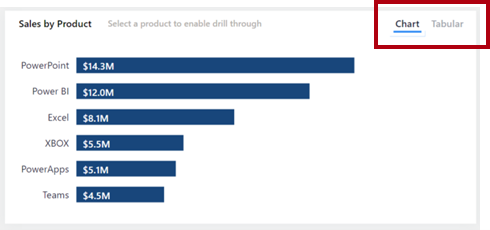
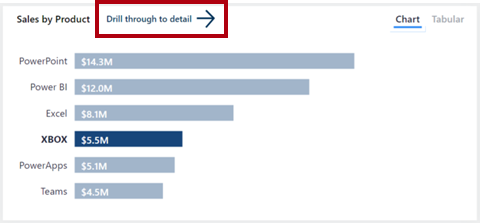

Many different button actions are available to help you configure report navigation experiences. While buttons enable navigation, the report and button layout is critical to ensure that report consumers can efficiently navigate within the report.

> [!TIP]
> To ensure seamless integration into your report design, these UX components should be considered early in the design process. Retrofitting buttons and actions to a report design can lead to an unintuitive and disjointed experience for report consumers.

Buttons should be placed in relevant and consistent locations. A button is only valuable if it's easy to find. To promote ease of discovery, ensure that buttons are placed in a relevant and consistent location on the report page.

In the following example, buttons that are located along the left side of the report page allow report consumers to navigate between pages. Most important, they're placed in the same location and in the same order on all report pages. The button that represents the current page is formatted in a way to highlight the icon.

> [!div class="mx-imgBorder"]
> 

When a button only impacts one section of a report, you can place it within that section so that it's clear to report consumers that the action applies only to that section.

In the following image, two buttons are located in the upper-right corner of a section that allow the report consumer to switch between visual types.

> [!div class="mx-imgBorder"]
> 

Similarly, if a button action drills through to a page, place it as close as possible to the visual that activates it.

In the following image, the **Drill through to detail** button is located above the visual that activates it.

> [!div class="mx-imgBorder"]
> 

On the drillthrough page, ensure that a back button will provide a simple way for the report consumer to return to where they drilled from. An established convention is to use a left-pointing arrow icon for the button.

> [!NOTE]
> Power BI automatically adds a back button, which is located in the upper-left corner of the page. The button icon is a left-pointing arrow.

> [!div class="mx-imgBorder"]
> 

Buttons need to be clearly interactive. If a button doesn't appear to be interactive, the report consumer might not notice it. To help in their discovery, you can apply two formatting options: on-hover formatting and descriptive tooltips.

### On-hover formatting

You can configure buttons to change their state when a hover over is available. When the report consumer hovers the cursor over a button, the cursor icon changes to a pointing finger, which indicates that the button is selectable. In this example, the **Tabular** button text is light gray by default, but when they hover the cursor over, it darkens to black.

> [!div class="mx-imgBorder"]
> 

### Descriptive tooltips

In addition to on-hover formatting, you can configure tooltips to concisely communicate what the button does.

> [!div class="mx-imgBorder"]
> 

> [!NOTE]
> Enable and enter the tooltip text in the **Action** section for the button.
