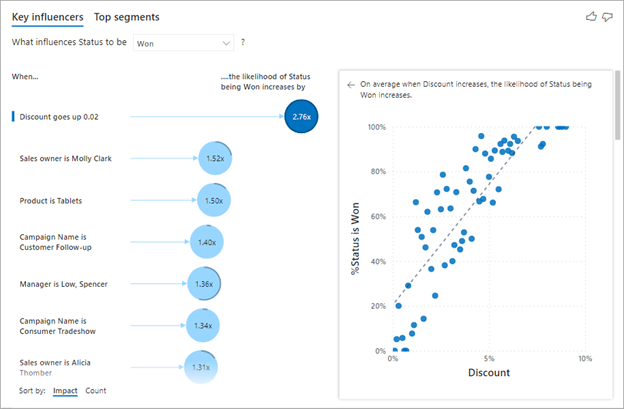
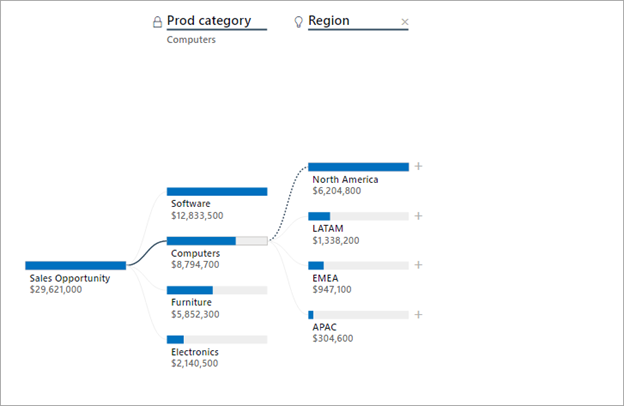
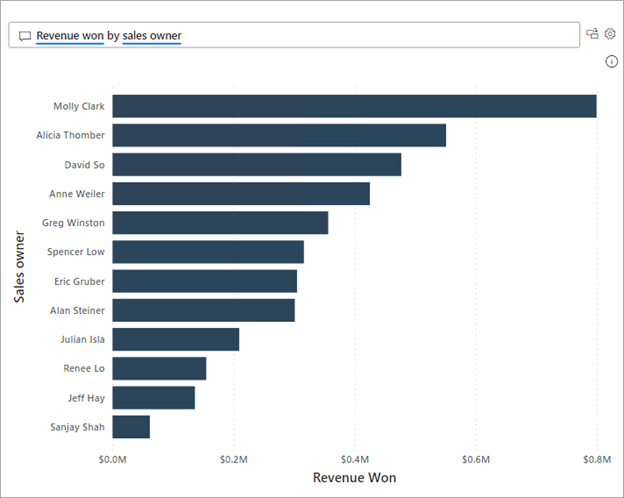

Power BI includes several specialized visuals that provide a considerable interactive experience for report consumers. Often, these specialized visuals are called AI visuals because Power BI uses machine learning to discover and display insights from data. These visuals provide a simple way to deliver a rich and interactive experience to your report consumers.

The three main AI visuals are:

- Key influencers

- Decomposition tree

- Q&A

> [!TIP]
> When adding an AI visual to your report, make sure that you size it to become as large as possible. That way, report consumers can fully interact with and explore the data in the visual.

### Key influencers

The **Key influencers** visual helps report consumers understand the factors that drive a particular metric, like sales revenue. By using AI, Power BI will analyze the data, rank the factors that matter, and then present them as key influencers.

In the following example, the visual helps report consumers understand the important dimensions that contribute to won sales opportunities. According to the visual, when the discount rate increases by two percent, the likelihood of a won sales opportunity increases by a factor of 2.76.

> [!div class="mx-imgBorder"]
> 

Essentially, the **Key influencers** visual is many visuals inside one frame. When you select a key influencer, an adjacent visual will show a representation of the influencer as a comparison against the remainder of the data. Additionally, the **Key influencers** visual includes the **Top segments** view, which shows the highest-ranking segments that contribute to a particular metric.

The capabilities of the **Key influencers** visual are best described by following an example. For a demonstration of the **Key influencers** visual, watch the following video.

&nbsp;
> [!VIDEO https://www.microsoft.com/videoplayer/embed/]

For more information, see [Create key influencers visualizations](/power-bi/visuals/power-bi-visualization-influencers).

### Decomposition tree

The **Decomposition Tree** visual helps report consumers visualize data across multiple dimensions. It automatically aggregates data and enables consumers to drill down into dimensions in any order. As a result, it's a valuable tool for ad hoc exploration and conducting root cause analysis. As an AI visual, a decomposition tree provides a guided exploration experience that helps by finding the next dimension for consumers to drill down into.

In the following example, a **Decomposition Tree** visual helps report consumers to understand the breakdown of sales opportunity revenue.

For a demonstration of the **Decomposition Tree** visual, watch the following video. The lock icon next to the **Prod Category** split means that the report author added the split and set it so that it can't be removed. Additionally, the lightbulb icon next to the **Region** split means that the report consumer used an AI split to discover the best split.

> [!div class="mx-imgBorder"]
> 

The capabilities of the **Decomposition Tree** visual are best described by following an example. For a demonstration of the **Decomposition Tree** visual, watch the following video.

&nbsp;
> [!VIDEO https://www.microsoft.com/videoplayer/embed/]

For more information, see [Create and view decomposition tree visuals in Power BI](https://docs.microsoft.com/power-bi/visuals/power-bi-visualization-decomposition-tree).

### Q&A

The **Q&A** visual allows report consumers to ask questions of their data and receive responses as data visualizations. Similar to how web search engines parse and understand complex search requests, report consumers can write natural language questions (in English).

> [!div class="mx-imgBorder"]
> 

> [!TIP]
> To optimize the Q&A experience, ensure that the data field names are user-friendly. You can also enhance the data model with synonyms and terms. Additionally, you can hide fields, such as fields that are used in model relationships, to restrict their use in Q&A. You can also add suggested questions that become prompts in the **Q&A** visual.

For a demonstration of the **Q&A** visual, watch the following video.

For more information, see [Use Power BI Q&A to explore your data and create visuals](/power-bi/create-reports/power-bi-tutorial-q-and-a).

&nbsp;
> [!VIDEO https://www.microsoft.com/videoplayer/embed/]
