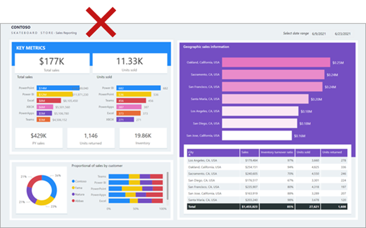
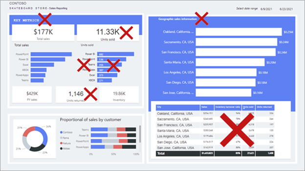

Having the right data and selecting the right visuals is important. Just as important is ensuring that the report is visually appealing. A well-designed report should guide the report consumer to quickly find and understand the answers to their questions.

While striving to produce a good looking report, bear in mind that the report should be easy to consume. What's more, it may be possible to add more visuals to a well-designed report page without it feeling cluttered.

## Space

Space is essential for an effective report design as it helps reduce clutter and increase readability. Spacing applies to the report page margins and the spacing between report objects.

### Margins

Margins are the border area, or edge, around each page. Having a consistently spaced border area frames the report objects.

Because there isn't a report page property to set margins, it's up to you to lay out objects in way that results in a consistent border area. Margin sizes should be equal on the left and right, with possible variation on the top and bottom. Space across the top of bottom can show branding, titles, slicers, or other information that needs to be separated from the visuals.

In the following report, notice the consistent spacing (highlighted with dashed lines) around the border area of the page.

> [!div class="mx-imgBorder"]
> 

### Object spacing

Ensure there's sufficient space surrounding, or within, report objects.

> [!NOTE]
> When visual headers are enabled, be sure to test that they don't overlap with nearby objects because overlapping objects can make it difficult to interact with visual header icons. Appropriate spacing between visuals will help you to avoid this problem.

Consider using different space depth to visually separate sections of related objects.

Take care, however, because too much space can result in an unbalanced report layout and could draw the eye of the report consumer away from what matters. Moderation is key: Always strive to produce an evenly spaced and balanced report.

Spacing is described in more detail in the Alignment topic.

## Size

Size can relate to the page size and visual size.

### Page size

The page size can be set to predefined or custom dimensions. It's possible to set custom dimensions that are larger than available screen size, and so the report consumer will need to interact with scrollbars to view the entire page.

> [!div class="mx-imgBorder"]
> 

Take care that a large page size filled with visuals may take time to render, and visuals may not render in a top-to-bottom order.

### Visual size

Generally, the more important the visual, the larger its size. Report consumers quickly focus on larger visuals. When there are similar visuals on the page, like a series of card visuals, they should be equally sized.

Many visuals are responsive to size, so they look good small or large. Consider that a line chart visual may appear like a sparkline when sized small. In this case, only a few axis and data labels may appear. When sized larger, more detail is revealed, including many more axis and data labels.

While report consumers can use focus mode to enlarge a single visual, the visual should still clearly communicate its data when viewed at actual size on the report page. Focus mode can help to better interpret the data or more easily interact with the visual, like expanding into levels of a matrix or decomposition tree visual.

## Alignment

When there are multiple visuals on the report page, ensure they're properly aligned. That means the edges of visuals should be in alignment, and the spacings between visuals are consistent.

Alignment also relates to format options. For example, the alignment of titles and legends *within visuals* should be consistent.

Consider laying out the report page with different sections, and align visuals appropriately within the sections. Sections can be *implied* or *explicit*.

### Implied sections

Define implied sections simply by the aligning groups of visuals in close proximity. In the following example, notice how spacing separates the visuals. This example demonstrates how well-applied spacing can guide the report consumer's eye while providing balance and structure to the report page.

> [!div class="mx-imgBorder"]
> 

### Explicit sections

Define explicit sections using colored shapes and overlaying aligned visuals on those shapes. In the following example, notice the colored background shapes and spacing (highlighted with shading) separate the visuals into three sections.

> [!div class="mx-imgBorder"]
> 

> [!TIP]
> Use the alignment commands found on the **Format** contextual ribbon tab. They make it easy to perfectly align visuals.

## Color

Use color sparingly and meaningfully, as overusing it can be distracting. Stick to a few softer colors as a base, aligned with corporate colors. Softer colors ensure that the data is the focus in your reports. Reserve the use of bolder colors to highlight exceptions.

Ensure colors are sufficiently contrasting. Color contrast is especially important to create accessible reports for low-vision report consumers. It's described in more detail in Unit 5.

In the following example, there are several issues related to color. First, the colors applied to the left side of the page are different to those applied to the right side. Second, the colors are bright and possibly distract the report consumer. Lastly, some colors, like yellow, don't provide sufficient contrast with the white data labels.

> [!div class="mx-imgBorder"]
> 

In the following image, the report layout is improved with the use of better colors. They are now consistent and provide suitable contrast with the white data labels.

> [!div class="mx-imgBorder"]
> 

## Consistency

Most importantly, strive for consistency when laying out and configuring report objects. Consistency should apply to everything in your report design, including spacing, margins, size, and alignment and especially to object format options. Format options include the selection of font, font size, font weight, colors, and many other styling options. Format options also include the enabling of visual features like axis labels and data labels.

In the following example, there are many inconsistencies. They include mixed fonts, different font sizes, inconsistent titles. At first glance, it just doesn't feel right.

> [!div class="mx-imgBorder"]
> 

The easiest and quickest way to enforce consistency is to use a *report theme*. A report theme applies design changes to your entire report, ensuring consistent application of colors, fonts, page, and visuals format options, even including the **Filters** pane styles.

Consider using one of the many built-in themes from the theme gallery. You can use one as a starting point and customize it to better meet your requirements. Or you can create a theme from scratch, which can be a lot of work but provides you with granular control.

> [!NOTE]
> Be aware that the theme is overridden when explicitly configuring a format option. For example, you can explicitly set a color by entering a HEX value instead of selecting a color from the palette. Try to limit overriding the report theme to an exception basis because if you switch themes, overridden properties won't update.

Be sure to export the report theme, which is a JSON file, and apply it to other reports to ensure consistency *across reports*.

> [!TIP]
> You can use a third-party site like [powerbi.tips](https://powerbi.tips/?azure-portal=true) to generate a theme. It guides you to build a color palette and set property values for all core visual types.

To learn more about report themes, see [Use report themes in Power BI Desktop](/power-bi/create-reports/desktop-report-themes/?azure-portal=true).
