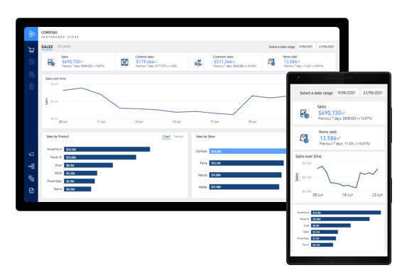

Power BI offers a set of mobile apps for iOS and Android mobile devices. The app allows consumers to connect to and interact with Power BI reports.

While report consumers can view any Power BI report page in landscape orientation, you can provide an improved consumption experience in portrait orientation. You can complete this action by creating a mobile view for each report page that's designed for mobile devices when in portrait view.

You can add any page visual, including slicers, to the mobile view. Furthermore, visuals are responsive, meaning that they change dynamically to display the maximum amount of data, regardless of size.

> [!div class="mx-imgBorder"]
> 

In the Power BI mobile app, report consumers can identify a mobile-optimized report by a special icon. The following example shows that the Power BI mobile app lists two reports, each accompanied by a different icon. The first report is **Retail Analysis**, which isn't optimized for mobile view. The second report is **Sales & Returns**, which is a mobile-optimized report.

> [!div class="mx-imgBorder"]
> 

When report consumers open a mobile-optimized report, the report opens in mobile-optimized mode. If they hold their phone in landscape orientation, the report opens in unoptimized view.

For more information, see [Optimize Power BI reports for the mobile app](/power-bi/create-reports/desktop-create-phone-report/?azure-portal=true).
