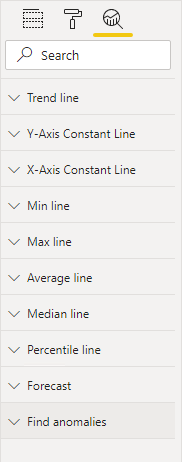
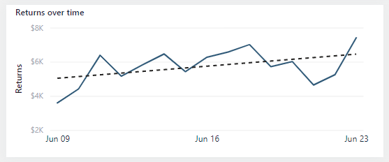
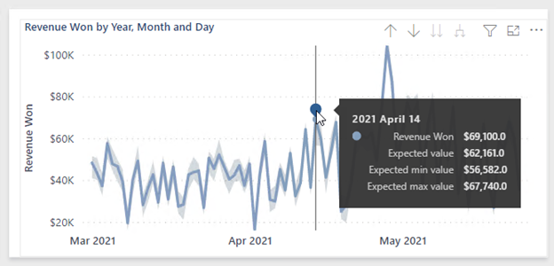

Highlighting values in reports helps you to quickly communicate important and relevant facts about data. Power BI supports several techniques to highlight values:

- Conditional formatting

- Overlaid analytics

- Anomaly detection

- Specialized visuals

### Conditional formatting

You can use conditional formatting to format table and matrix visuals. With this approach, you can apply rules to highlight specific cells by using:

- Background color

- Font color

- Data bars

- Icons

The following image shows an example of a matrix visual with icons. The icons highlight the **On hand** values.

> [!div class="mx-imgBorder"]
> 

> [!NOTE]
> Consider that report consumers might be blind or have low vision. Take care not to highlight by using only color. Instead, consider using icons that can use shape and color to communicate status.

For more information, see [Use conditional formatting in tables](/power-bi/create-reports/desktop-conditional-table-formatting).

### Overlaid analytics

You can also overlay analytics to highlight values. Certain visuals, like the line chart visual, allow you to add analytic options. Options include trend lines, constant lines, minimum or maximum lines, and many others.

> [!div class="mx-imgBorder"]
> []

The following image is an example of a trend line. The upward gradient of the trend line clearly indicates that returns are increasing over time.

> [!div class="mx-imgBorder"]
> []

For more information, see [Use the Analytics pane in Power BI Desktop](/power-bi/transform-model/desktop-analytics-pane).

### Anomaly detection

When a time series (date field) is on the X-axis, two additional analytic options are available. These options use AI to produce a forecast or find anomalies. The anomaly detection feature can help you highlight exceptional values.

The following example shows a line chart visual. Power BI detected an anomaly on a particular date and marked it with a shape. When the report consumer hovers the cursor over the shape, a tooltip appears that describes expected values.

> [!div class="mx-imgBorder"]
> 

Select the anomaly shape to open the **Anomalies** pane, which lists a series of visuals that provide further possible explanations.

For more information, see [Anomaly detection](/power-bi/visuals/power-bi-visualization-anomaly-detection).

### Specialized visuals

Some specialized visuals can help to highlight values in your reports; specifically, the **Key influencers** visual and the **Decomposition Tree** visual. These two visuals are covered in Unit 8.
