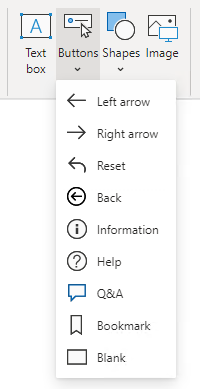

The button element can take your Power BI reports to the next level by making them behave like an app. Buttons support six different actions that take effect when the button is selected.

When you are inserting a button, many preconfigured buttons are available for you to choose from. These preconfigured buttons include icons and preconfigured actions, such as the Back button, Q&A button, and Bookmark button.

> [!div class="mx-imgBorder"]
> 

> [!NOTE]
> You can assign any type of action to images and shapes so that these elements can behave like buttons.

The **Back** action navigates to the previous page. It's useful in drillthrough scenarios, allowing the report consumer to quickly return to where they drilled from.

The **Bookmark** action activates a selected bookmark. Bookmarks can turn a Power BI report into a guided analytical experience, maximize available page real estate, and provide user-friendly interactions. Bookmarks are covered in the next unit.

The **Drillthrough** action is assigned a target drillthrough destination page. The button remains disabled until drillthrough becomes a valid action, which is the case when you are interacting with a visual that can navigate to the drillthrough page. When the **Drillthrough** action is selected, Power BI navigates to the drillthrough page, propagating appropriate filters.

The **Page navigation** action directs the report consumer to a specific report page. The page can be a specific page that is assigned at design time or a measure that returns the page name. Using a measure allows Power BI to dynamically determine the page based on the filter context.

> [!NOTE]
> A measure is a model object that summarizes data. When assigned to the **Page navigation** action, measure formulas, which are written in Data Analysis Expressions (DAX), must return a text value that represents the page name.

The **Q&A** action opens a pop-up window that allows the report consumer to explore data by using intuitive, natural language capabilities and receive answers as data visualizations.

For more information, see [Q&A for Power BI business users](/power-bi/consumer/end-user-q-and-a).

> [!TIP]
> Unlike the **Q&A** visual, a button that is assigned the **Q&A** action doesn't occupy significant space on the report page.

The **Web URL** action opens the URL by using the default web browser. Like the **Page navigation** action, this action can be a specific URL or one that is returned by a measure. The measure can produce a URL that appends filter context to the query string. For example, if the report consumer filters the page by a single customer, the measure can return a URL to an external system that includes the customer key in the query string.

> [!TIP]
> Consider using the **Web URL** action to create a bridge to resources that are commonly referenced in tandem. **Web URL** actions can be highly effective in prompting direct action in external systems.
>
