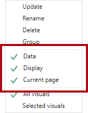
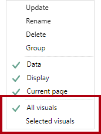
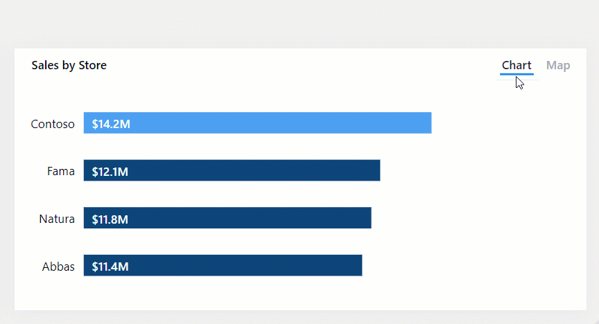
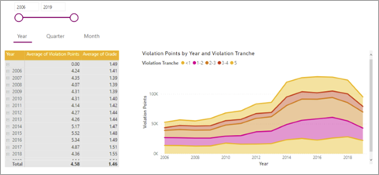
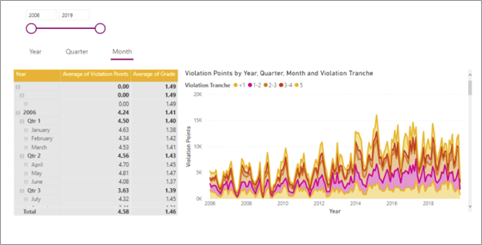
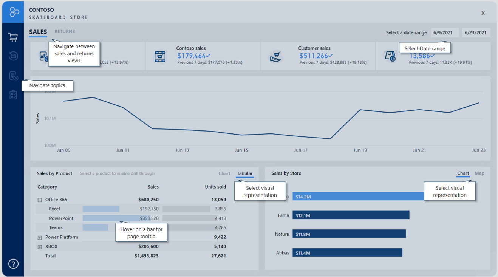

Bookmarks are a powerful way to turn a Power BI report into a guided analytical experience. Bookmarks can also help maximize available page space and provide user-friendly interactions. The possibilities are nearly endless, spanning from simple outcomes, such as resetting filters, to more complex behaviors that swap visuals or navigate visual depth.

Commonly, you will add buttons to a report design and configure their actions to apply a bookmark. Shapes and images can also apply bookmarks.

To understand what you can achieve with bookmarks, you need to know how to configure them. You can configure the state that they capture and the scope of visuals that they effect.

> [!TIP]
> To ensure that all actions produce the intended result, be as prescriptive as possible when deciding on the enabled states and scope.
>
## Bookmark state

Bookmarks capture different state, relating to date, display, and the current page. By default, a new bookmark captures all state types, but you can decide to disable any of them.

> [!div class="mx-imgBorder"]
> 

The **Data** state captures anything that impacts the queries that Power BI sends to the dataset. For example, if a slicer is included in the scope of the bookmark, the **Data** state retains the applied slicer items when the bookmark was created (or updated). It will also capture sort order and the drill depth of a visual because the query is impacted.

The **Display** state is related to the visibility of a report object. Objects consist of visuals and also elements like text boxes, buttons, shapes, and images. By using the **Selection** pane, you can hide or unhide objects and groups of objects. Additionally, you can swap visuals on a report page by creating bookmarks that capture hidden and unhidden objects.

The **Current page** state determines whether the bookmark will direct the report consumer to the bookmarked page or apply the current page. Disabling the **Current page** state is rare, but you should consider some creative use cases. For example, on a page tooltip, a bookmark can change the visuals without navigating from the page that the report consumer has selected.

## Bookmark scope

Bookmarks can apply to all page visuals or specific visuals that you select.

> [!div class="mx-imgBorder"]
> 

The **All visuals** scope is turned on by default, meaning that the bookmark applies to all report objects, even if hidden.

The **Selected visuals** scope will target only those visuals that are selected when the bookmark was updated.

> [!TIP]
> Press the **Ctrl** key to select multiple visuals. The simplest way to select multiple visuals is to use the **Selection** pane. Also, when you are creating a selected visuals bookmark that shows/hides several objects, create a group of those objects and configure visibility for the group. That way, you can add or remove objects from the group without the need to update the bookmark.

<!---
Setting **Bookmark** scope is best described with an example. For a demonstration on the use of the **Selected visuals** scope, watch the following video.

&nbsp;
> [!VIDEO https://www.microsoft.com/videoplayer/embed/]
<!---

## Bookmark examples

By combining different bookmark states and scopes, you can create intuitive experiences.

> [!NOTE]
> Make sure that you include bookmark requirements in all design decisions. For optimal experiences, you should create bookmarks at the end of report development after you have added all report elements. This approach will help you avoid the complex and time-consuming updating of bookmarks when you're adding new elements.

The ensuing sections highlight common use cases for bookmarks.

## Reset slicers

You can provide a simple way for report consumers to quickly reset slicers to a default state by following these steps:

1. Configure the bookmark to capture the **Data** state.

1. Configure the bookmark to use the **Selected visuals** scope, targeting the slicers that you want to reset. The **Selected visuals** scope is key because you don't want to impact other slicers or visuals. For example, if a drillable visual is on the page, the bookmark shouldn't overwrite the drill state when it resets the slicers.

1. Set the slicers to the default values.

1. Update the bookmark.

1. Assign the bookmark to a button action.

## Swap visuals

Swapping a visual means replacing it with another visual. For example, your report can allow the report consumer to select the type of visual, perhaps a chart or a table. Alternatively, you might allow the report user to determine the unit system, whether it's metric or imperial.

In the following example, buttons allow the report consumer to swap a bar chart visual for a map visual.

> [!div class="mx-imgBorder"]
> 

Swapping a visual requires two bookmarks, and you can do so by following these steps:

1. Configure each bookmark to capture the **Display** state but not the **Data** state. These settings will preserve any sorting or additional filtering.

1. Configure each bookmark to use the **Selected visuals** scope, targeting the initially visible visual and the hidden visual.

1. Update the first bookmark, with one visual as visible and the other as hidden.

1. Update the second bookmark by using the inverse visibility state.

1. Assign the bookmarks to button actions.

> [!NOTE]
> No performance is impacted by having hidden visuals on a page. Hidden visuals don't run queries. Swapping visuals will provide flexible consumption options to the report consumer while retaining optimal performance and making the most out of the report page space.

## Drill down multiple visuals and direct depth navigation

When visuals have many levels of drill depth, buttons and bookmarks can provide report consumers with a quick and simple way to arrive at the required depth.

In the following example, bookmarks navigate the matrix visual and the area chart visual across year and month.

> [!div class="mx-imgBorder"]
> 

> [!div class="mx-imgBorder"]
> 

You can create a bookmark for each required drill depth with the following steps:

1. Configure each bookmark to capture the **Data** state, which preserves the drill state of visuals.

2. Configure each bookmark to use the **Selected visuals** scope, targeting the visuals to update.

3. In the visuals, drill down to the required level, and then update the corresponding bookmark.

4. Assign the bookmarks to button actions.

> [!TIP]
> In the **Bookmark** scope, consider including a shape or alternate button that appears as highlighted. That way, report consumers will be aware of the selected drill level.

## Pop-up overlays

Use buttons and bookmarks to overlay an image, shape, or text box. A good example of a pop-up overlay is one that provides built-in assistance. Designing reports with built-in assistance is covered in Unit 7.

In the following example, when the report consumer selects the **Help** button in the lower-left corner of the page, a full-page image becomes visible. The image includes many coach marks, which point to the targeted objects on the report page. Also, the image uses transparency so that the underlying report design remains partially visible. When the report consumer selects anywhere on the page, the image becomes hidden (due to an action on the image that uses a bookmark).

> [!div class="mx-imgBorder"]
> 

Two bookmarks are required for creating a pop-up overlay:

1. Configure the first bookmark to capture the **Display** state.

1. Ensure that the overlay object is visible, and then update the bookmark.

1. Assign the bookmark to a **Help** button action.

1. Configure the second bookmark to capture the **Display** state.

1. Ensure that the overlay object is hidden, and then update the bookmark.

1. Assign the bookmark to the overlay object.