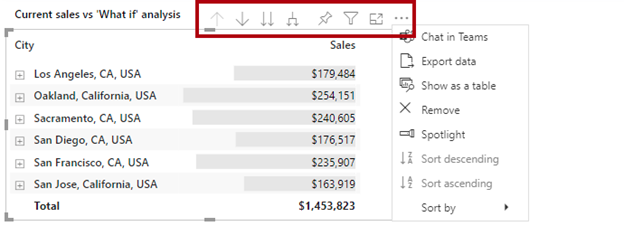

Visual headers make many interactions available to report authors and consumers. All report objects, including visuals and elements (like buttons), have a visual header. The visual header appears when you hover the cursor over the report object, and they can launch actions like focus mode, drill up, or drill down. You can also access the **More options** menu by selecting the ellipsis (**...**) button. This menu includes sorting options, export, spotlight, and many others. By default, visual headers are enabled for all report objects.

> [!div class="mx-imgBorder"]
> 

Visual headers might appear in the upper or lower part of the object. Power BI attempts to show visual headers in the upper right of the object if sufficient space is available between the upper part of the object and the edge of the page. If no space is available in the upper part, Power BI will place the visual headers in the lower-right corner of the visual. If no space is available in either location, it will place the headers inside the visual in the upper right.

> [!TIP]
> Always leave sufficient space for the visual headers to appear in the upper-right section of objects. This approach ensures a consistent experience for report consumers. Also, take care not to overlap objects because superimposed visual headers make it difficult for consumers to see or select icons.

A report setting is available for you as the report author to disable all visual headers. When visual headers are disabled they will still be visible when editing the report, but they will be hidden for report consumers (in reading view). However, situations might occur where enabling this option is a good idea because it limits most interactions. It might make sense to disable visual interactions when you are delivering a Power BI report to an audience that's unfamiliar with Power BI or when you don't expect them to interact with the report.

Visual headers can be turned off for a single object. A good report design turns off visual headers for objects that don't need them. Therefore, consider turning off visual headers for slicers and buttons and any other object that won't be used to launch actions. Fewer visual headers will produce a cleaner and less distracting end result.

For those objects that have visual headers, consider disabling functionality that's not appropriate or useful. You can disable all visual header icons, including the **More options** (**...**) menu.

> [!NOTE]
> At design time, the icons will still appear to help you create the report. However, when the report opens in reading view, the icons won't appear.`

By enabling the visual header tooltip icon, you can enter a text value or reference a page tooltip. This topic is covered in the next unit.

For more information, see [Using improved visual headers in Power BI reports](/power-bi/create-reports/desktop-visual-elements-for-reports#using-improved-visual-headers-in-power-bi-reports).
