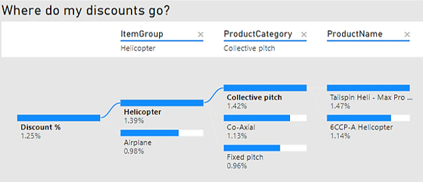

AI visuals offer greater insight by using embedded machine learning and natural language processing to get a greater understanding of your data. AI visuals are found in the Visualization pane like any other visual.

In this unit, we will be exploring the following AI visuals: the decomposition tree, Q&A visual, and the key influencers visual.

> [!div class="mx-imgBorder"]
> 

## Understand measures with a decomposition tree

The decomposition tree is an interactive visual that allows you to break down a measure by various attributes across different dimensions. 

The decomposition tree is a great visual for root cause analysis, which is the ability to ask "why" over and over until you get to the root of your problem. It is a good way to look at the "who" and the "how" when things are going great or poorly.

> [!div class="mx-imgBorder"]
>  

When building out a decomposition tree, you start with a measure and then select the different ways to break down the measure. In the previous example, you are looking at discounts to see where they are flowing, and which is receiving the highest discount. With the decomposition tree, you can see where you are not offering discounts, hence greater margins. Taking it a step further, you could look at the relationship between your discounts and quantities sold to see if they were having the desired impact of moving product.

## Ask questions with a Q&A visual

The Q&A visual allows users to ask natural language questions and get answers in the form of a visual. The visuals are chosen by Power BI based on the data being displayed. You would use the Q&A visual to explore your data using intuitive, natural language capabilities. The Q&A visual only provides results about the data in Power BI.

> [!div class="mx-imgBorder"]
>  

There are default questions that are served up to us, but we can also ask deeper questions of our data like about specific dimensional members in our data. If you like a visual that's created in the Q&A, you can even turn it into a standard visual for use in the rest of your workbook.

> [!div class="mx-imgBorder"]
> 

## Use machine learning with key influencers

Key influencers use machine learning to help find the drivers behind your metrics. Key influencers analyze your data, ranks the important factors, and displays them as key influencers.

For example, you are looking at the results of an NPS (net promoter score) survey. You can identify what are the commonalities amongst people that returned lower scores on the survey. You populate the metric that you are looking to understand and then add fields that you think might influence it's increase or decrease. We will take a closer look at this in the Lab.

> [!div class="mx-imgBorder"]
> 
