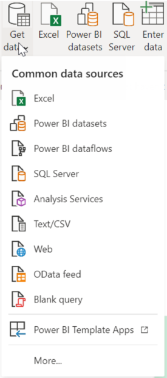

By the end of this module, you'll be able to connect to the same data sources that you're familiar with in Tableau Desktop.

## Get data

Microsoft Power BI connects to data from many different data sources through the **Get data** feature. These data sources range from flat files, on-premises databases, big data, web services, and streaming applications, to datasets that are published to Power BI service.

> [!div class="mx-imgBorder"]
> 

> [!NOTE]
> For datasets that are published to Power BI service, you can consider this functionality as synonymous with Tableau data extracts that are published to Tableau Server and/or Tableau Online.

Many sources have been integrated with Power BI and connect in minutes with pre-built dashboards and reports.

> 

### Default list of data sources in Power BI when you select the Get data button

With Power BI, you can get a consolidated view of your data, no matter where the data lives.

## Datasets

A Power BI dataset is the foundational term for the data that feeds a single Power BI report. A dataset is the Power BI model; It contains the connection to the data source, data tables, the data, the relationship between tables, and Data Analysis Expressions (DAX) calculations.

You can only have one dataset for each report, but a dataset can be made up of multiple data sources. Typically, a dataset is created after you've already formatted, cleansed, and loaded data into Power BI.

## Dataset modes

The two main dataset modes in Power BI that should be familiar to Tableau analysts are Import mode and DirectQuery mode.

### Import mode

Import mode, the most common mode, allows the data to be loaded into memory and refreshed on request or schedule. This mode often delivers fast performance because you immediately have access to the data; it's loaded into memory and ready to go when you are.

:::image type="complex" source="../media/extracts-vs-import.png" alt-text="Data in Tableau and Power B I.":::
   In Tableau, extracts are snapshots of your data that can be used to improve performance by storing the data on disk and loading it into memory. In Power B I, import mode is applied to the datasets and delivers fast performance by importing the data, loading it into memory, and storing it to disk.
:::image-end:::

> [!NOTE]
> Import mode is like taking an extract of data in Tableau Desktop.

After it has been imported, the data is always stored to disk and must be loaded to memory before Power BI can query the dataset. Imported data can demand several resources from your machine because the size of the model(s) can grow quickly. Additionally, the dataset is only as fresh (or up to date) as its last refresh. Therefore, these datasets must be refreshed manually or, if you’re leveraging the Service, on a schedule.

### DirectQuery mode

DirectQuery mode allows analysts to query the data source on request to return results. This query storage mode is dependent on your data source performance; if you've spent considerable time and resources on the data source to make it perform optimally, you'll want to capitalize on your efforts.

:::image type="complex" source="../media/live-connections-vs-direct-query.png" alt-text="Live connections in Tableau versus DirectQuery mode in Power B I.":::
   In Tableau, live connections are connections to the underlying data; Tableau makes queries directly against the data source and returns the results. In Power B I, DirectQuery mode means that Power B I is directly connected to the data source; the data comes straight from a query that is sent to the data source.
:::image-end:::

> [!NOTE]
> DirectQuery mode is similar to using a live connection to data in Tableau Desktop.

Use DirectQuery mode when the sheer volume of data is too extensive to load into a model (or refresh), or when (in most common scenarios) reports need to deliver real-time or near real-time data. This mode lets an organization's users see the latest data when they're interacting with the created filters and slicers.

### Composite mode

As you continue learning more about Power BI, you might encounter the composite mode. A commonly discussed mode, the composite mode is where you blend the Import and DirectQuery modes; you're not restricted to picking one or the other for your dataset.

Occasionally, using the composite mode makes sense, especially when you're designing your report for performance. For example, you might use the Import mode for your data aggregations and the DirectQuery mode when you need to get more granular details.

Composite modes are geared toward allowing Power BI to determine the most efficient mode to use on a query-by-query basis. When configured correctly, Power BI combines the performance of DirectQuery modes with the ability to retrieve live (or as close to live) data.

> [!NOTE]
> This practice is also common with Tableau and is dependent on the use case. The benefits of doing a combination of a live connection and an extract are the same between Power BI and Tableau.

## Reference links

For more information on the different dataset modes, see [Dataset modes in the Power BI service](https://docs.microsoft.com/power-bi/connect-data/service-dataset-modes-understand/?azure-portal=true).
