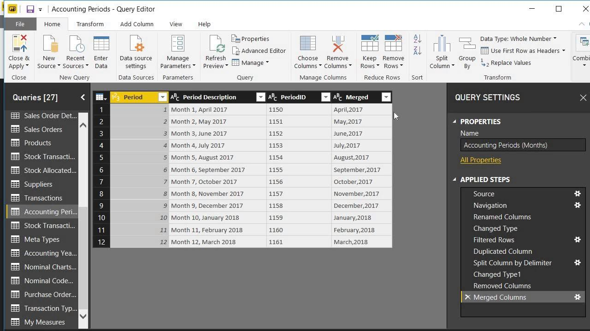

With Power BI Desktop, you can:

- Connect to data, including multiple data sources.

- Shape the data with queries that build insightful, compelling data models.

- Use those data models to build visualizations and reports.

- Share your report files for others to use, build on, and share.

## Connect to data

Power BI Desktop connects to data from many different data sources through the **Get data** feature. These data sources range from flat files, on-premises databases, big data, web services and streaming applications, to datasets that are published to Power BI service.

> [!div class="mx-imgBorder"]
> 

## Shape your data

Now that you are connected to your data, you can adjust the data to meet your requirements. To shape your data, you can provide Power Query Editor with instructions on adjusting the data. Shaping the data does not affect the original data source, only this view of the data.

> [!div class="mx-imgBorder"]
> 

## Build your reports

In the Power BI Desktop **Report** view, you can build visualizations and reports. The **Report** view has six main areas:

1. The ribbon at the top, which displays common tasks that are associated with reports and visualizations.

1. The canvas area in the middle, where visualizations are created and arranged.

1. The pages tab area at the bottom, which lets you select or add report pages.

1. The **Filters** pane, where you can filter data visualizations.

1. The **Visualizations** pane, where you can add, change, or customize visualizations and apply interactions.

1. The **Fields** pane, which shows the available fields that can be dragged onto the canvas, **Filters** pane, or **Visualizations** pane to create or modify visualizations.

> [!div class="mx-imgBorder"]
> 

## Share your work

Now that you have a Power BI Desktop report, you can share it with other users. You can either distribute the .pbix file like any other file, upload the .pbix file from Power BI service, or you can publish directly from Power BI Desktop to Power BI service.
