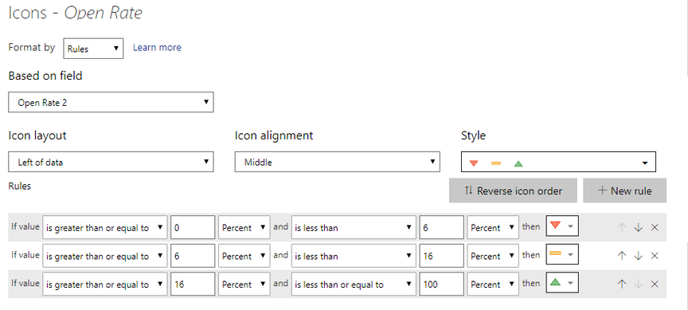

Analysts use conditional formatting to help them visually explore and analyze data, detect critical issues, and identify patterns and trends. The colors in conditional formatting work similarly to the Colors Marks card in Tableau. It can be broken out into three different types: color scale, rules, and field values.

## Color Scale

Color scale determines whether the color will be a continuous value or a diverging color. This scale is based on a numeric value.

## Rules

Rules are a new concept for Tableau analysts. Normally, analysts would create separate IF/THEN calculations where you are associating a range of values to strings or numbers. Then, analysts drop the calculations onto the Marks card to change the color depending on those strings or numbers.

> [!div class="mx-imgBorder"]
> 

In Power BI, this is built straight into the product. You can create a series of IF/THEN statements and associate them to a specific color.

> [!div class="mx-imgBorder"]
> 

## Field values

Field values allow analysts to use a color denoted in their data. For example, if you have a column that declares the color, either as natural language (like the text "green") or code (#00ff00), Power BI can interpret these values and convert them into color.

> [!TIP]
> You can load companion files that declare certain colors within your data.
