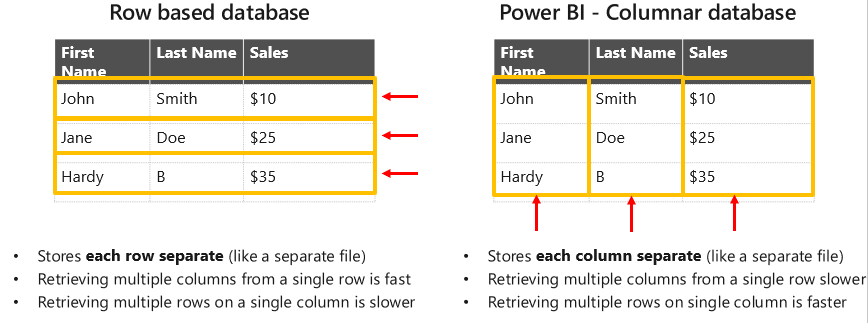

Before you further explore how to improve a model refresh and function, you should know how Power BI stores data. Similar to Tableau's hyper files, Power BI stores data as a columnar database.

> [!div class="mx-imgBorder"]
> 

> [!NOTE]
> A columnar database stores each column as its own file instead of storing the data row-by-row (row-based database).

Storing your data as a columnar database is ideal for long tables where retrieving rows for a column is much faster. Data in one column is always of the same type, like a string or integer. Because all entries of a type are grouped together, they can be compressed more efficiently, which leads to better performance when you are analyzing large volumes of data.

> [!NOTE]
> Power BI also attempts to store these columns optimally by grouping them together, such as items. After the columns have been grouped, a dictionary of mapped distinct values will be created.

## Improve a model

Consider the following factors when you're looking to improve a model's performance:

-   Cardinality

-   Changing BLANKs to values

-   Removing redundant and unnecessary fields

-   Star schemas

-   Auto date/time

-   Integers versus strings

### Remove high-cardinality fields

Cardinality refers to the number of unique values that are contained in a column, or field, of a database. High-cardinality values are typically identification numbers, email addresses, or user names.

> [!div class="mx-imgBorder"]
> 

Your first consideration should be removing high-cardinality fields. If you have a unique ID for every row, remove that field. The higher the cardinality, the more costly it is to store; distinct values equal high cost.

A common problem is a **Date/Time** field, where the combination of the date and time increases the cardinality of the field. To resolve this issue, consider splitting the field into separate date and time fields.

### Change BLANKs to values

When writing measures, you might encounter scenarios where a meaningful value can't be returned. In these instances, you might be tempted to return a value, such as zero, instead. For the sake of performance, you should reconsider this temptation.

During most calculations, BLANK values are ignored, but the zero values aren't. Converting the BLANK values to zero will force the calculation to evaluate more rows and return a large query result set, which often leads to slow report rendering. In other words, converting the BLANK values to zero adds to the calculation cost.

### Remove redundant and unnecessary fields

Removing redundant and unnecessary fields is important because you're attempting to limit the width of your tables, which will improve refresh performance. Typically, redundant fields can be removed because you've created a star schema, and you don't need the same field to show up multiple times. With unnecessary fields, you're identifying what fields will be used on import. It's best to start small and grow instead of throwing all data together in one massive dataset.

### Create high-performance models with star schemas

Star schema design is relevant to developing high-performance, useable Power BI models. Each Power BI report creates a query that is sent to the Power BI model. These queries are used to filter, group, and summarize the model data. Having a well-designed model provides tables for filtering, grouping, and summarizing.

> [!NOTE]
> A star schema is a type of data modeling schema where you have one fact table in the middle and several associated dimension tables around the fact table. Star schemas are optimized for querying large datasets.

This well-designed model works well with the star schema requirements:

-   The dimensions tables support filtering and grouping.

-   The fact table supports summarization.

A star schema prevents the calculation and handling of addition joins that you would get from a snowflake schema, but it will still provide the benefit of condensed data that a flat table can't provide.

### Turn off Auto date/time

**Auto date/time** is a data load option in Power BI Desktop that supports useful time intelligence reporting based on date columns that are loaded into a model. With this option turned on, Power BI Desktop will create hidden date/time tables behind every date field in your dataset.

With all these hidden date/time tables and date fields together, your model size grows significantly. Reducing model size optimizes performance, especially with larger datasets. Optimally, you would create one date table and link to that date table. You can also add other date dimensionalities with your own date table that can provide more functionality than the hidden auto date/time table.

To turn off the **Auto date/time** option in Power BI, use the following procedure.

> [!div class="mx-imgBorder"]
> 

1.  Select **File > Options and settings**.

1.  Select **Options**.

1.  Select the **Data Load** option in either the **Global** or the **Current File** sections.

1.  Clear the **Auto date/time for new files** option in the **Time intelligence** section.

### Use integers over strings

Integers are better than strings for two reasons:

- Matching an integer to another integer is faster than matching a string to a string.

- Strings must be stored in such a way that you must find its index first, and then you will find the value.

Strings are referenced twice, while integers are referenced only once.

For more information, see [Understand star schema and the importance for Power BI](https://docs.microsoft.com/power-bi/guidance/star-schema/?azure-portal=true). 
